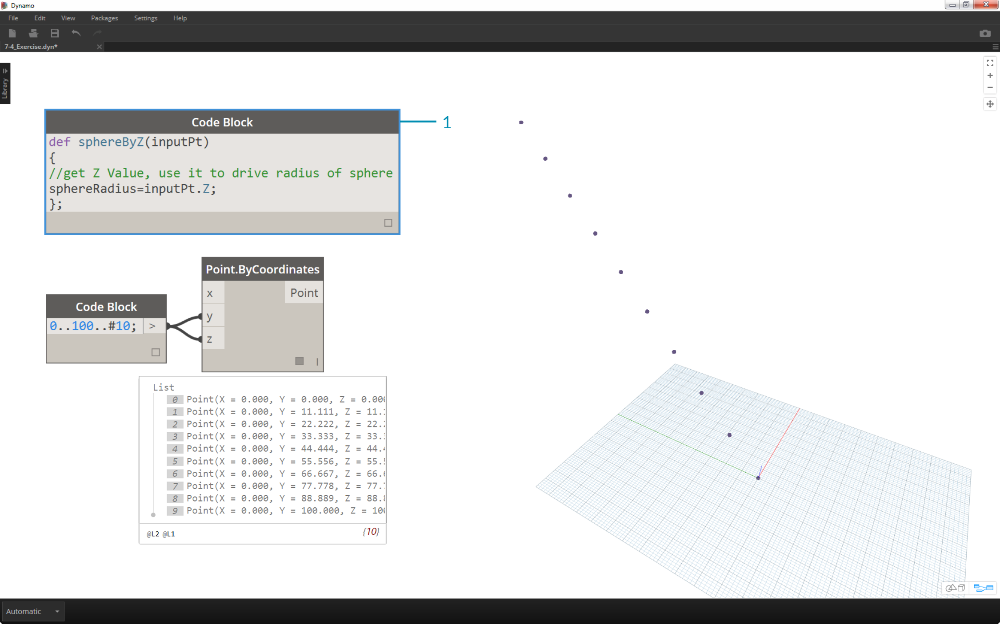
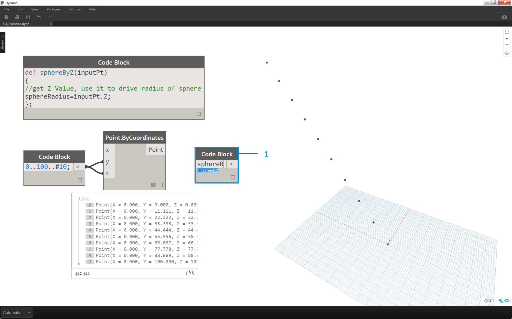
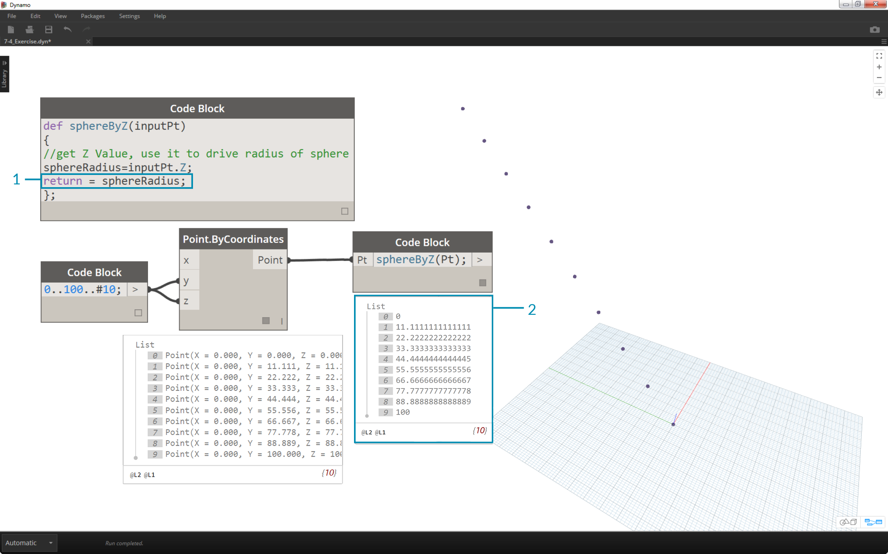
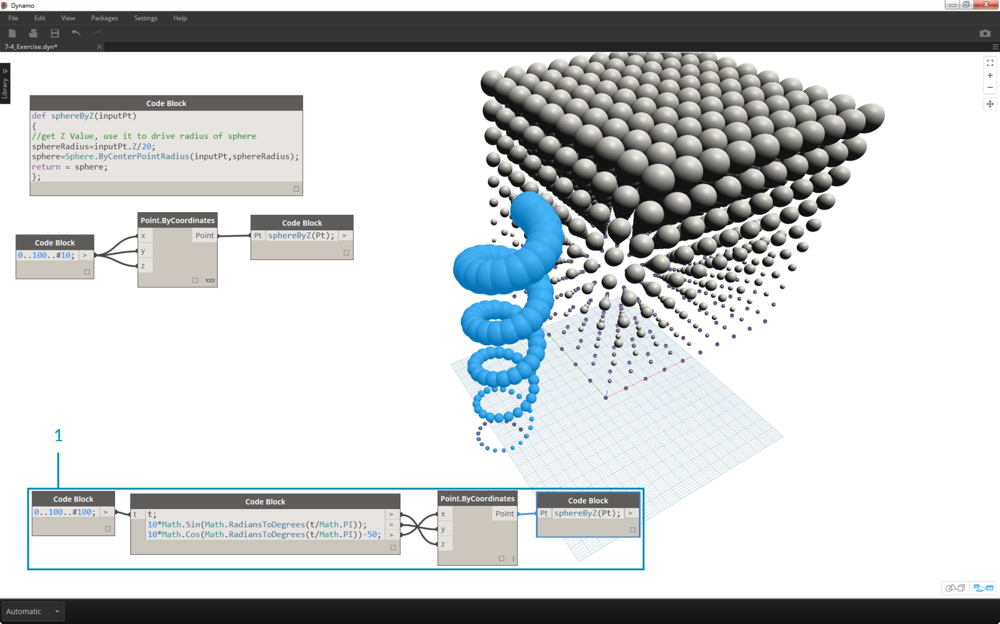

## Code Block Functions
Functions can be created in a code block and recalled elsewhere in a Dynamo definition.  This creates another layer of control in a parametric file, and can be viewed as a text-based version of a custom node.  In this case, the "parent" code block is readily accessible and can be located anywhere on the graph.

### Parents
Text

### Children
Text

### Exercise

>1. Descriptive Text
2. Second step of descriptive text

>1. Descriptive Text
2. Second step of descriptive text

>1. Descriptive Text
2. Second step of descriptive text

>1. Descriptive Text
2. Second step of descriptive text

>1. Descriptive Text
2. Second step of descriptive text

>1. Descriptive Text
2. Second step of descriptive text

>1. Descriptive Text
2. Second step of descriptive text

>1. Descriptive Text
2. Second step of descriptive text

>1. Descriptive Text
2. Second step of descriptive text

>1. Descriptive Text
2. Second step of descriptive text

>1. Descriptive Text
2. Second step of descriptive text

