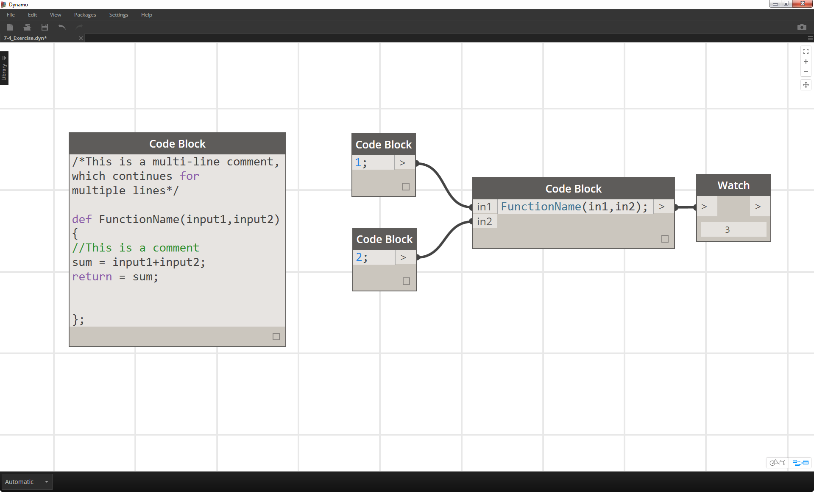
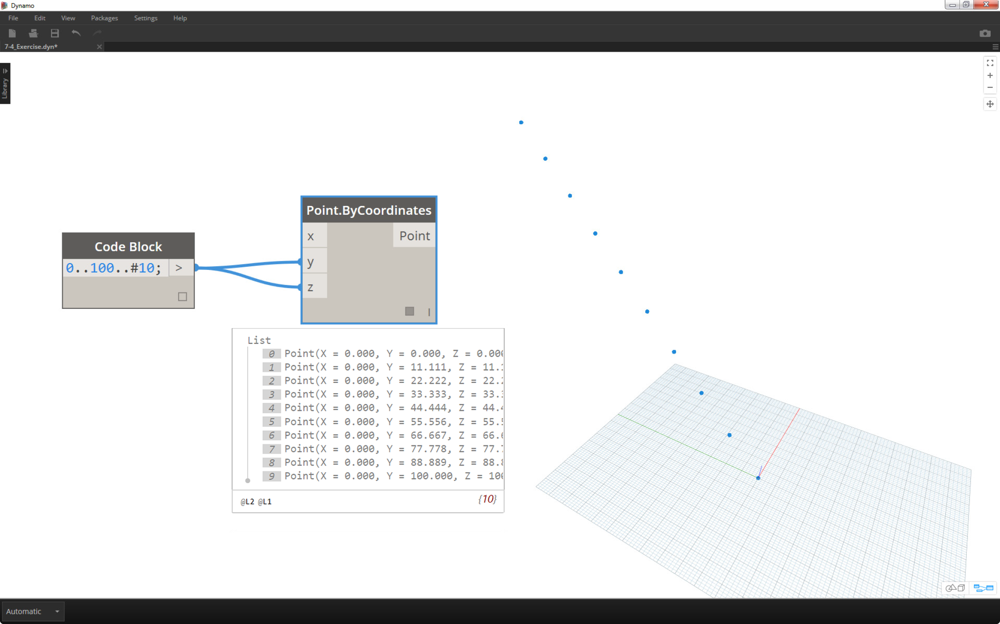
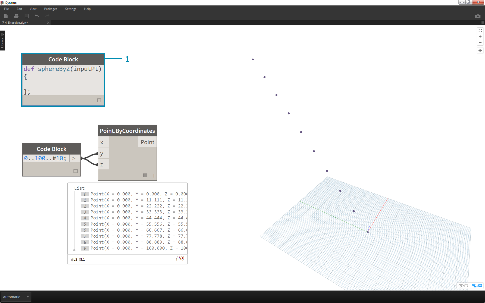
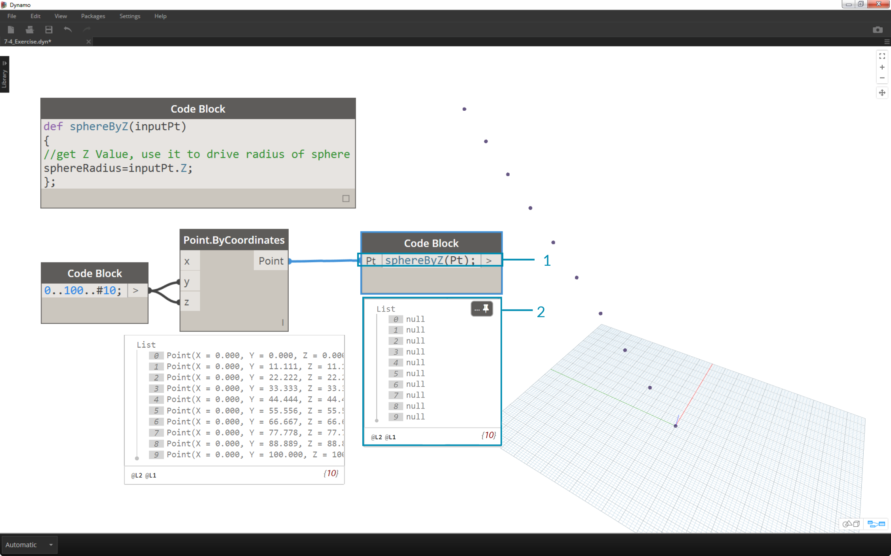
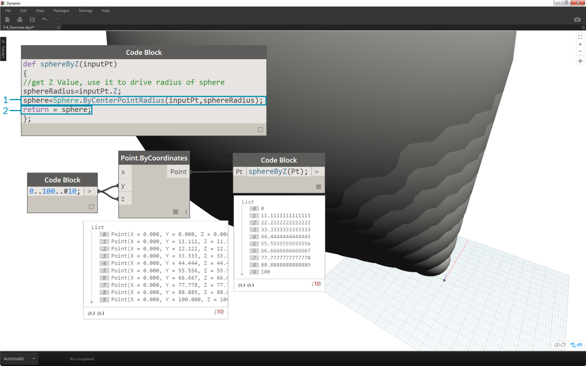
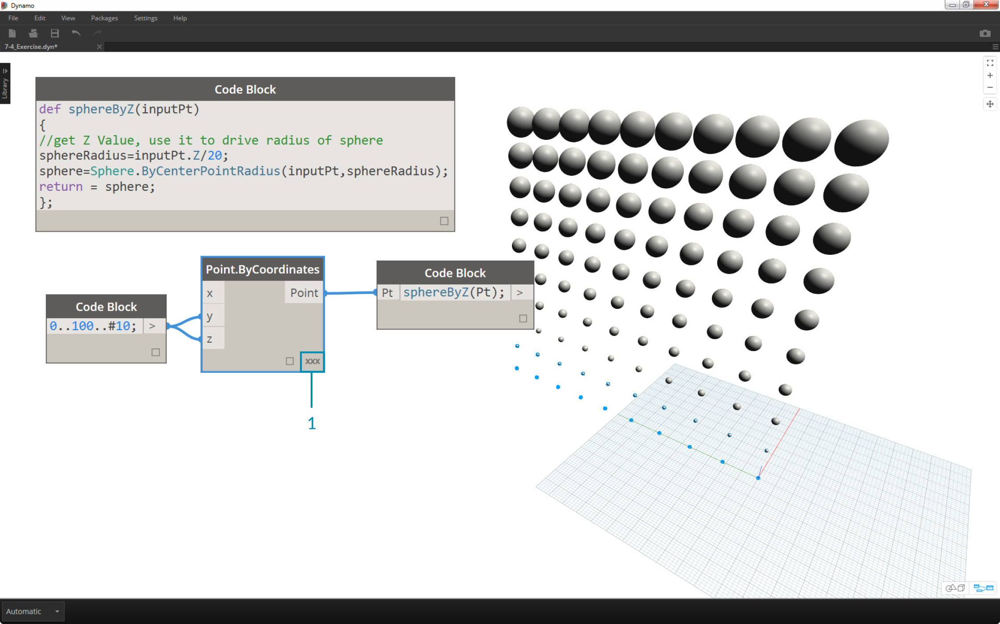
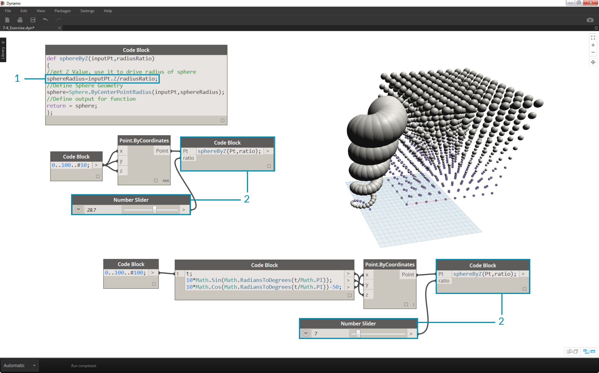

## Code Block Functions
Functions can be created in a code block and recalled elsewhere in a Dynamo definition.  This creates another layer of control in a parametric file, and can be viewed as a text-based version of a custom node.  In this case, the "parent" code block is readily accessible and can be located anywhere on the graph.  No wires needed!

### Parent
The first line has the key word “def”, then the function name, then the names of inputs in parentheses. Braces define the body of the function. Return a value with “return =”. Code Blocks that define a function do not have input or output ports because they are called from other Code Blocks.

```
/*This is a multi-line comment,
which continues for
multiple lines*/

def FunctionName(input1,input2)
{
//This is a comment
sum = input1+input2;
return = sum;
};
```

### Children
Call the function with another Code Block in the same file by giving the name and the same number of arguments. It works just like the out-of-the-box nodes in your library.


```
FunctionName(in1,in2);
```


### Exercise
>Download the example file that accompanies this exercise (Right click and "Save Link As..."). A full list of example files can be found in the Appendix. [Functions_SphereByZ.dyn](datasets/7-4/Functions_SphereByZ.dyn)

In this exercise, we will make a generic definition that will create spheres from an input list of points.  The radius of these spheres are driven by the Z property of each point.


> Let's begin with a number range of ten values spanning from 0 to 100.  Plug these into a *Point.ByCoordinates* nodes to create a diagonal line.


>1. Create a *code block* and introduce our definition by using the line of code:
```
def sphereByZ(inputPt){
};
```
  The *inputPt* is the name we've given to represent the points that will drive the function.  As of now, the function isn't doing anything, but we'll build up this function in the steps to come.


>1. Adding to the *code block* function, we place a comment and a *sphereRadius* variable which queries the *Z* position of each point.  Remember, *inputPt.Z* does not need parenetheses as a method.  This is a *query* of an existing element's properties, so no inputs are necessary:
```
def sphereByZ(inputPt,radiusRatio)
{
//get Z Value, use it to drive radius of sphere
sphereRadius=inputPt.Z;
};
```


>1. Now, let's recall the function we've created in another *code block*. If we double-click on the canvas to create a new *code block*, and type in *sphereB*, we notice that Dynamo suggest the *sphereByZ* function that we've defined. Your function has been added to the intellisense library! Pretty cool.


>1. Now we call the function and create a variable called *Pt* to plug in the points created in the earlier steps:
```sphereByZ(Pt)
```
2. We notice from the output that we have all null values.  Why is this? When we defined the function, we are calculating the *sphereRadius* variable, but we did not define what the function should *return* as an *output*.  We can fix this in the next step.


>1. An important step, we need to define the output of the function by adding the line ```return = sphereRadius;
``` to the *sphereByZ* function.
2. Now we see that the output of the *code block* gives us the Z coordinates of each point.



> Let's create actual spheres now by editing the *Parent* function.
1. We first define a sphere with the line of code:
```sphere=Sphere.ByCenterPointRadius(inputPt,sphereRadius);
```
2. Next, we change the return value to be the *sphere* instead of the *sphereRadius*: ```return = sphere;
```.  This gives us some giant spheres in our Dynamo preview!


>1. To temper the size of these spheres, let's update the *sphereRadius* value by adding a divider: ```sphereRadius = inputPt.Z/20;
```.  Now we can see the separate spheres and start to make sense of the relationship between radius and Z value.


>1. On the *Point.ByCoordinates* node, by changing the lacing from *Shortest List* to *Cross Product*, we create a grid of points.  The *sphereByZ* function is still in full effect, so the points all create spheres with radii based on Z values.


>1. And just to test the waters, we plug the original list of numbers into the X input for *Point.ByCoordinates*.  We now have a cube of spheres.
2. Note: if this takes a long time to calculate on your computer, try to change *#10* to something like *#5*.


> 1. Remember, the *sphereByZ* function we've created is a generic function, so we can recall the helix from an earlier lesson and apply the function to it.


> One final step: let's drive the radius ratio with a user defined parameter.  To do this, we need to create a new input for the function and also replace the *20* divider with a parameter.
1. Update the *sphereByZ* definition to:
```
def sphereByZ(inputPt,radiusRatio)
{
//get Z Value, use it to drive radius of sphere
sphereRadius=inputPt.Z/radiusRatio;
//Define Sphere Geometry
sphere=Sphere.ByCenterPointRadius(inputPt,sphereRadius);
//Define output for function
return = sphere;
};```
2. Update the children code blocks by adding a *ratio* variable to the input: ```sphereByZ(Pt,ratio);
```
Plug a slider into the newly created code block input and vary the size of the radii based on the radius ratio.


