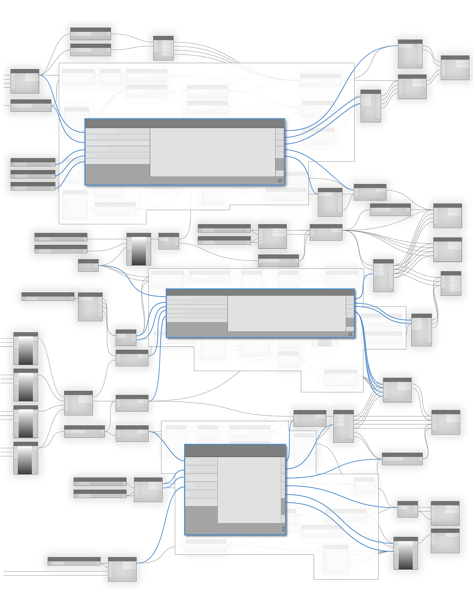

# Code Blocks and DesignScript

The code block is a unique feature in Dynamo that dynamically links a visual programming environment with a text-based one.  The code-block has access to all of the Dynamo nodes and can define an entire graph in one node.  Read this chapter closely, as the code block is a fundamental building block of Dynamo.

