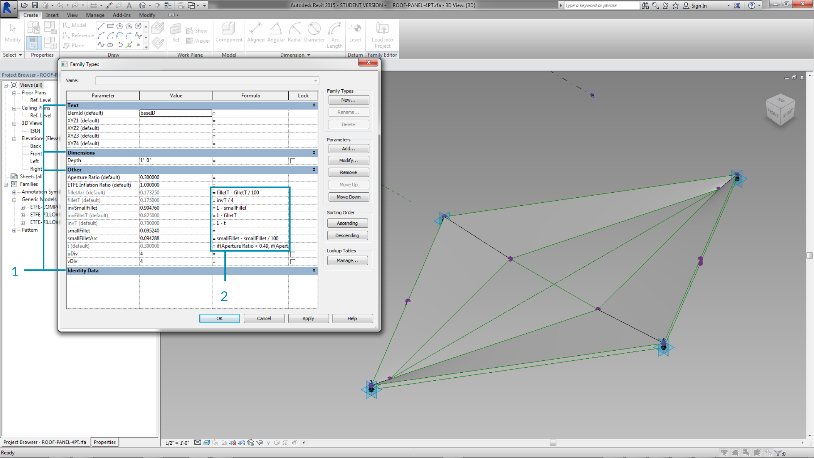
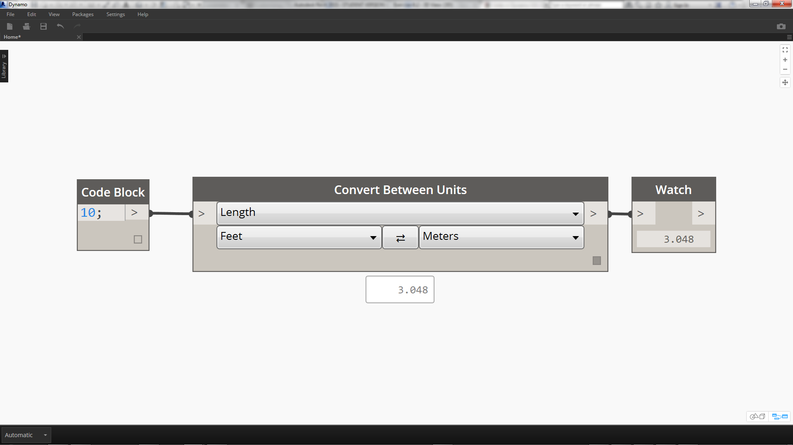
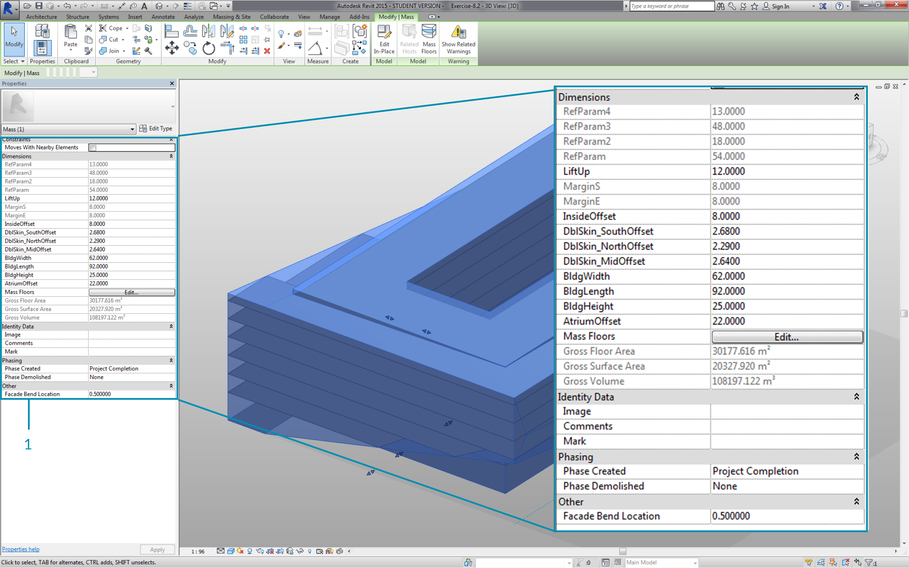
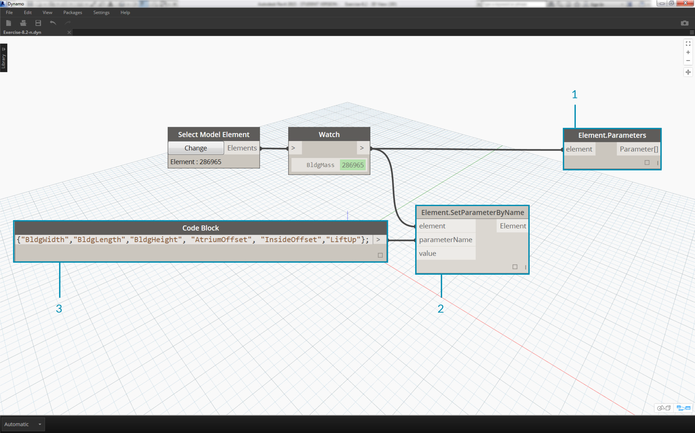
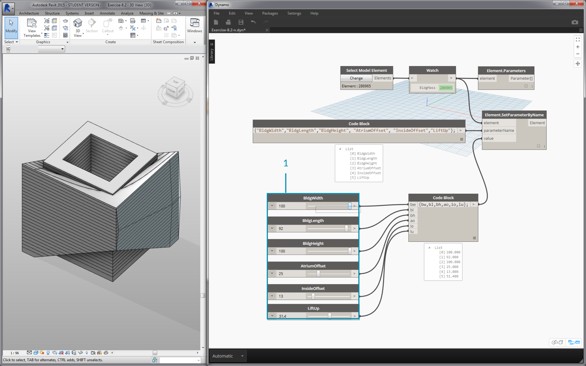
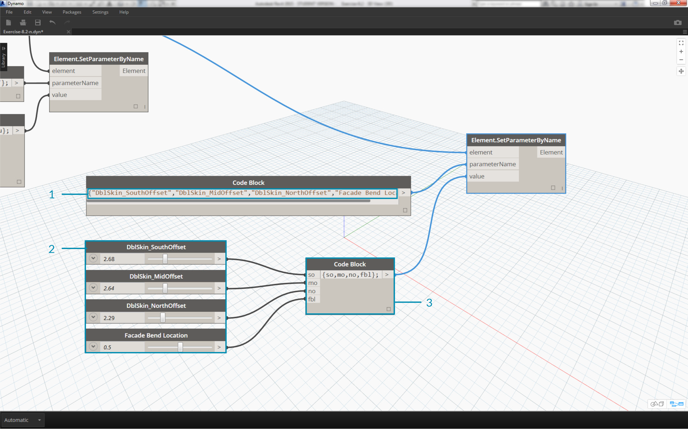

## Editing
A powerful feature of Dynamo is that you can edit parameters on a parametric level.  For example, a generative algorithm or the results of a simulation can be used to drive the parameters of an array of elements. This way, a set of instances from the same family can have custom properties in your Revit project.
### Type and Instance Parameters

> 1. Instance parameters define the aperture of the panels on the roof surface, ranging from an Aperture Ratio of 0.1 to 0.4.
2. Type-based parameters are applied to every element on the surface because they are the same family type.  The material of each panel, for example,  can be driven by a type-based parameter.


>1. If you've set up a Revit family before, remember that you have to assign a parameter type (string, number, dimension, etc.) Be sure to use the correct data type when assigning parameters from Dynamo.
2. You can also use Dynamo in combination with parametric constraints defined in a Revit family's properties.

As a quick review of parameters in Revit, we recall that there are type parameters and instance parameters.  Both can be edited from Dynamo, but we'll work with instance parameters in the exercise below.

#### Units
As of version 0.8, Dynamo is fundamentally unitless.  This allows Dynamo to remain an abstract visual programming environment. Dynamo nodes that interact with Revit dimensions will reference The Revit project's units.  For example, if you are setting a length parameter in Revit from Dynamo, the number in Dynamo for the value will correspond to the default units in the Revit project.  The exercise below works in meters.


> For a quick conversion of units, use the *"Convert Between Units"* node.  This is a handy tool for converting Length, Area, and Volume units on the fly.

### Exercise
>Download the example files that accompanies this exercise (Right click and "Save Link As..."). A full list of example files can be found in the Appendix.
1. [Editing.dyn](datasets/8-3/Editing.dyn)
2. [ARCH-Editing-BaseFile.rvt](datasets/8-3/ARCH-Editing-BaseFile.rvt)

This exercise focuses on editing Revit elements without performing geometric operation in Dynamo.  We're not importing Dynamo geometry here, just editing parameters in a Revit project.  This exercise is basic, and to the more advanced Revit users, notice that these are instance parameters of a mass, but the same logic can be applied to an array of elements to customize on a large scale. This is all done with the "Element.SetParameterByName" node.


> Begin with the example Revit file for this section.  We've removed the structural elements and adaptive trusses from the previous section.  In this exercise, we will focus on a parametric rig in Revit and manipulating in Dynamo.
1. Selecting the building in Mass in Revit, we see an array of instance parameters in the properties panel.


> 1. Select the building mass with the *"Select Model Element"* node.
2. We can query all of the parameters of this mass with the *"Element.Parmaters"* node.  This includes type and instance parameters.


> 1. Reference the *Element.Parameters* node to find target parameters.  Or, we can view the properties panel from the previous step to choose which parameter names we want to edit.  In this case, we are looking for the parameters which affect the large geometric moves on the building mass.
2. We will make changes to the Revit element using the *Element.SetParameterByName* node.
3. Using the *code block*, we define a list of these parameters, with quotes around each item to denote a string.  We can also use the List.Create node with a series of *"string"* nodes connected to multiple inputs.  Code block is simply faster and easier.  Just make sure that the string matches the exact name in Revit, case-specific:  ```{"BldgWidth","BldgLength","BldgHeight", "AtriumOffset", "InsideOffset","LiftUp"};
```


> 1. We also want to designate values for each parameter.  Add six *"integer sliders"* to the canvas and rename to the corresponding parameter in the list.  Also, set the values of each slider to the image above.  In order from top-to-bottom: ```62,92,25,22,8,12
```
2. Define another *code block* with a list of the same length as the parameter names.  In this case, we name variables (without quotes) which create inputs for the *code block.*  Plug the *sliders* into each respective input: ```{bw,bl,bh,ao,io.lu};
```
3. Connect the *code block *to the *"Element.SetParameterByName*"* node.  With run automatically checked, we will automatically see results.

**Note - this demonstration works with instance parameters, but not type parameters.*


Just as in Revit, many of these parameters are dependent on each other.  There are of course combinations where the geometry may break.  We can remedy this issue with defined formulas in the parameter properties, or we can setup a similar logic with math operations in Dynamo (this is an additional challenge if you'd like to expand on the exercise).
> 1. This combination gives a funky new design to the building mass: ```100,92,100,25,13,51.4
```


> 1. Let's copy the graph and focus on the facade glazing which will house the truss system.  We isolate four parameters in this case: ``` {"DblSkin_SouthOffset","DblSkin_MidOffset","DblSkin_NorthOffset","Facade Bend Location"};
```
2. Additionally, we create *number sliders* and rename to the appropriate parameters.  The first three sliders from top-to-bottom should be remapped to a domain of [0,10], while the final slider, *"Facade Bend Location"*, should be remapped to a domain of [0,1].  These values, from top-to-bottom should start with these values (although they're arbitrary): ```2.68,2.64,2.29,0.5
```
3. Define a new *code block *and connect the sliders: ```{so,mo,no,fbl};
```


> 1. By changing the *sliders* in this part of the graph, we can make the facade glazing much more substantial: ```9.98,10.0,9.71,0.31
```

