## Creating
You can create an array of Revit elements in Dynamo with full parametric control.  The Revit nodes in Dynamo offer the ability to import elements from generic geometries to specific category types (like walls and floors).  In this section, we'll focus on importing parametrically flexible elements with adaptive components.

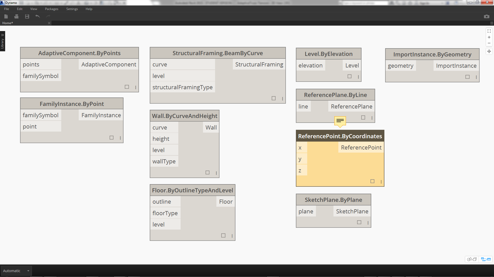
### Adaptive Components
An adaptive component is a flexible family category which lends itself well to generative applications. Upon instantiation, you can create a complex geometric element which is driven by the fundamental location of adaptive points.


> An example of a three-point adaptive component in the family editor. This generates a truss which is defined by the position of each adaptive point.  In the exercise below, we'll use this component to generate a series of trusses across a facade.

#### Principles of Interoperability
The adaptive component is a good example for best practices of interoperability.  We can create an array of adaptive components by defining the fundamental adaptive points.  And, when transferring this data to other programs, we have the ability to reduce the geometry to simple data.  Importing and exporting with a program like Excel follows a similar logic.

Suppose a facade consultant wants to know the location of the truss elements without needing to parse through fully articulated geometry.  In preparation for fabrication, the consultant can reference the location of adaptive points to regenerate geometry in a program like Inventor.

The workflow we'll setup in the exercise below allows us to access all of this data while creating the definition for Revit element creation.  By this process, we can merge conceptualization, documentation, and fabrication into a seamless workflow.  This creates a more intelligent and efficient process for interoperability.

#### Multiple Elements and Lists

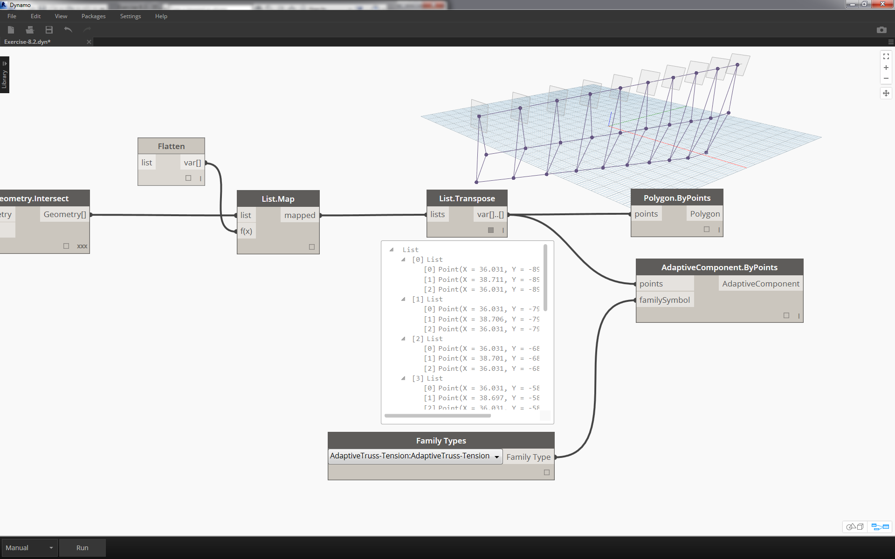

The exercise below will walk through how Dynamo references data for Revit element creation.  To generate multiple adaptive components, we define a list of lists, where each list has three points representing each point of the adaptive component.  We'll keep this in mind as we manage the data structures in Dynamo.

### Exercise
> Download the example files that accompanies this exercise (Right click and "Save Link As..."). A full list of example files can be found in the Appendix.
1. [Creating.dyn](datasets/8-4/Creating.dyn)
2. [ARCH-Creating-BaseFile.rvt](datasets/8-4/ARCH-Creating-BaseFile.rvt)

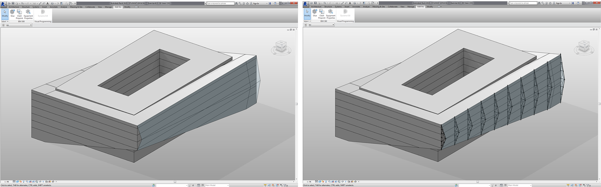
> Beginning with the example file from this section (or continuing with the Revit file from the previous session), we see the same Revit mass.
1. This is the file as opened.
2. This is the truss system we'll created with Dynamo, linked intelligently to the Revit mass.

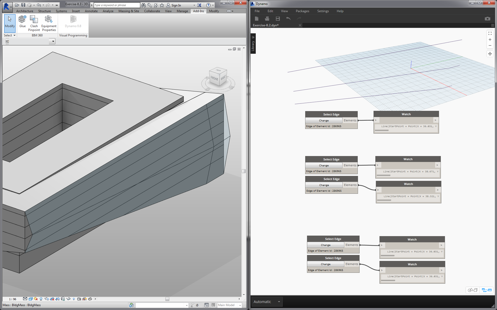
> We've used the *"Select Model Element"* and *"Select Face"* nodes, now we're taking one step further down in the geometry hierarchy and using *"Select Edge"*.  With the Dynamo solver set to run *"Automatic"*, the graph will continually update to changes in the Revit file. The edge we are selecting is tied dynamically to the Revit element topology.  As long as the topology* does not change, the connection remains linked between Revit and Dynamo.
1. Select the top most curve of the glazing facade.  This spans the full length of the building.  If you're having trouble selecting the edge, remember to choose the selection in Revit by hovering over the edge and hitting *"Tab"* until the desired edge is highlighted.
2. Using two *"Select Edge"* nodes, select each edge representing the cant at the middle of the facade.
3. Do the same for the bottom edges of the facade in Revit.
4. The *Watch* nodes reveal that we now have lines in Dynamo.  This is automatically converted to Dynamo geometry since the edges themselves are not Revit elements.  These curves are the references we'll use to instantiate adaptive trusses across the facade.

**Note - to keep a consistent topology, we're referring to a model that does not have additional faces or edges added.  While parameters can change its shape, the way it which it is built remains consistent.*

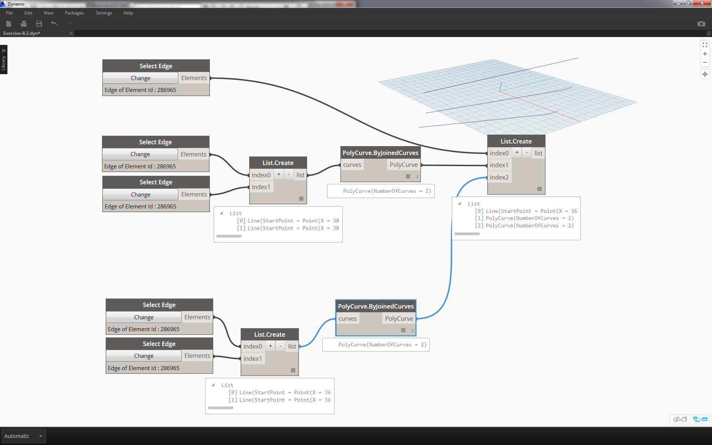
> We first need to join the curves and merge them into one list.  This way we can *"group"* the curves to perform geometry operations.
1. Create a list for the two curves at the middle of the facade.
2. Join the two curves into a Polycurve by plugging the *List.Create* component into a *Polycurve.ByJoinedCurves* node.
3. Create a list for the two curves at the bottom of the facade.
4. Join the two curves into a Polycurve by plugging the *List.Create* component into a *Polycurve.ByJoinedCurves* node.
5. Finally, join the three main curves (one line and two polycurves) into one list.

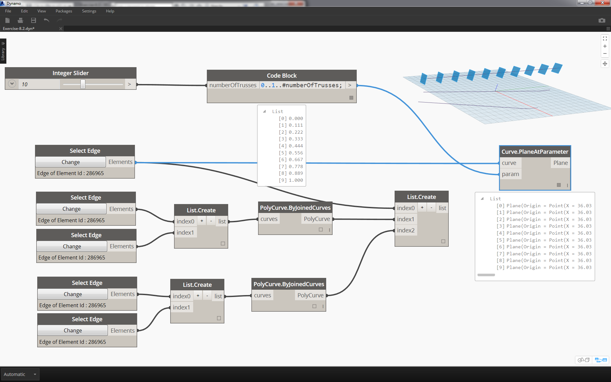
> We want to take advantage of the top curve, which is a line, and represents the full span of the facade.  We'll create planes along this line to intersect with the set of curves we've grouped together in a list.
1. With a *code block*, define a range using the syntax: ```0..1..#numberOfTrusses;
```
2. Plug an *integer slider *into the input for the code block.  As you could have guessed, this will represent the number of trusses. Notice that the slider controls the number of items in the range defined from *0 *to *1*.
3. Plug the *code block* into the *param* input of a *"Curve.PlaneAtParameter"* node, and plug the top edge into the *curve* input.  This will give us ten planes, evenly distributed across the span of the facade.

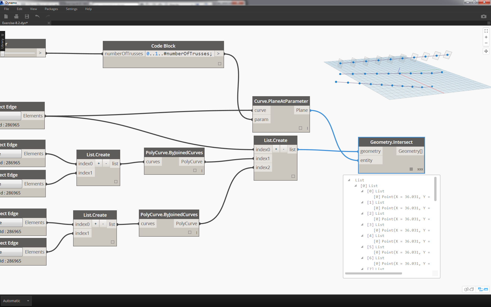
> A plane is an abstract piece of geometry, representing a two dimensional space which is infinite.  Planes are great for contouring and intersecting, as we are setting up in this step.
1. Using the *Geometry.Intersect* node, plug the *Curve.PlaneAtParameter* into the *entity* input of the *Geometry.Intersect* node.  Plug the main *List.Create* node into the *geometry* input.  We now see points in the Dynamo viewport representing the intersection of each curve with the defined planes.

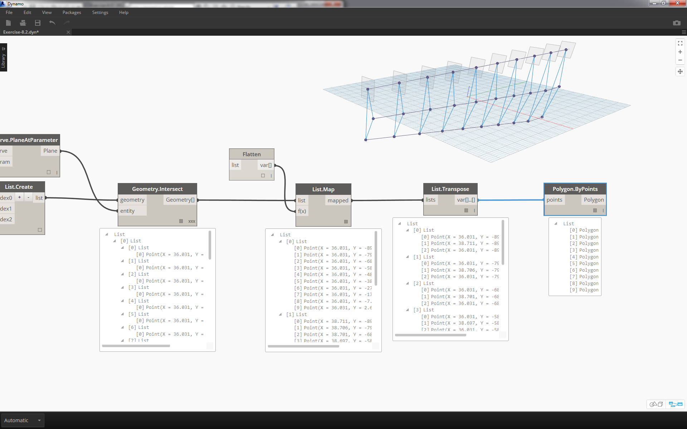
> Notice the output is a list of lists of lists. Too many lists for our purposes.  We want to do a partial flatten here.  We need to take one step down on the list and flatten the result.  To do this, we use the *List.Map* operation, as discussed in the list chapter of the primer.
1. Plug the *Geometry.Intersect* node into the list input of *List.Map*.
2. Plug a *Flatten* node into the f(x) input of *List.Map*.  The results gives 3 list, each with a count equal to the number of trusses.
3. We need to change this data. If we want to instantiate the truss, we have to use the same number of adaptive points as defined in the family.  This is a three point adaptive component, so instead of three lists with 10 items each (numberOfTrusses), we want 10 lists of three items each.  This way we can create 10 adaptive components.
3. Plug the *List.Map* into a *List.Transpose* node.  Now we have the desired data output.
4. To confirm that the data is correct, add a *Polygon.ByPoints* node to the canvas and double check with the Dynamo preview.


> In the same way we created the polygons, we array the adaptive components.
1. Add an *AdaptiveComponent.ByPoints* node to the canvas, plug the *List.Transpose* node into the *points* input.
2. Using a *Family Types* node, select the *"AdaptiveTruss"* family, and plug this into the *familySymbol* input of the *AdaptiveComponent.ByPoints* node.

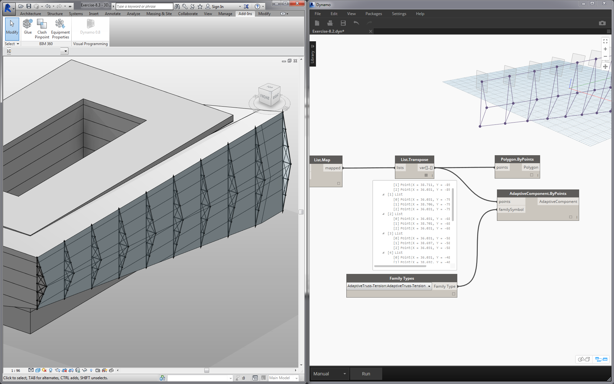
> Checking in Revit, we now have the ten trusses evenly spaced across the facade!

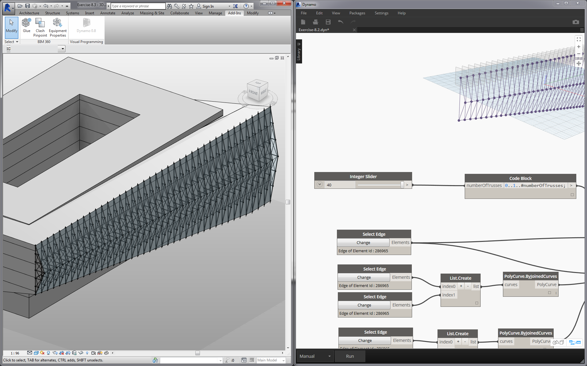
> 1. "Flexing" the graph, we turn up the *numberOfTrusses* to *40* by changing the *slider*.  Lots of trusses, not very realistic, but the parametric link is working.

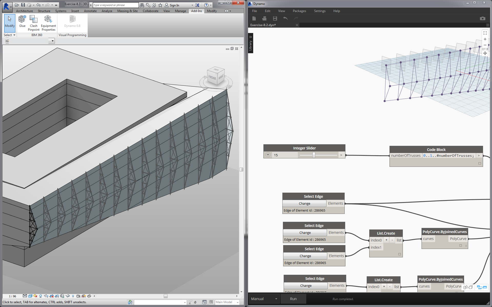
> 1. Taming the truss system, let's compromise with a value of *15* for *numberOfTrusses*.

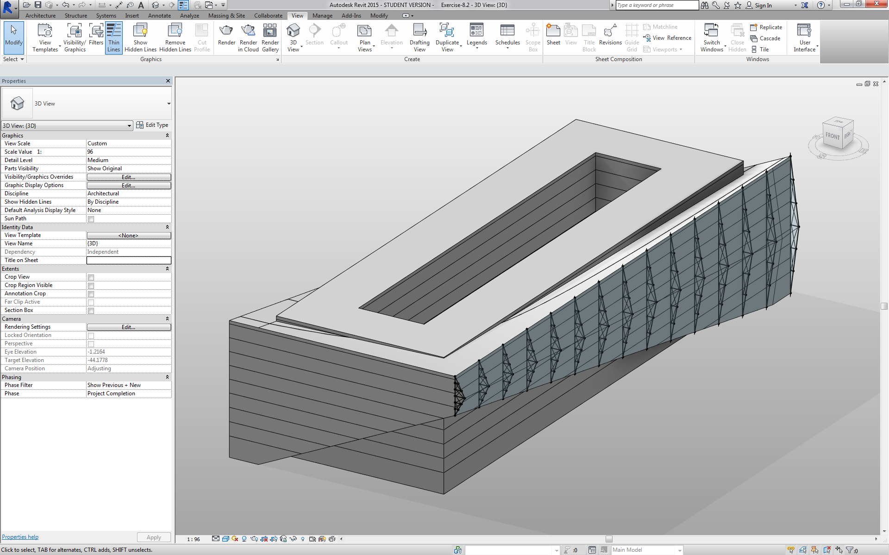
> And for the final test, by selecting the mass in Revit and editing instance parameters, we can change the form of the building and watch the truss follow suit.  Remember, this Dynamo graph has to be open in order to see this update, and the link will be broken as soon as it's closed.


### DirectShape Elements
Another method for importing parametric Dynamo geometry into Revit is with DirectShape. In summary, the DirectShape element and related classes support the ability to store externally created geometric shapes in a Revit document. The geometry can include closed solids or meshes. DirectShape is primarily intended for importing shapes from other data formats such as IFC or STEP where not enough information is available to create a "real" Revit element.  Like the IFC and STEP workflow, the DirectShape functionality works well with importing Dynamo created geometries into Revit projects as real elements. 

Let's walk through and exercise for importing Dynamo geometry as a DirectShape into our Revit project. Using this method, we can assign an imported geometry's category, material, and name - all while maintaining a parametric link to our Dynamo graph.

### Exercise
> Download the example files that accompanies this exercise (Right click and "Save Link As..."). A full list of example files can be found in the Appendix.
1. [DirectShape.dyn](datasets/8-4/DirectShape.dyn)
2. [ARCH-DirectShape-BaseFile.rvt](datasets/8-4/ARCH-DirectShape-BaseFile.rvt)


> Begin by opening the sample file for this lesson - ARCH-DirectShape-BaseFile.rvt.
1. In the 3D view, we see our building mass from the previous lesson.
2. Along the edge of the atrium is one reference curve, we'll use this as a curve to reference in Dynamo.
3. Along the opposing edge of the atrium is another reference curve which we'll reference in Dynamo as well.


>1. To reference our geometry in Dynamo, we'll use *Select Model Element* for each member in Revit. Select the mass in Revit and import the geometry into Dynamo by Using *Element.Faces* - the mass should now be visible in your Dynamo preview.
2. Import one reference curve into Dynamo by using *Select Model Element* and *CurveElement.Curve*.
3. Import the other reference curve into Dynamo by using *Select Model Element* and *CurveElement.Curve*.


>1. Zooming out and panning to the right in the sample graph, we see a large group of nodes - these are geometric operations which generate the trellis roof structure visible in the Dynamo preview.  These nodes are generating using the *Node to Code* functionality as discussed in the [code block section](../07_Code-Block/7-2_Design-Script-syntax.md#Node) of the primer.
2. The structure is driven by three major parameters - Diagonal Shift, Camber, and Radius.


>Zooming a close-up look of the parameters for this graph.  We can flex these to get different geometry outputs.

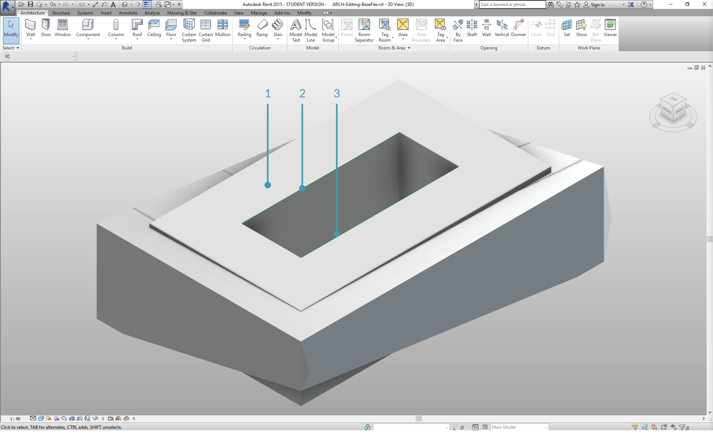
>1. Dropping the *DirectShape.ByGeometry* node onto the canvas, we see that it has four inputs: **geometry, category, material**, and **name**.
2. Geometry will be the solid created from the geometry creation portion of the graph
3. The category input is chosen using the dropdwon *Categories* node. In this case we'll use "Structural Framing".
4. The material input is selected through the array of nodes above - although it can be more simply defined as "Default" in this case.

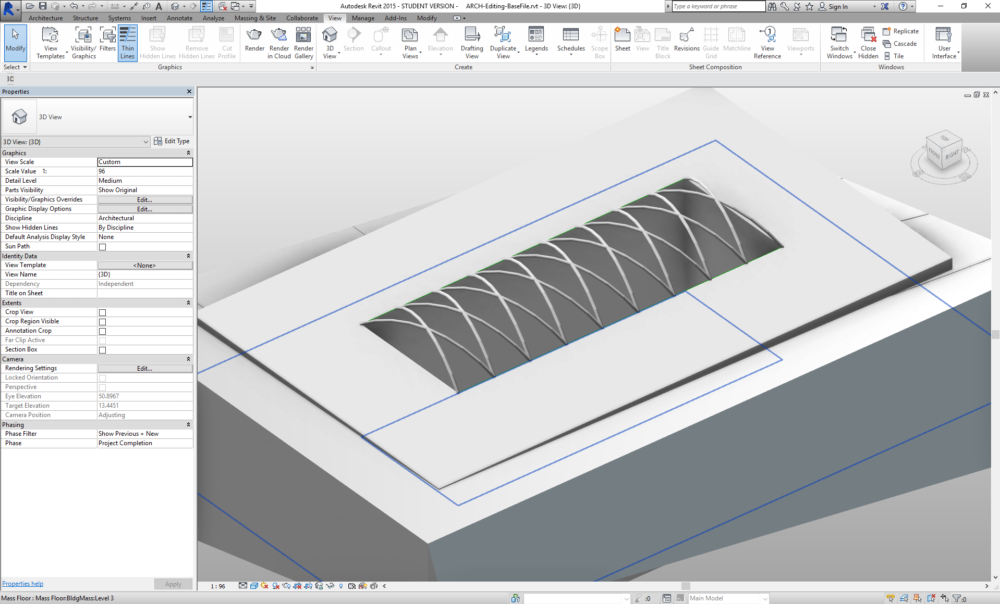
>After running the solver, back in Revit, we have the imported geometry on the roof in our project. This is a structural framing element, rather than a generic model.  The parametric link to Dynamo remains intact.


>1. If we "flex" the Dynamo graph by changing the "Diagonal Shift" parameter to "-2", we just run the solver again and get a new imported DirectShape!