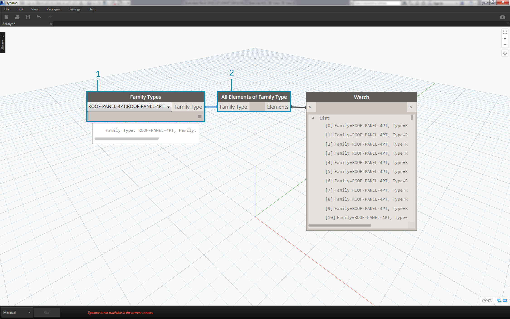
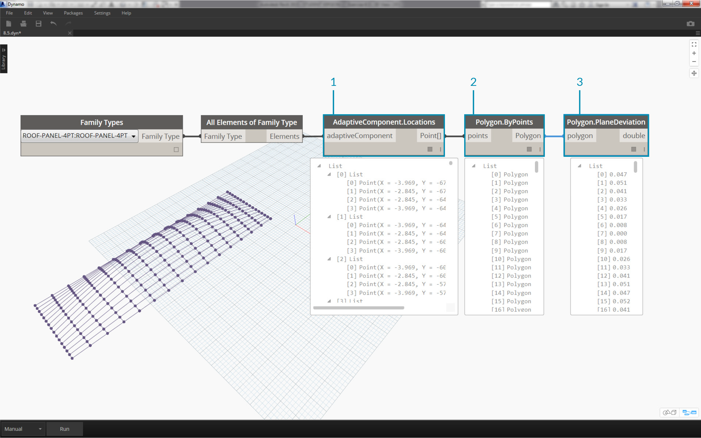
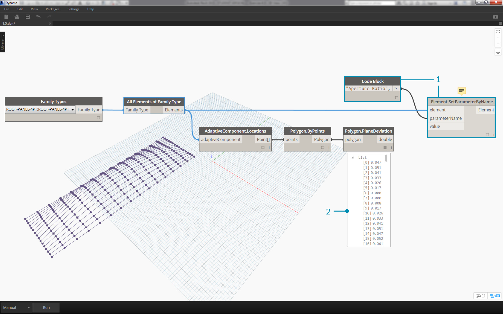
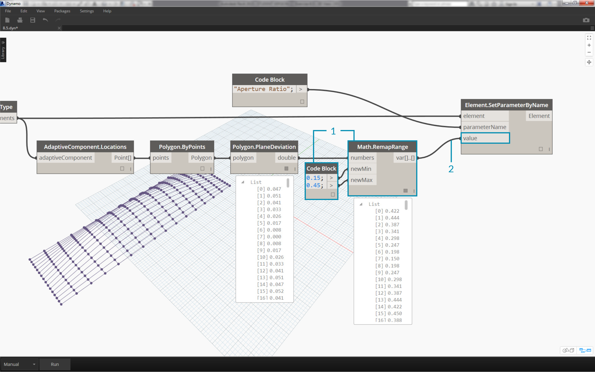
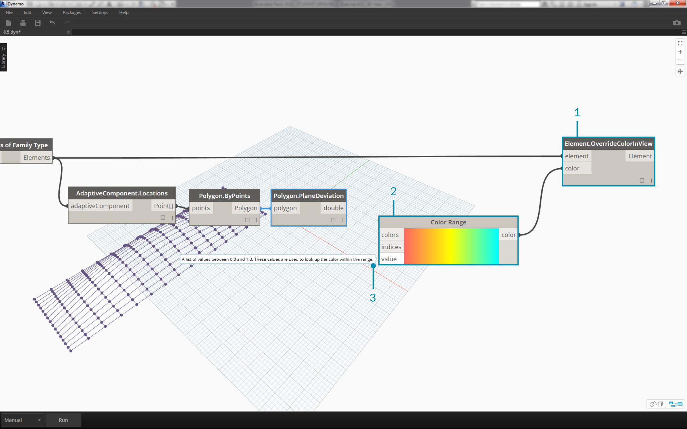
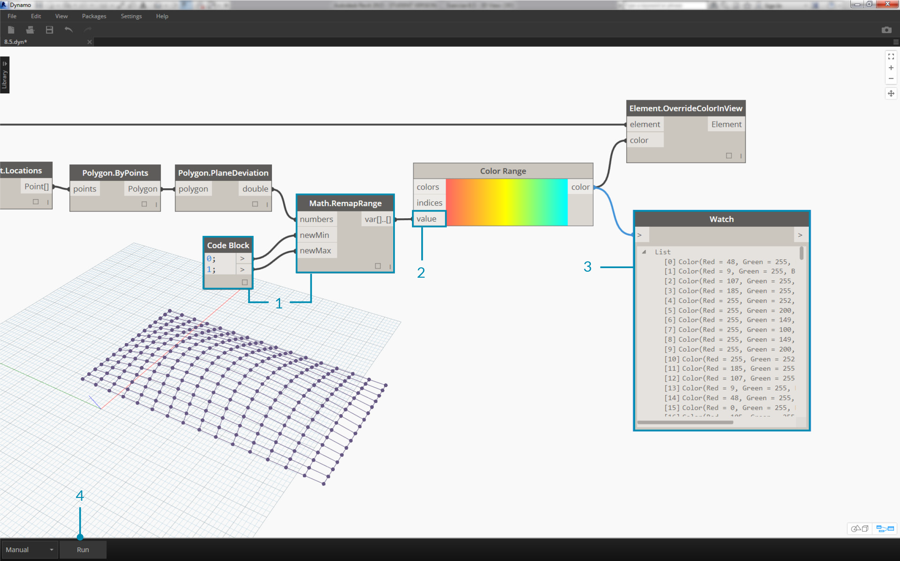
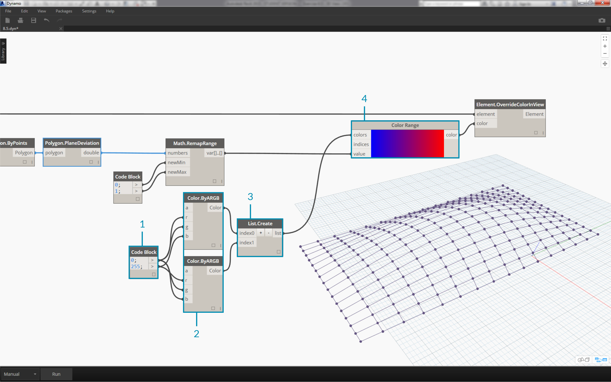
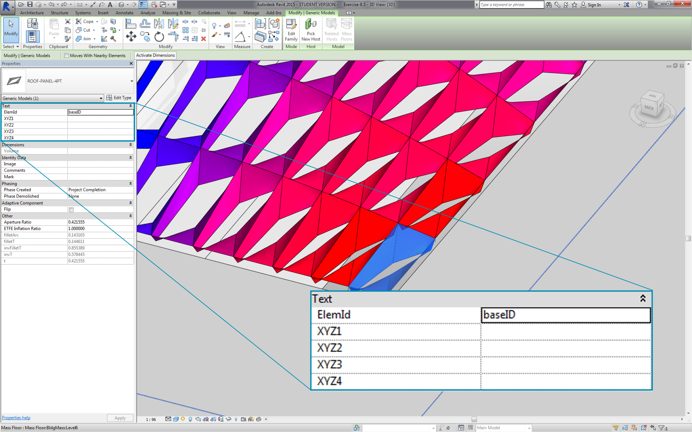
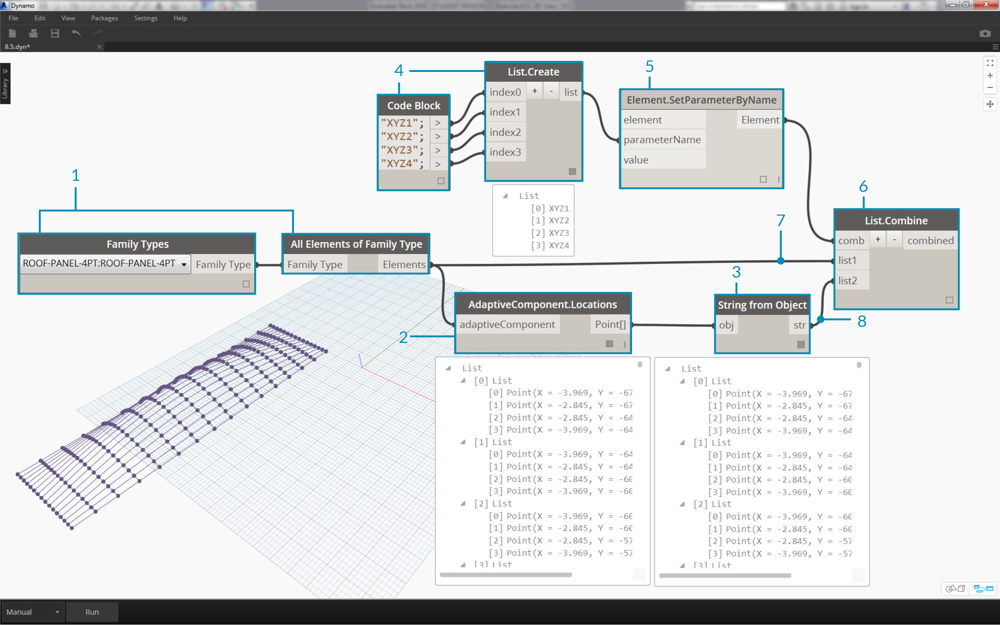

## Documenting
Editing parameters for documentation follows suit with the lessons learned in prior sections.  In this section, we'll look at editing parameters which don't affect the geometric properties of an element, but instead prepare a Revit file for documentation.

#### Deviation
In the exercise below, we'll use a basic deviation from plane node to create a Revit sheet for documentation. Each panel on our parametrically defined roof structure has a different value for deviation, and we want to call out the range of values using color and by scheduling out the adaptive points to hand off to a facade consultant, engineer, or contractor.


> The deviation from plane node will calculate the distance that the set of four points varies from the best-fit plane between them.  This is a quick and easy way to study constructability.

### Exercise
>Download the example files that accompanies this exercise (Right click and "Save Link As..."). A full list of example files can be found in the Appendix.
1. [Documenting.dyn](datasets/8-6/Documenting.dyn)
2. [ARCH-Documenting-BaseFile.rvt](datasets/8-6/ARCH-Documenting-BaseFile.rvt)

Start with the Revit file for this section (or continue from the previous section).  This file has an array of ETFE panels on the roof.  We'll reference these panels for this exercise.


> 1. Add a *Family Types* node to the canvas and choose *"ROOF-PANEL-4PT"*.
2. Plug this node into a Select *All Elements of Family Type* node to get all of the elements from Revit into Dynamo.


> 1. Query the location of adaptive points for each element with the *AdaptiveComponent.Locations* node.
2. Create a polygon from these four points with the *Polygon.ByPoints* node.  Notice we now have an abstract version of the paneled system in Dynamo without having to import the full geometry of the Revit element.
3. Calculate planar deviation with the *Polygon.PlaneDeviation* node.


> Just for kicks, like the previous exercise, let's set the *aperture ratio *of each panel based on its planar deviation.
1. Add an *Element.SetParameterByName* node to the canvas and connect the adaptive components to the *element* input.  Connect a *code block* reading *"Aperture Ratio"* into the *parameterName* input.
2. We cannot directly connect the deviation results into the value input because we need to remap the values to the parameter range.


> 1. Using *Math.RemapRange*, remap the deviation values to a domain between *.15 *and *.45*.
2. Plug these results into the value input for *Element.SetParameterByName*.


> Back in revit we can *kind of* make sense of the change in aperture across the surface.


> Zooming in, it becomes more clear that the closed panels are weighted towards the corners of the surface. The open corners are towards the top.  The corners represent areas of larger deviation while bulge has minimal curvature, so this makes sense.

###Color and Documentation
Setting the Aperture Ratio doesn't clearly demonstrate the deviation of panels on the roof, and we're also changing the geometry of the actual element.  Suppose we just want to study the deviation from the standpoint of fabrication feasibility.  It would be helpful to color the panels based on deviation range for our documentation.  We can do that with the series of steps below, and in a very similar process to the steps above.


> 1. Remove the *Element.SetParameterByName* nodes and add *Element.OverrideColorInView*.
2. Add a *Color Range* node to the canvas and plug into the color input of *Element.OverrideColorInView*. We still have to connect the deviation values to the color range in order to create the gradient.
3. Hovering over the *value* input, we can see that the values for the input must be between *0* and *1* in order to map a color to each value.  We need to remap the deviation values to this range.


> 1. Using *Math.RemapRange*, remap the planar deviation values to a range between* 0* and *1* (note: you can use the *"MapTo"* node to define a source domains as well).
2. Plug the results into a *Color Range* node.
3. Notice our output is a range of colors instead of a range of numbers.
4. If you're set to Manual, hit *Run*.  You should be able to get away with being set to Automatic from this point forward.


> Back in Revit, we see a much more legible gradient which is representative of planar deviation based on our color range.  But what if we want to customized the colors?  Notice that the minimum deviation values are represented in red, which seems to be the opposite of what we'd expect.  We want to have maximum deviation to be red, with minimum deviation represented by a calmer color.  Let's go back to Dynamo and fix this.


> 1. Using a *code block*, add two numbers on two different lines:
```0;``` and ```255;```.
2. Create a red and blue color by plugging the appropriate values into two *Color.ByARGB* nodes.
3. Create a list from these two colors.
4. Plug this list into the *colors* input of the *Color Range*, and watch the custom color range update.


> Back in Revit, we can now make better sense of areas of maximum deviation in the corners.  Remember, this node is for overriding a color in a view, so it can be really helpful if we had a particular sheet in the set of drawings which focuses on a particular type of analysis.

###Scheduling


> 1. Selecting one ETFE panel in Revit, we see that there are four instance parameters, *XYZ1, XYZ2, XYZ3,* and *XYZ4*.  These are all blank after they're correctly.  These are text-based parameters and need values.  We'll use Dynamo to write the adaptive point locations to each parameter.  This helps interoperability if the geometry needs to be sent to an engineer of facade consultant.


> In a sample sheet, we have a large, empty schedule.  The XYZ parameters are shared parameters in the Revit file, which allows us to add them to the schedule.


> Zooming in, the XYZ parameters are yet to be filled in.  The first two parameters are taken care of by Revit.


> To write in these values, we'll do a complex list operation.  The graph itself is simple, but the concepts build heavily from the list mapping as discussed in the list chapter.
1. Select all the adaptive components with two nodes.
2. Extract the locations of each points with *AdaptiveComponent.Locations*.
3. Convert these points to strings.  Remember, the parameter is text-based so we need to input the correct data type.
4. Create a list of the four strings which define the parameters to change: *XYZ1, XYZ2, XYZ3,* and *XYZ4*.
5. Plug this list into the *parameterName* input of *Element.SetParameterByName*.
6. Connect *Element.SetParameterByName* into the the *combinator* input of *List.Combine.*
7. Connect the *adaptive components* into *list1*.
8. Connect *String* from Object into *list2*.
9. We are list mapping here, because we are writing four values for each element, which creates a complex data structure.  The *List.Combine* node defines an operation one step down in the data hierarchy.  This is why element and value inputs are left blank.  *List.Combine* is connecting the sublists of its inputs into the empty inputs of *List.SetParameterByName*, based on the order in which they are connected.


> Selecting a panel in Revit, we see now that we have string values for each parameter.  Realistically, we would create a simpler format to write a point (X,Y,Z).  This can be done with string operations in Dynamo, but we're bypassing that here to stay within the scope of this chapter.


> A view of the sample schedule with parameters filled in.


> Each ETFE panel now has the XYZ coordinates written for each adaptive point, representing the corners of each panel for fabrication.


