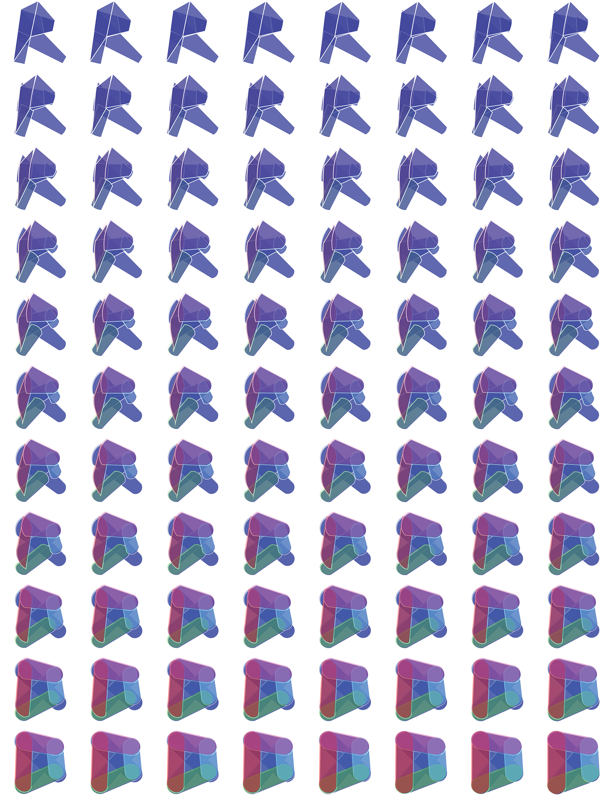

# Dynamo for Revit

While Dynamo is a flexible environment, designed to port into a wide range of programs, it was originally created for use with Revit.  A visual program creates robust options for a Building Information Model (BIM).  Dynamo offers a whole suite of nodes specifically designed for Revit, as well as third-party libraries from a thriving AEC community.  This chapter focuses on the basics of using Dynamo in Revit.

