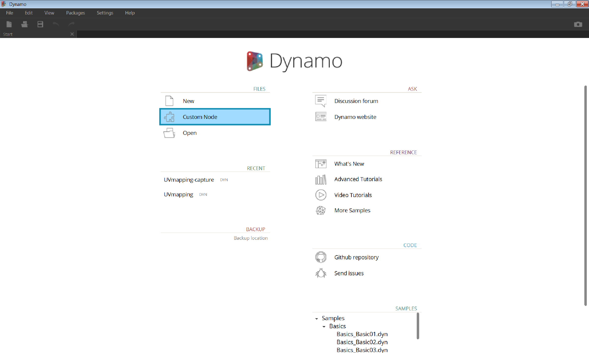
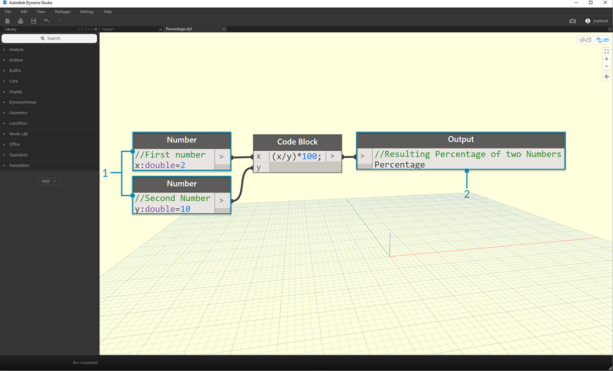

## Custom Nodes
Dynamo has a large assortment of core nodes that you can rely on to build pretty much any graph you need, but sometimes a quicker, more elegant, and more easily shared solution is to build your own nodes. These can be reused among different projects, they make your program clearer and cleaner, and they can be pushed to the package manager and shared.

Custom Nodes are constructed by nesting other nodes and custom nodes inside of a container. When this container node is executed in your graph, everything inside it will be executed.  This can help make your graph clearer and cleaner, as well as allow you to reuse and share a useful combination of nodes.

###Cleaning up Your Graph
###Adapting to Change
###Worksharing

### Custom Node Environment

> To create a Custom Node from scratch, Launch Dynamo and select Custom Node, or type Ctrl + Shift + N from the canvas.

> Assign a name, description, and category in the Custom Node Properties dialog.

> This will open a canvas with a yellow background, indicating that you are working inside of a custom node. In this canvas you have access to all of the core Dynamo nodes, as well as the **Input** and **Output** nodes.

> 1. **Inputs:** input nodes create input ports on the custom node. The syntax for an input node is *input name : datatype = default value(optional)*
2. **Outputs:** Similar to inputs, these will create output ports on the custom node.

> You can save this custom node as a .dyf file and add it to your library under  *File > Import Library*

