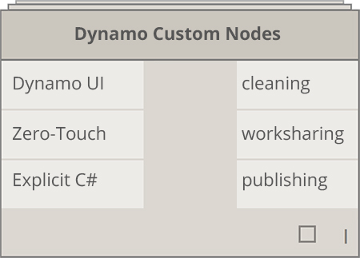
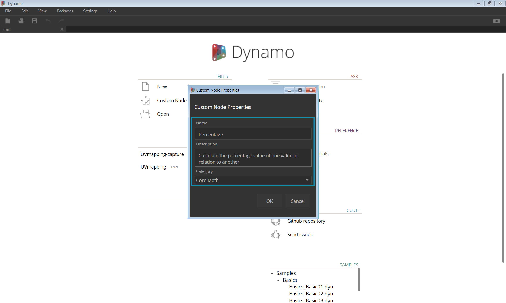
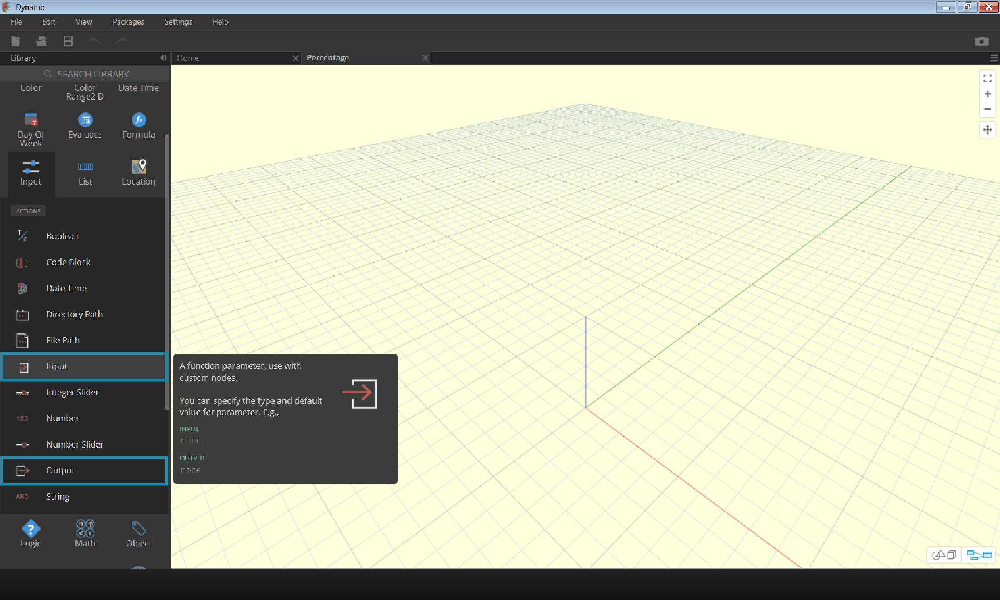

## Custom Nodes
Dynamo offers many core nodes for a wide-range of visual programming tasks. Sometimes a quicker, more elegant, or more easily shared solution is to build your own nodes. These can be reused among different projects, they make your graph clearer and cleaner, and they can be pushed to the package manager and shared with the global Dynamo community.

###Cleaning up Your Graph

Custom Nodes are constructed by nesting other nodes and custom nodes inside of a "Dynamo Custom Node," which we can think of conceptually as a container. When this container node is executed in your graph, everything inside it will be executed to allow you to reuse and share a useful combination of nodes.

###Adapting to Change
When you have multiple copies of a custom node in your graph, you can update all of them by editing the base custom node. This allows you to update your graph seamlessly by adapting to any changes that may occur in workflow or design.

###Work Sharing
Arguably the best feature of custom nodes is their work sharing capabilities. If a "power user" creates a complex Dynamo graph and hands it off to a designer who is new to Dynamo, he/she can condense the graph to the bare essentials for design interaction.  The custom node can be opened to edit the internal graph, but the "container" can be kept simple.  With this process, custom nodes allow Dynamo users to design a graph that is clean and intuitive.

###Many Ways to Build a Node
There are a wide variety of ways to build custom nodes in Dynamo. In the examples in this chapter, we'll create custom nodes directly from the Dynamo UI.  If you are a programmer and you are interested in C# or Zero-Touch formatting, you can reference [this page ](https://github.com/DynamoDS/Dynamo/wiki/How-To-Create-Your-Own-Nodes)on the Dynamo Wiki for a more in-depth review.

### Custom Node Environment
Let's jump into the custom node environment and make a simple node to calculate a percentage.  The custom node environment is different from the Dynamo graph environment, but the interaction is fundamentally the same. With that said, let's create our first custom node!

> To create a Custom Node from scratch, Launch Dynamo and select Custom Node, or type Ctrl + Shift + N from the canvas.

> Assign a name, description, and category in the Custom Node Properties dialog.
1. **Name:** Percentage
2. **Description**: Calculate the percentage of one value in relation to another.
3. **Category:** Core.Math

> This will open a canvas with a yellow background, indicating that you are working inside a custom node. In this canvas you have access to all of the core Dynamo nodes, as well as the **Input** and **Output** nodes, which label the data flowing into and out of the custom node.  They can be found in *Core>Input*.

> 1. **Inputs:** input nodes create input ports on the custom node. The syntax for an input node is *input_name : datatype = default_value(optional)*
2. **Outputs:** Similar to inputs, these will create and name output ports on the custom node.

You can save this custom node as a .dyf (as opposed to the standard .dyn) file and it will automatically be added to your session and future sessions. You will find the custom node in your library in the category that is specified in the custom node's properties.

> Left: The Core > Math category of the default library
Right: Core > Math with the new custom node

###Moving Forward
Now that we've created our first custom node, the next sections will dive deeper into custom node functionality and how to publish generic workflows.  In the following section, we'll look at developing a custom node that transfers geometry from one surface to another.
