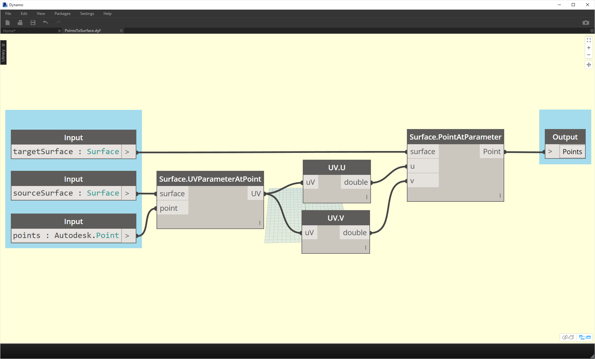
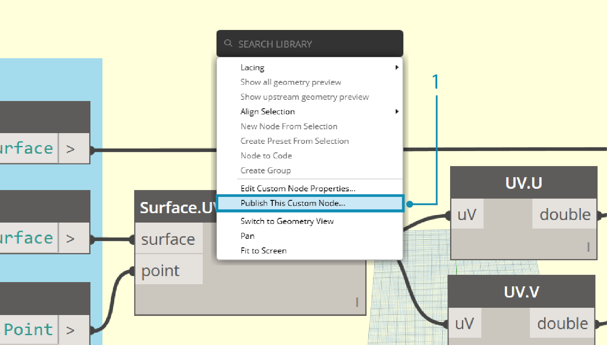
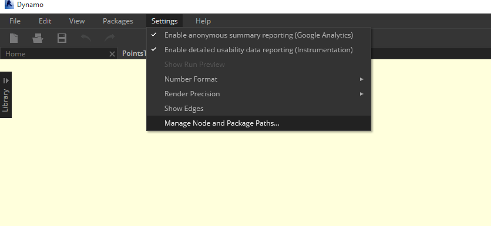
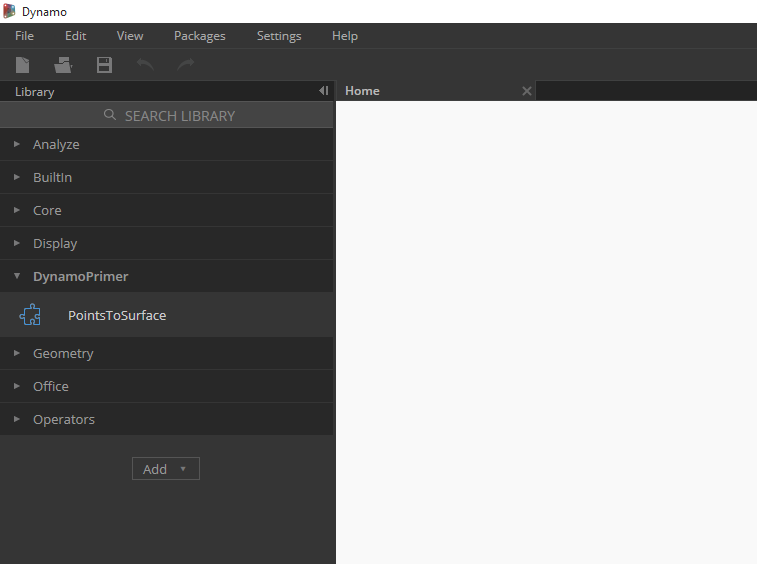

##Adding to Your Library
We've just created a custom node and applied it to a specific process in our Dynamo graph. And we like this node so much, we want to keep it in our Dynamo library to reference in other graphs. To do this, we'll publish the node locally. This is a similar process to publishing a package, which we'll walk through in more detail in the next chapter.

###Publishing a Custom Node Locally
Let's move forward with the custom node that we created in the previous section. By publishing a node locally, the node will be accessible in your Dynamo library when you open a new session. Without publishing a node, a Dynamo graph which references a custom node must also have that custom node in its folder (or the custom node must be imported into Dynamo using *File>Import Library*).

>Download the example file that accompanies this exercise (Right click and "Save Link As..."). A full list of example files can be found in the Appendix. [PointsToSurface.dyf](datasets/9-3/PointsToSurface.dyf)

> After opening the PointsToSurface custom node, we see the graph above in the Dynamo Custom Node Editor.  You can also open up a custom node by double clicking on it in the Dynamo Graph Editor.

> 1. To Publish a custom node locally, simply right click on the canvas and select *"Publish This Custom Node..."*

> Fill out the relevant information similar to the image above and select *"Publish Locally".*.  Note that the Group field defines the main element accessible from the Dynamo menu.

> Choose a folder to house all of the custom nodes that you plan on publishing locally. Dynamo will check this folder each time it loads, so make sure the folder is in a permanent place.  Navigate to this folder and choose *"Select Folder".* Your Dynamo node is now published locally, and will remain in your Dynamo Toolbar each time you load the program!

> 1. To check on the custom node folder location, go to *Settings > Manage Node and Package Paths...*

> In this window we see two paths: *AppData\Roaming\Dynamo...* refers to the default location of Dynamo Packages installed online. *Documents\DynamoCustomNodes...* refers to the location of custom nodes we've published locally. *
1. You may want to move your local folder path down in the list order above (by selecting the folder path and clicking on the down arrow to the left of the path names).  The top folder is the default path for package installs.  So by keeping the default Dynamo package install path as the default folder, online packages will be separated from your locally published nodes.*

> We switched the order of the path names in order to have Dynamo's default path as the package install location.

> Navigating to this local folder, we can find the original custom node in the *".dyf"* folder, which is the extension for a Dynamo Custom Node file.  We can edit the file in this folder and the node will update in the UI. We can also add more nodes to the main *DynamoCustomNode* folder and Dynamo will add them to your library at restart!

> Dynamo will now load each time with *"PointsToSurface"* in the *"DynamoPrimer"* group of your Dynamo library.