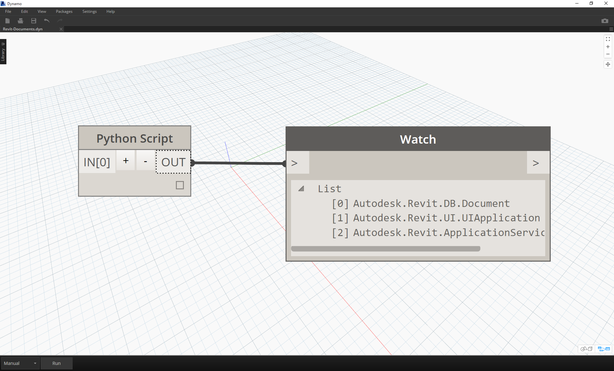
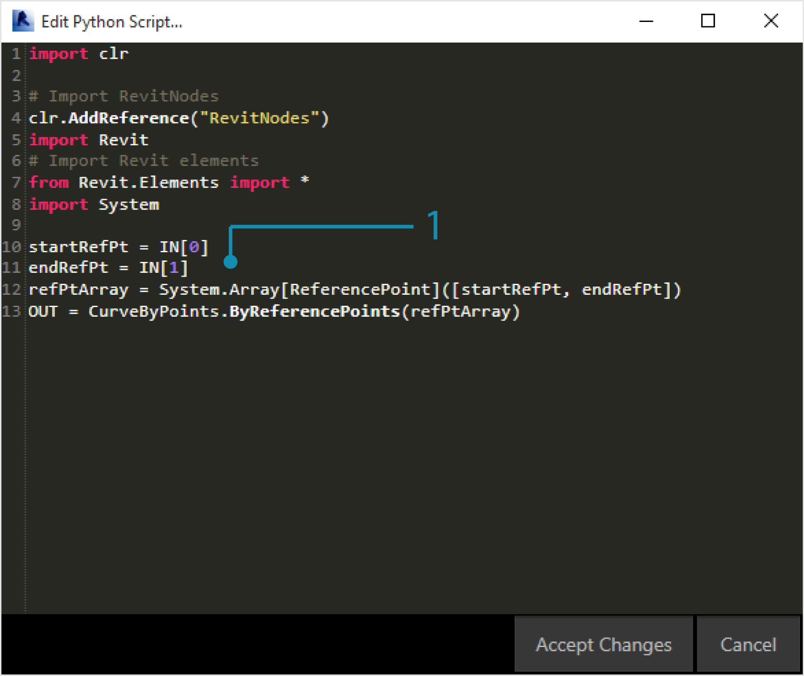
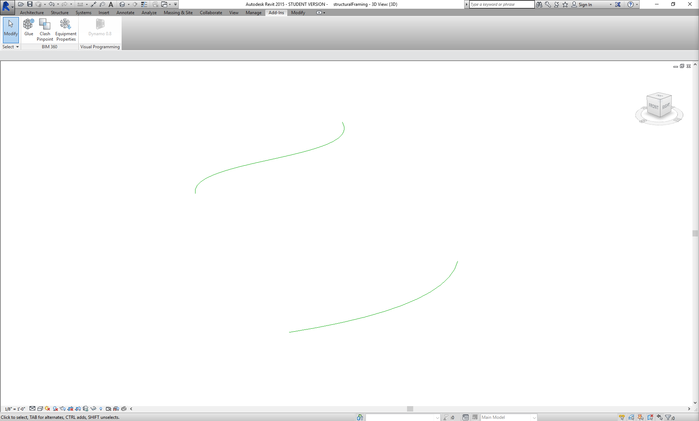
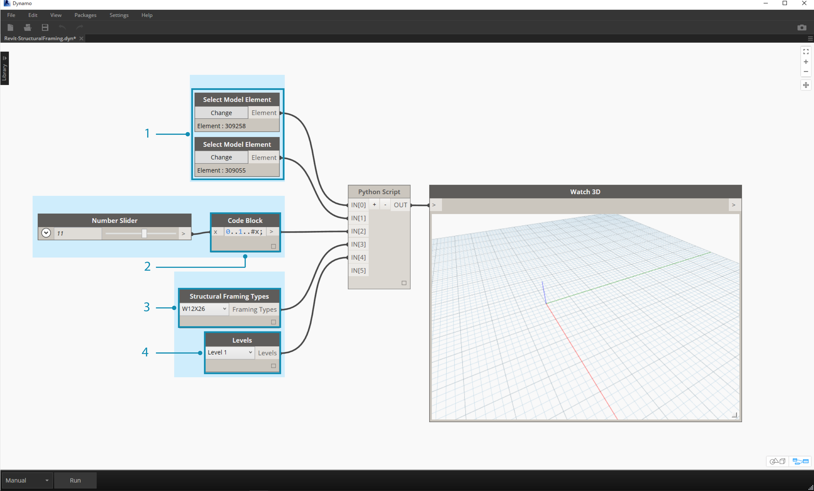
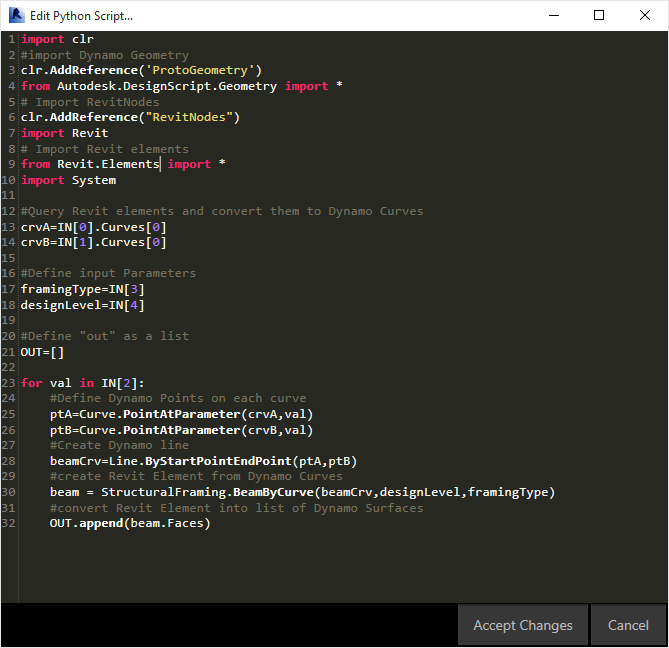
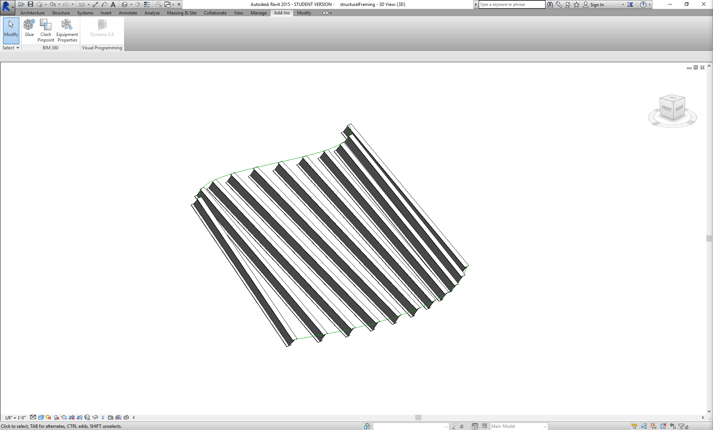
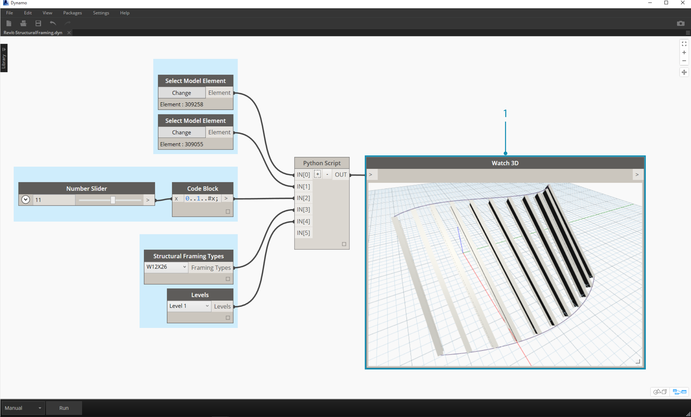
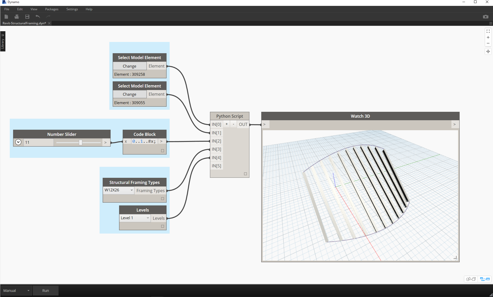

In this example, we will write a python script that creates patterns from a solid module, and turn it into a custom node.
First, let’s create our solid module using Dynamo nodes. 
[image1]

> 1.	Rectangle.ByWidthLength: Create a rectangle that will be the base of our solid
2.	Surface.ByPatch: Connect the rectangle to the ‘closedCurve’ input to create the bottom surface

[image2]
>1.	Geometry.Translate: Connect the rectangle to the ‘geometry’ input to move it up, using a code block to specify the base thickness of our solid
2.	Polygon.Points: Query the translated rectangle to extract the corner points
3.	Geometry.Translate: Use a code block to create a list of four values corresponding to the four points, translating one corner of the solid up
4.	Polygon.ByPoints: Use the translated points to reconstruct the top polygon
5.	Surface.ByPatch: Connect the polygon to create the top surface
Now that we have our top and bottom surfaces, let’s loft between the two profiles to create the sides of the solid.

[image3]
>1.	List.Create: Connect the bottom rectangle and the top polygon to the index inputs
2.	Surface.ByLoft: Loft the two profiles to create the sides of the solid
3.	List.Create: Connect the top, side, and bottom surfaces to the index inputs to create a list of surfaces
4.	Solid.ByJoinedSurfaces: Join the surfaces to create the solid module

Now that we have our solid, let’s drop a Python Script node onto the canvas. Double click the node to open the python editor.
[image4]
> The default content of the script editor imports the Autodesk.DesignScript.Geometry library, and defines the input (IN) and output (OUT) of the node. Note that the node can accept multiple inputs that will be stored as a list, while only one output can be specified.

[image5]
> To add additional inputs to the node, close the editor and click the + icon on the node. The inputs are named IN[0], IN[1], etc. to indicate that they represent items in a list.

Let’s start by defining our inputs and output. 

[image]
```
#The solid module to be arrayed
solid = IN[0]
#A number that determines which rotation pattern to use
seed = IN[1]
#The number of solids to array in the X and Y axes
xCount = IN[2]
yCount = IN[3]

#Create an empty list for the arrayed solids
solids = []

#Assign your output to the OUT variable.
OUT = solids
```

Next we need to think about what information is required in order to array our solid module. First, we will need to know the dimensions of the solid to determine the translation distance. Due to a bounding box bug, we will have to use the edge curve geometry to create a bounding box.

```
# Create an empty list for the edge curves
crvs = []

#Get edges and convert to curve geometry 
edges = solid.Edges

#Loop through edges and append corresponding curve geometry to the list
for edge in edges:
	crvs.append(edge.CurveGeometry)
	
#Get the bounding box of the curves
bbox = BoundingBox.ByGeometry(crvs)

#Get the X and Y translation distance based on the bounding box
yDist = bbox.MaxPoint.Y-bbox.MinPoint.Y
xDist = bbox.MaxPoint.X-bbox.MinPoint.X
```

Since we will be both translating and rotating the solid modules, let’s use the Geometry.Transform operation. By looking at the Geometry.Transform node, we know that we will need a source coordinate system and a target coordinate system to transform the solid. The source is the context coordinate system of our solid, while the target will be a different coordinate system for each arrayed module. That means we will have to loop through the x and y values to transform the coordinate system differently each time. See the commented code below:

```
#create number ranges for X and Y
xRange = list(range(xCount))
yRange = list(range(yCount))

#get the source coordinate system
fromCoord = solid.ContextCoordinateSystem
 
#Loop through X and Y
for i in xRange:
	for j in yRange:
		#Rotate and translate the coordinate system
		toCoord = fromCoord.Rotate(solid.ContextCoordinateSystem.Origin,Vector.ByCoordinates(0,0,1),(90*(i+j%seed)))
		vec = Vector.ByCoordinates((xDist*i),(yDist*j),0)
		toCoord = toCoord.Translate(vec)
		#Transform the solid from the source coordinate system to the target coordinate system and append to the list
		solids.append(solid.Transform(fromCoord,toCoord))
```

[image]

> Save the Python script by clicking ‘Accept Changes’ and plug the input values into the node. You should see a pattern of solids.

[image]

> Try changing the seed value to create different patterns. 

[image]

> You can also change the parameters of the solid module itself for different effects.

Now that we have created a useful python script, let’s save it as a custom node. Select the python script node, right-click and select ‘New Node From Selection.’ 

[Image]

> Assign a name, description, and category.

This will open a new canvas in which to edit the custom node. 

[Image]

> 1. Inputs: Change the input names to be more descriptive and add data types and default values. 
2.	Output: Change the output name
Save the node as a .dyf file

[Image]

> The custom node reflects the changes we just made.


### Exercise 01
>Create a new Revit Project.  Download the example file that accompanies this exercise (Right click and "Save Link As..."). A full list of example files can be found in the Appendix. 

In these exercises, we'll explore elementary Python scripts in Dynamo for Revit.  The exercise will focus on dealing with Revit files and elements, as well as the communication between Revit and Dynamo.


> This is a cut and dry method for retrieving the *doc*, *uiapp*, and *app* of the Revit file linked to your Dynamo sesson.  Programmers who have worked in the Revit API before may notice the items in the watch list.  If these items do not look familiar, that's ok, we'll be using other examples in the exercises below.  

Here is how we're importing Revit Services and retrieving the document data in Dynamo:

> A look at the Python node in Dynamo. The commented code is below.

```
import clr
# Import DocumentManager
clr.AddReference("RevitServices")
import RevitServices
from RevitServices.Persistence import DocumentManager

doc = DocumentManager.Instance.CurrentDBDocument
uiapp = DocumentManager.Instance.CurrentUIApplication
app = uiapp.Application

#Assign your output to the OUT variable
#OUT is defined as a list of three items
OUT=[doc,uiapp,app]
```


### Exercise 02
>Create a new Revit Family - Conceptual Mass. Download the example file that accompanies this exercise (Right click and "Save Link As..."). A full list of example files can be found in the Appendix. 

In this exercise, we'll make a simple Model Curve in Revit using the Dynamo Python node.  


> Begin with the set of nodes in the image above.  We'll first create two reference point in Revit from Dynamo nodes. 
1. **Important note - when performing Revit operations, be certain that the run mode has been set to "Manual". Otherwise the program will crash.**
2. Create a code block and give it a value of "0;"
3. Plug this value into a ReferencePoint.ByCoordinates node for X,Y, and Z inputs.
4. Create three sliders, ranging from -100 to 100 with a step size of 1.
5. Connect each slider to a ReferencePoint.ByCoordinates node.
6. Add a Python node to the canvas, click the "+" button on the node to add another input and plug the two references points into each input.  Open the Python node.


> A look at the Python node in Dynamo. The commented code is below.
1. **System.Array:** Revit needs a System Array as an input (rather than a Python list). This is just one more line of code, but paying attention to argument types will facilitate Python programming in Revit.

```
import clr

# Import RevitNodes
clr.AddReference("RevitNodes")
import Revit
# Import Revit elements
from Revit.Elements import *
import System

#define inputs
startRefPt = IN[0]
endRefPt = IN[1]

#define system array to match with required inputs
refPtArray = System.Array[ReferencePoint]([startRefPt, endRefPt])
#create curve by reference points in Revit
OUT = CurveByPoints.ByReferencePoints(refPtArray)

```

### Exercise 03
>This exercise remains simple, but drives home the topics of connecting data and geometry from Revit to Dynamo and back.  Let's begin by opening Revit-StructuralFraming.rvt. Once opened, load Dynamo and open the file Revit-StructuralFraming.dyn.


> This Revit file is about as basic as it gets. To reference curves, one drawn on Level 1 and the other drawn on Level 2. We want to get these curves into Dynamo and maintain a live link.  


> In this file we have a set of nodes plugging into five inputs of a Python node.  
1. **Select Model Element Nodes:** Hit the select button for each and select a corresponding curve in Revit.
2. **Code Block:** using the syntax *"0..1..#x;"*, connect an integer slider ranging from 0 to 20 into the *x* input.  This designates the number of beams to draw between the two curves.
3. **Structural Framing Types:** We'll choose the default W12x26 beam here from the dropdown menu.  
4. **Levels:** select "Level 1".


> This code in Python is a little more dense, but the comments within the code describe what's happening the process:

```
import clr
#import Dynamo Geometry
clr.AddReference('ProtoGeometry')
from Autodesk.DesignScript.Geometry import *
# Import RevitNodes
clr.AddReference("RevitNodes")
import Revit
# Import Revit elements
from Revit.Elements import *
import System

#Query Revit elements and convert them to Dynamo Curves
crvA=IN[0].Curves[0]
crvB=IN[1].Curves[0]

#Define input Parameters
framingType=IN[3]
designLevel=IN[4]

#Define "out" as a list
OUT=[]

for val in IN[2]:
	#Define Dynamo Points on each curve
	ptA=Curve.PointAtParameter(crvA,val)
	ptB=Curve.PointAtParameter(crvB,val)
	#Create Dynamo line
	beamCrv=Line.ByStartPointEndPoint(ptA,ptB)
	#create Revit Element from Dynamo Curves
	beam = StructuralFraming.BeamByCurve(beamCrv,designLevel,framingType)
	#convert Revit Element into list of Dynamo Surfaces
	OUT.append(beam.Faces)

```

> In Revit, we have an array of beams spanning the two curves as structural elements. Note: this isn't a realistic example...the structural elements are used as an example for native Revit instances created from Dynamo.

> In Dynamo, we can see the results as well. The beams in the Watch3D node refer to the geometry queried from the Revit elements.

Notice that we have a continuous process of translating data from the Revit Environment to the Dynamo Environment. In summary, here's how the process plays out:

1. Select Revit element
2. Convert Revit element to Dynamo Curve
3. Divide Dynamo curve into a series of Dynamo points
4. Use the Dynamo points between two curves to create Dynamo lines
5. Create Revit beams by referencing Dynamo lines
6. Output Dynamo surfaces by querying the geometry of Revit beams

This may sound a little heavy handed, but the script makes it as simple as editing the curve in Revit and re-running the solver (although you may have to delete the previous beams when doing so).


> With an update to the refernce curves in Revit, we get a new array of beams.
