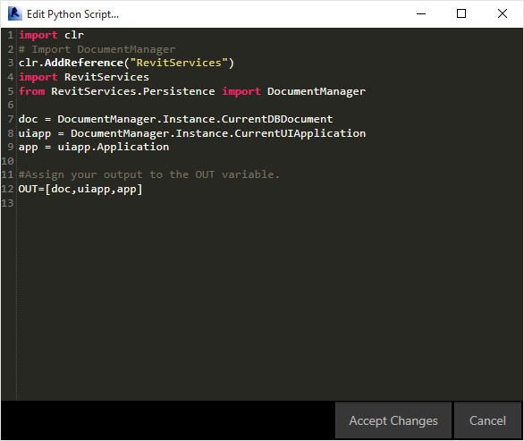
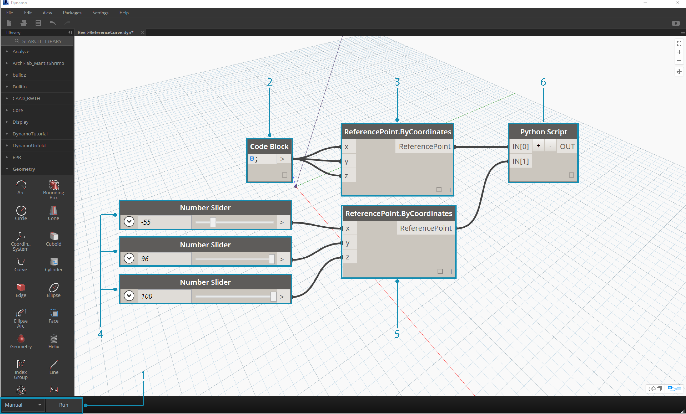

### Exercise 01
>Create a new Revit Project.  Download the example file that accompanies this exercise (Right click and "Save Link As..."). A full list of example files can be found in the Appendix. 

In these exercises, we'll explore elementary Python scripts in Dynamo for Revit.  The exercise will focus on dealing with Revit files and elements, as well as the communication between Revit and Dynamo.


> This is a cut and dry method for retrieving the *doc*, *uiapp*, and *app* of the Revit file linked to your Dynamo sesson.  Programmers who have worked in the Revit API before may notice the items in the watch list.  If these items do not look familiar, that's ok, we'll be using other examples in the exercises below.  

Here is how we're importing Revit Services and retrieving the document data in Dynamo:

> A look at the Python node in Dynamo. The commented code is below.

```
import clr
# Import DocumentManager
clr.AddReference("RevitServices")
import RevitServices
from RevitServices.Persistence import DocumentManager

doc = DocumentManager.Instance.CurrentDBDocument
uiapp = DocumentManager.Instance.CurrentUIApplication
app = uiapp.Application

#Assign your output to the OUT variable
#OUT is defined as a list of three items
OUT=[doc,uiapp,app]
```


### Exercise 02
>Create a new Revit Family - Conceptual Mass. Download the example file that accompanies this exercise (Right click and "Save Link As..."). A full list of example files can be found in the Appendix. 

In this exercise, we'll make a simple Model Curve in Revit using the Dynamo Python node.  


> Begin with the set of nodes in the image above.  We'll first create two reference point in Revit from Dynamo nodes. 
1. **Important note - when performing Revit operations, be certain that the run mode has been set to "Manual". Otherwise the program will crash.**
2. Create a code block and give it a value of "0;"
3. Plug this value into a ReferencePoint.ByCoordinates node for X,Y, and Z inputs.
4. Create three sliders, ranging from -100 to 100 with a step size of 1.
5. Connect each slider to a ReferencePoint.ByCoordinates node.
6. Add a Python node to the canvas, click the "+" button on the node to add another input and plug the two references points into each input.  Open the Python node.


> A look at the Python node in Dynamo. The commented code is below.
1. **System.Array:** Revit needs a System Array as an input (rather than a Python list). This is just one more line of code, but paying attention to argument types will facilitate Python programming in Revit.

```
import clr

# Import RevitNodes
clr.AddReference("RevitNodes")
import Revit
# Import Revit elements
from Revit.Elements import *
import System

#define inputs
startRefPt = IN[0]
endRefPt = IN[1]

#define system array to match with required inputs
refPtArray = System.Array[ReferencePoint]([startRefPt, endRefPt])
#create curve by reference points in Revit
OUT = CurveByPoints.ByReferencePoints(refPtArray)

```
