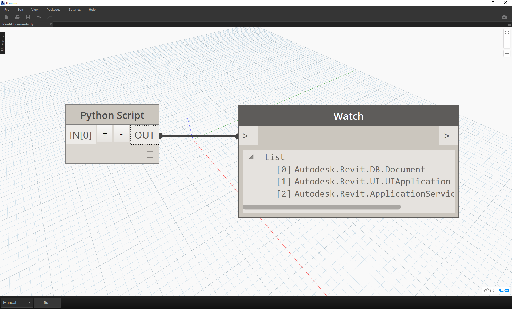
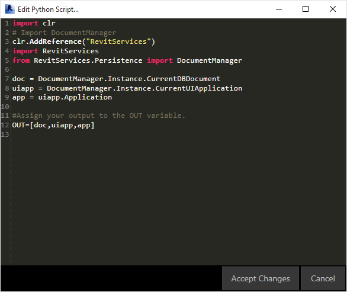
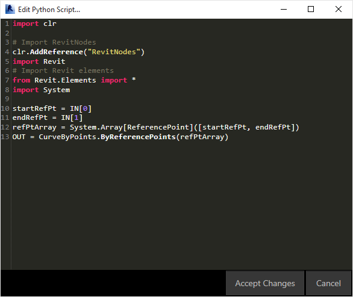
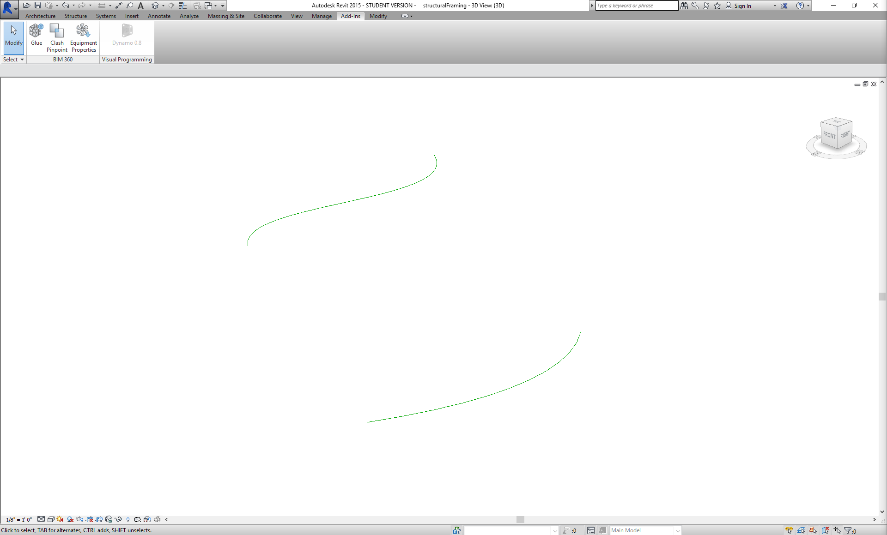
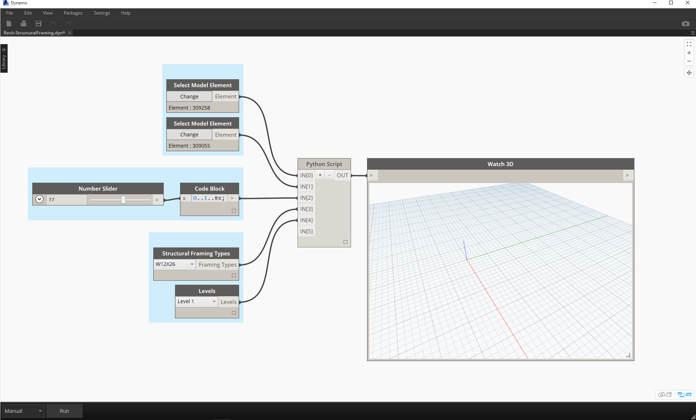
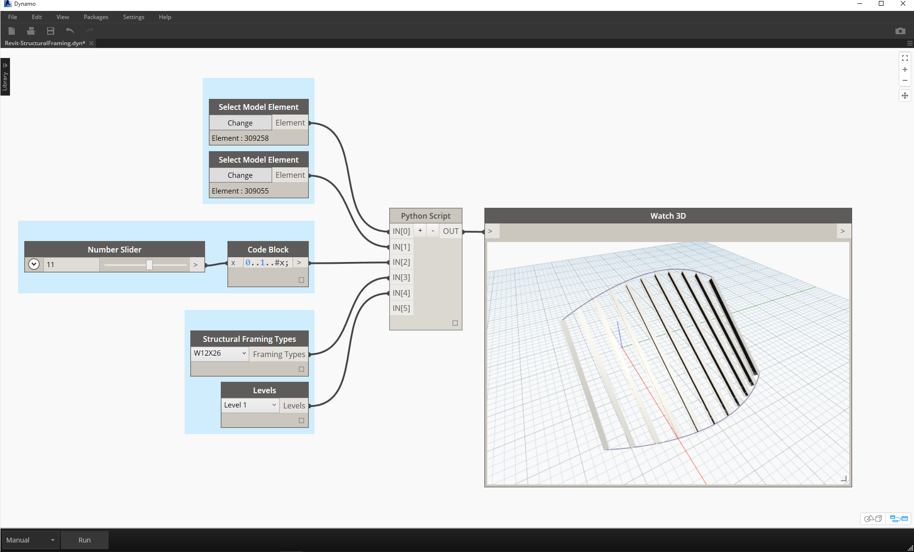

<style>
img{display:block;margin-left: auto;   margin-right: auto }
</style>

##Python and Revit

Now that we've demonstrated how to use Python scripts in Dynamo, let's take a look at connecting Revit libraries into the scripting environment. Remember, we imported our Dynamo core nodes with the first three lines in the block of code below.  To import the Revit nodes, Revit elements, and the Revit document manager, we only have to add a few more lines:

```
import clr
clr.AddReference('ProtoGeometry')
from Autodesk.DesignScript.Geometry import *

# Import RevitNodes
clr.AddReference("RevitNodes")
import Revit

# Import Revit elements
from Revit.Elements import *

# Import DocumentManager
clr.AddReference("RevitServices")
import RevitServices
from RevitServices.Persistence import DocumentManager

import System
```

This gives us access to the Revit API and offers custom scripting for any Revit task.  By combining the process of visual programming with Revit API scripting, collaboration and tool development improve significantly.  For example, a BIM manager and a schematic designer can work together on the same graph.  In this collaboration, they can improve design and execution of the model.


###Platform Specific APIs

The plan behind the Dynamo Project is to widen the scope of platform implementation.  As Dynamo adds more programs to the docket, users will gain access to platform-specific APIs from the Python scripting environment.  While Revit is the case study for this section, we can anticipate more chapters in the future which offer comprehensive tutorials on scripting in other platforms.  Additionally, there are many [IronPython](http://ironpython.net/) libraries accessible now which can be imported into Dynamo!

The examples below demonstrate ways to implement Revit-specific operations from Dynamo using Python. For a more detailed review on Python's relationship to Dynamo and Revit, refer to the [Dynamo Wiki page](https://github.com/DynamoDS/Dynamo/wiki/Python-0.6.3-to-0.7.x-Migration). Another useful resource for Python and Revit is the [Revit Python Shell ](https://github.com/architecture-building-systems/revitpythonshell) Project.

### Exercise 01
>Create a new Revit Project.  Download the example file that accompanies this exercise (Right click and "Save Link As..."). A full list of example files can be found in the Appendix. [Revit-Doc.dyn](datasets/9-5/Revit-Doc.dyn)

In these exercises, we'll explore elementary Python scripts in Dynamo for Revit.  The exercise will focus on dealing with Revit files and elements, as well as the communication between Revit and Dynamo.


> This is a cut and dry method for retrieving the *doc*, *uiapp*, and *app* of the Revit file linked to your Dynamo sesson.  Programmers who have worked in the Revit API before may notice the items in the watch list.  If these items do not look familiar, that's okay; we'll be using other examples in the exercises below.

Here is how we're importing Revit Services and retrieving the document data in Dynamo:

> A look at the Python node in Dynamo. The commented code is below.

```
import clr
# Import DocumentManager
clr.AddReference("RevitServices")
import RevitServices
from RevitServices.Persistence import DocumentManager

doc = DocumentManager.Instance.CurrentDBDocument
uiapp = DocumentManager.Instance.CurrentUIApplication
app = uiapp.Application

#Assign your output to the OUT variable
#OUT is defined as a list of three items
OUT=[doc,uiapp,app]
```


### Exercise 02
>Download the example files that accompanies this exercise (Right click and "Save Link As..."). A full list of example files can be found in the Appendix. [Revit-ReferenceCurve.dyn](datasets/9-5/Revit-ReferenceCurve.dyn)

In this exercise, we'll make a simple Model Curve in Revit using the Dynamo Python node.


> Begin with the set of nodes in the image above.  We'll first create two reference points in Revit from Dynamo nodes.

> Begin by creating a new Conceptual Mass family in Revit. Launch Dynamo and create the set of nodes in the image above.  We'll first create two reference point in Revit from Dynamo nodes.
1. **Important note - when performing Revit operations, be certain that the run mode has been set to "Manual". Otherwise the program will crash.**
2. Create a code block and give it a value of "0;".
3. Plug this value into a ReferencePoint.ByCoordinates node for X,Y, and Z inputs.
4. Create three sliders, ranging from -100 to 100 with a step size of 1.
5. Connect each slider to a ReferencePoint.ByCoordinates node.
6. Add a Python node to the workspace, click the "+" button on the node to add another input and plug the two references points into each input.  Open the Python node.


> A look at the Python node in Dynamo. The commented code is below.
1. **System.Array:** Revit needs a System Array as an input (rather than a Python list). This is just one more line of code, but paying attention to argument types will facilitate Python programming in Revit.

```
import clr

# Import RevitNodes
clr.AddReference("RevitNodes")
import Revit
# Import Revit elements
from Revit.Elements import *
import System

#define inputs
startRefPt = IN[0]
endRefPt = IN[1]

#define system array to match with required inputs
refPtArray = System.Array[ReferencePoint]([startRefPt, endRefPt])
#create curve by reference points in Revit
OUT = CurveByPoints.ByReferencePoints(refPtArray)

```


> From Dynamo, we've created two reference points with a line connecting them using Python. Let's take this a little further in the next exercise.

### Exercise 03
>Download and unzip the example files that accompany this exercise (Right click and "Save Link As..."). A full list of example files can be found in the Appendix. [Revit-StructuralFraming.zip](datasets/9-5/Revit-StructuralFraming.zip)

>This exercise keeps it simple, but drives home the topics of connecting data and geometry from Revit to Dynamo and back.  Let's begin by opening Revit-StructuralFraming.rvt. Once opened, load Dynamo and open the file Revit-StructuralFraming.dyn.


> This Revit file is about as basic as it gets. Two reference curves: one drawn on Level 1 and the other drawn on Level 2. We want to get these curves into Dynamo and maintain a live link.


> In this file we have a set of nodes plugging into five inputs of a Python node.
1. **Select Model Element Nodes:** Hit the select button for each and select a corresponding curve in Revit.
2. **Code Block:** using the syntax *"0..1..#x;"*, connect an integer slider ranging from 0 to 20 into the *x* input.  This designates the number of beams to draw between the two curves.
3. **Structural Framing Types:** We'll choose the default W12x26 beam here from the dropdown menu.
4. **Levels:** select "Level 1".


> This code in Python is a little more dense, but the comments within the code describe what's happening in the process:

```
import clr
#import Dynamo Geometry
clr.AddReference('ProtoGeometry')
from Autodesk.DesignScript.Geometry import *
# Import RevitNodes
clr.AddReference("RevitNodes")
import Revit
# Import Revit elements
from Revit.Elements import *
import System

#Query Revit elements and convert them to Dynamo Curves
crvA=IN[0].Curves[0]
crvB=IN[1].Curves[0]

#Define input Parameters
framingType=IN[3]
designLevel=IN[4]

#Define "out" as a list
OUT=[]

for val in IN[2]:
	#Define Dynamo Points on each curve
	ptA=Curve.PointAtParameter(crvA,val)
	ptB=Curve.PointAtParameter(crvB,val)
	#Create Dynamo line
	beamCrv=Line.ByStartPointEndPoint(ptA,ptB)
	#create Revit Element from Dynamo Curves
	beam = StructuralFraming.BeamByCurve(beamCrv,designLevel,framingType)
	#convert Revit Element into list of Dynamo Surfaces
	OUT.append(beam.Faces)

```

> In Revit, we have an array of beams spanning the two curves as structural elements. Note: this isn't a realistic example...the structural elements are used as an example for native Revit instances created from Dynamo.

> In Dynamo, we can see the results as well. The beams in the Watch3D node refer to the geometry queried from the Revit elements.

Notice that we have a continuous process of translating data from the Revit Environment to the Dynamo Environment. In summary, here's how the process plays out:

1. Select Revit element
2. Convert Revit element to Dynamo Curve
3. Divide Dynamo curve into a series of Dynamo points
4. Use the Dynamo points between two curves to create Dynamo lines
5. Create Revit beams by referencing Dynamo lines
6. Output Dynamo surfaces by querying the geometry of Revit beams

This may sound a little heavy handed, but the script makes it as simple as editing the curve in Revit and re-running the solver (although you may have to delete the previous beams when doing so).


> With an update to the reference curves in Revit, we get a new array of beams.
