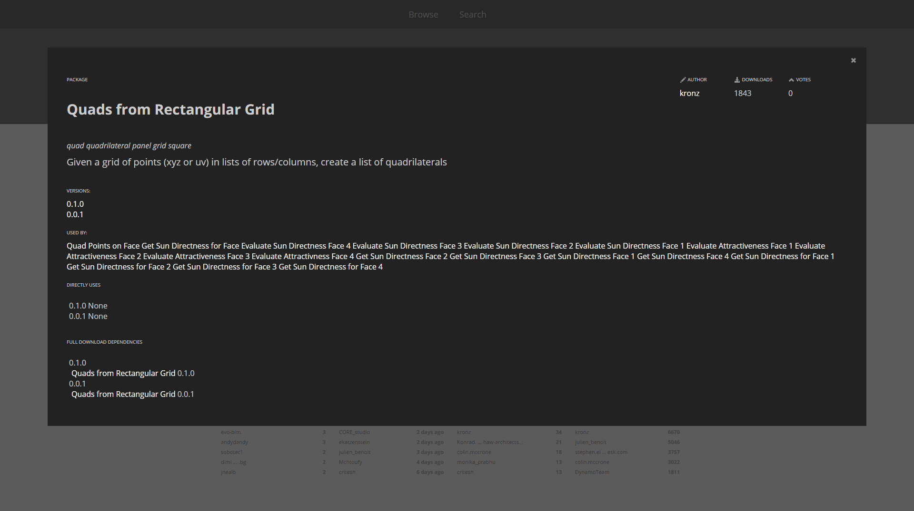

##Packages
###What is a package?
###Package Manager
####Versioning and Dependencies between Packages
####Sample Files in the *"extra"* folder
####Where are Files Stored Locally?
http://dynamobim.com/files-folders/

Packages>Manage Packages>Show Root Directory...

