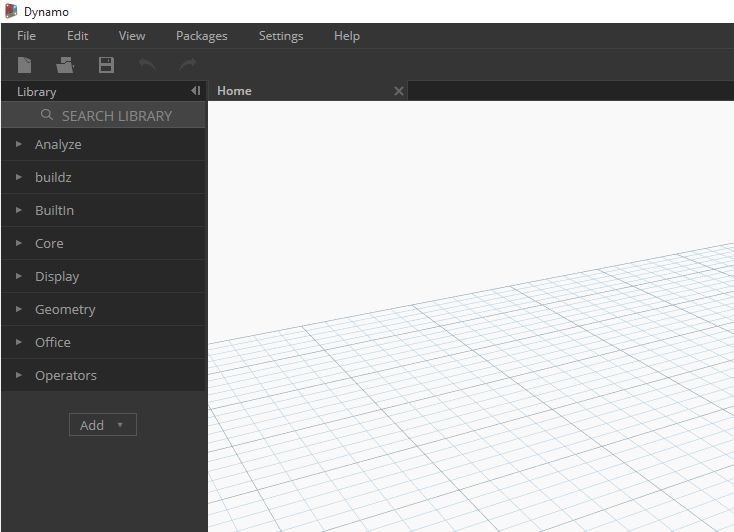

##Packages
In short, a package is a collection of custom nodes. The Dynamo Package Manager is a portal for the community to download any package which has been published online.  These toolsets are usually developed by third parties in order to extend Dynamo's core functionality, accessible to all and ready to download at the click of the button! 

An open-source project such as Dynamo thrives on this type of community involvement.  With dedicated third party developers, Dynamo is able to extend its reach to workflows in a range of industries.  For these reasons, the Dynamo team has made concerted efforts to streamline package development and publishing (which will be discussed in more detail in the following sections).  

###Installing a Package

###Introduction to the Package Manager
####Versioning and Dependencies between Packages
####Sample Files in the *"extra"* folder
####Where are Files Stored Locally?
http://dynamobim.com/files-folders/

Packages>Manage Packages>Show Root Directory...

