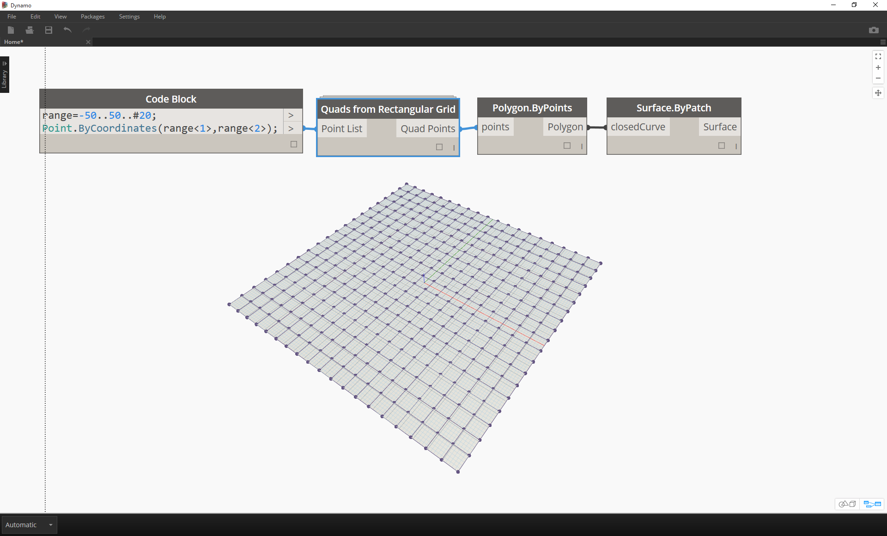

##Packages
In short, a package is a collection of custom nodes. The Dynamo Package Manager is a portal for the community to download any package which has been published online.  These toolsets are usually developed by third parties in order to extend Dynamo's core functionality, accessible to all and ready to download at the click of the button! 

An open-source project such as Dynamo thrives on this type of community involvement.  With dedicated third party developers, Dynamo is able to extend its reach to workflows in a range of industries.  For these reasons, the Dynamo team has made concerted efforts to streamline package development and publishing (which will be discussed in more detail in the following sections).  

###Installing a Package
The easiest way to install a package is by using the Packages toolbar in your Dynamo interface.  Let's jump right into it and install one now.  In this quick example, we'll install a popular package for creating quad panels on a grid.

>1. In Dynamo, go to *Packages>Search For a Package...*

> In the search bar, let's search for "quads from rectangular grid".  After a few moments, you should see all of the packages which match this search query. We want to select the first package with the matching name.
1. Click on the download arrow to the left of the package name and the package will install. Done!

>1. Notice that we now have another group in our Dynamo library called *"buildz"*. This name refers to the [developer](http://buildz.blogspot.com/) of the package, and the custom node is placed in this group. We can begin to use this right away. 

> With a quick code block operation to define a rectangular grid, we've create a list of rectangular panels.

###Package Folders
The example above focuses on a package with one custom node, but you use the same process for downloading packages with several custom nodes and supporting data files.  Let's demonstrate that down with a more comprehensive package: Dynamo Unfold.

> As in the example above, begin by selecting *Package>Search for a Package...*.  This time, we'll search for *"DynamoUnfold"*, one word, minding the caps.

####Sample Files in the *"extra"* folder

###Introduction to the Package Manager
####Versioning and Dependencies between Packages

####Where are Files Stored Locally?
http://dynamobim.com/files-folders/

Packages>Manage Packages>Show Root Directory...

