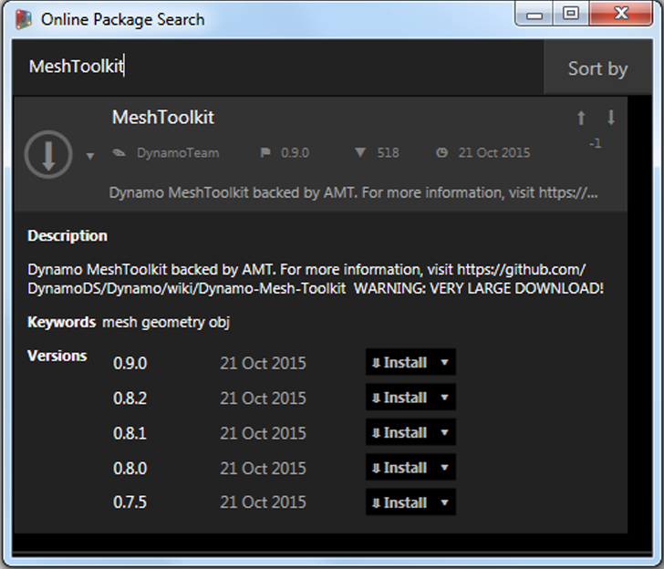
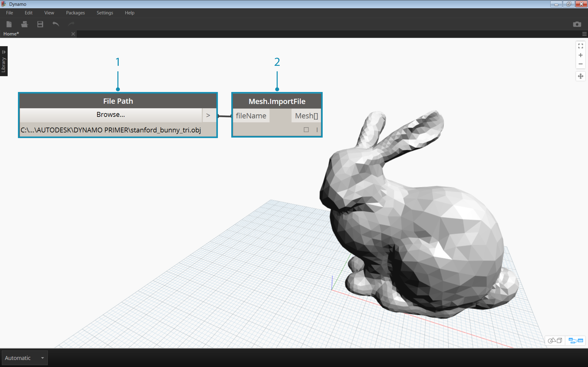

##Package Case Study – Mesh Toolkit

The Dynamo Mesh Toolkit provides tools to import meshes from external file formats, create a mesh from Dynamo geometry objects, and manually build meshes by their vertices and indices. The library also provides tools to modify meshes, repair meshes, or extract horizontal slices for use in fabrication.

The Dynamo Mesh Toolkit is part of Autodesk's ongoing mesh research, and as such will continue to grow over the coming years. Expect new methods to appear on the toolkit frequently, and feel free to reach out to the Dynamo team with comments, bugs, and suggestions for new features.

###Meshes vs. Solids
The exercise below demonstrates some basic mesh operations using the Mesh Toolkit.  In the exercise, we intersect a mesh with a series of planes, which can be computationally expensive using solids.  Unlike a solid, a mesh has a set "resolution" and is not defined mathematically, but topologically, and we can define this resolution based on the task at hand.  For more details on mesh to solid relationships, you can reference the[ Geometry For Computation Design](../05_Geometry-for-Computational-Design/5_geometry-for-computational-design.md) chapter in this primer.  For a more thorough examination of Mesh Toolkit, you can reference the [Dynamo Wiki page.](https://github.com/DynamoDS/Dynamo/wiki/Dynamo-Mesh-Toolkit) Let's jump into the package in the exercise below.

###Install Mesh Toolkit

> In Dynamo, go to *Packages > Search for Packages...* in the top menu bar.  In the search field, type *"MeshToolkit"*, all one word, minding the caps.  Click the download arrow for the appropriate package for your version of Dynamo.  Simple as that!

### Exercise
>Download and unzip the example files for this exercise (Right click and "Save Link As..."). A full list of example files can be found in the Appendix. [MeshToolkit.zip](datasets/10-2/MeshToolkit.zip)

Begin by opening *Mesh-Toolkit_Intersect-Mesh.dyn in Dynamo.* In this example, we will look at the Intersect node in the mesh toolkit. We will import a mesh and intersect it with a series of input planes to create slices. This is the starting point for preparing the model for fabrication on a laser cutter, waterjet cutter, or CNC mill.

>1.	**File Path:** Locate the mesh file to import (*stanford_bunny_tri.obj*). Supported file types are .mix and .obj
2. **Mesh.ImportFile:** Connect the file path to import the mesh

> 1. **Point.ByCoordinates:** Construct a point – this will be the center of an arc.
2. **Arc.ByCenterPointRadiusAngle:** Construct an arc around the point. This curve will be used to position a series of planes.

> 1. Code Block: Create a range of numbers between zero and one.
2. **Curve.PointAtParameter:** Connect the arc to the *‘curve’* input and the code block output to the *‘param’* input to extract a series of points along the curve.
3. **Curve.TangentAtParameter:** Connect the same inputs as the previous node.
4. **Plane.ByOriginNormal:** Connect the points to the *‘origin’* input and the vectors to the *‘normal’* input to create a series of planes at each point.

You should now see a series of planes oriented along the arc. Next, we will use these planes to intersect the mesh.

> 1. **Mesh.Intersect:** Intersect the planes with the imported mesh, creating a series of polycurve contours.
2. **PolyCurve.Curves:** Break the polycurves into their curve fragments.
3. **Curve.EndPoint:** Extract the end points of each curve.
4. **NurbsCurve.ByPoints:** Use the points to construct a nurbs curve. Use a Boolean node set to *True* to close the curves.

> 1. **Surface.ByPatch:** Construct surface patches for each contour to create “slices” of the mesh.

> Add a second set of slices for a waffle/egg-crate effect.

You may have noticed that the intersection operations calculate faster with a mesh vs. a comparable solid. Workflows such as the one demonstrated in this exercise lend themselves well to working with meshes.