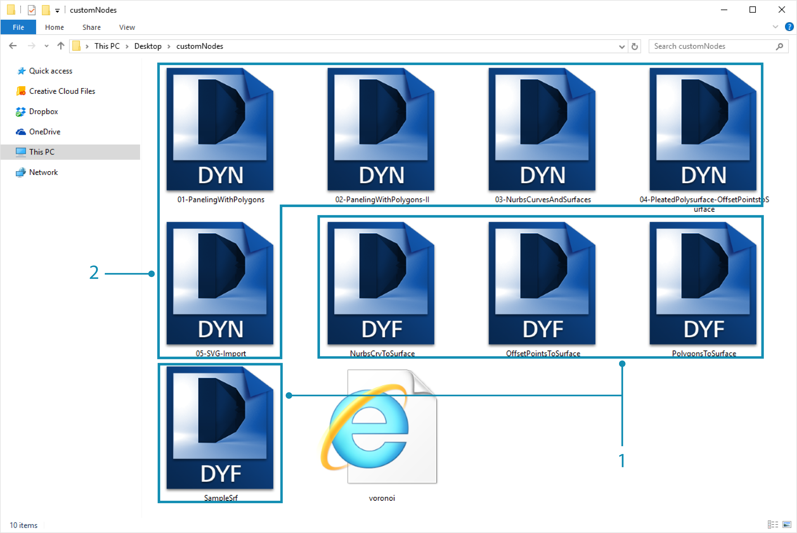
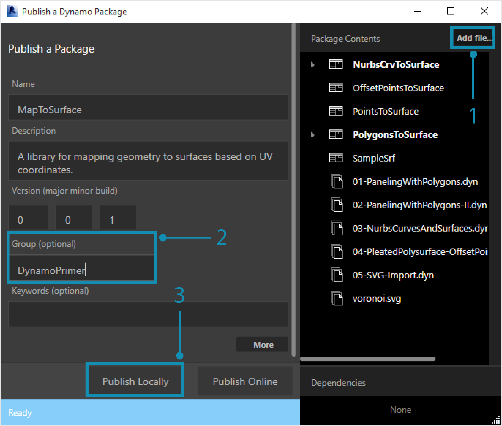
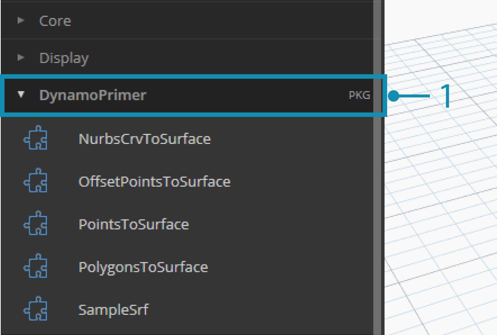
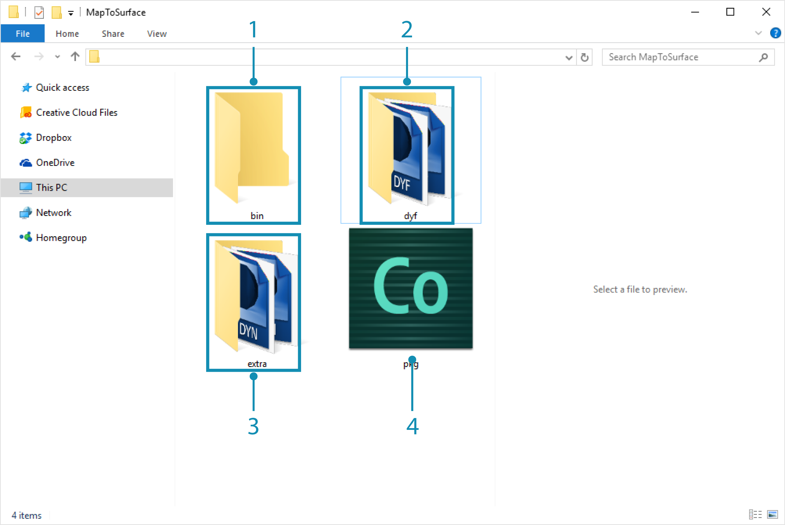

###Exercise
There are many ways to publish a package. Below is the process that we advise: publishing locally, developing locally, and then publishing online.

> This is the first submission for our package, and we've placed all of the example files and custom nodes into one folder.  With this folder prepared, we're ready to upload to the Dynamo Package Manager.
1. This folder contains five custom nodes.
2. This folder also contains four example files to show the user how to work with the custom nodes.

> In Dynamo, begin by clicking *Packages>Publish New Package...*

> In the *"Publish a Dynamo Package"* window, we've filled out the relevant forms on the left of the window.
1. By clicking *"Add File"*, we've also added the files from the folder structure on the right side of the screen. Notice that we've added every file, custom node (.dyf) or or example file (.dyn), indiscriminately. Dynamo will categories these items when we publish the package.
2. The "Group" field defines which group to find the custom nodes in the Dynamo UI.
3. Publish by clicking "Publish Locally". If you're following along, be certain to click *"Publish Locally"* and **not** *"Publish Online"*; we don't want a bunch of duplicate packages on the Package Manager.

> 1. After publishing, the custom nodes should be available under the "DynamoPrimer" group or your Dynamo Library.

> Now let's look at the root directory to see how Dynamo has formatted the package we just created. Do this by clicking *Packages>Manage Packages...*

> In the manage packages window, click on the three vertical dots to the right of *"MapToSurface"* and choose *"Show Root Directory".*

> Notice that the root directory is in the local location of your package (remember, we published the package "locally").  Dynamo is currently referencing this folder to read custom nodes. It's therefore important to locally publish the directory to a permanent folder location (ie: not your desktop). Here is the Dynamo package folder breakdown:
1. The *bin* folder houses .dll files created with C# or Zero-Touch libraries.  We don't have any for this package so this folder is blank for this example.
2. The *dyf* folder houses the custom nodes.  Opening this will reveal all of the custom nodes (.dyf files) for this package.
3. The extra folder houses all additional files.  These files are likely to be Dynamo Files (.dyn) or any additional files required (.xls, .jpeg, .sat, etc.).
4. The pkg file is a basic text file defining the package settings. This is automated in Dynamo, but can be edited if you want to get into the details.

> **Note: please do not follow along with this step unless you are actually publishing a package of your own!**
1. When you're ready to publish, in the "Manage Packages" window, select the o the right of MapToSurface and choose *Publish...*
2. If you're updating a package that has already been published, choose "Publish Version" and Dynamo will update your package online based on the new files in that package's root directory. Simple as that!

