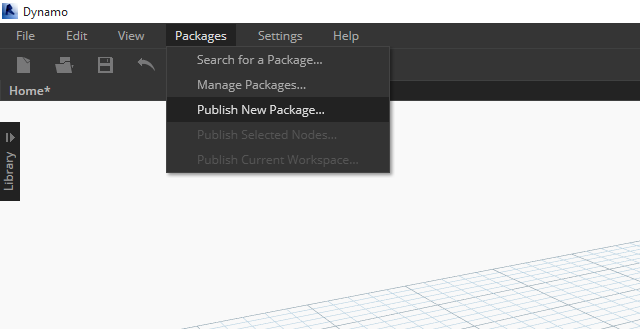
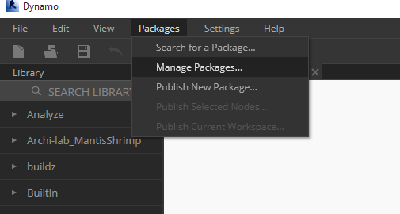
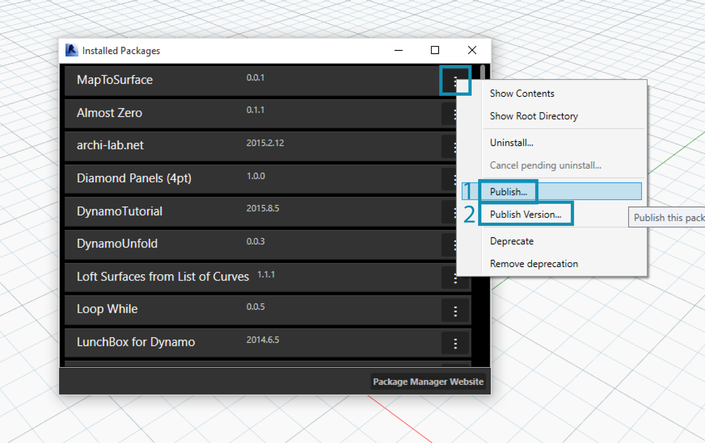

> This is the first submission for our package, and we've placed all of the example files and custom nodes into one folder.  With this folder prepared, we're ready to upload to the Dynamo Package Manager.
1. This folder contains five custom nodes.
2. This folder also contains four example files to show the user how to work with the custom nodes.

> In Dynamo, begin by clicking *Packages>Publish New Package...*

> This window should appear on your screen. Time to add our files.

> We've filled out the relevant forms on the left of the window.
1. By clicking *"Add File"*, we've also added the files from the folder structure on the right side of the screen. Notice that we've added every file, custom node (.dyf) or or example file (.dyn), indiscriminately. Dynamo will categories these items when we publish the package.
2. The "Group" field defines which group to find the custom nodes in the Dynamo UI.
3. Publish by clicking "Publish Locally". If you're following along, be certain to click *"Publish Locally"* and **not** *"Publish Online"*; we don't want a bunch of duplicate packages on the Package Manager.

> After publishing, the custom nodes should be available under the "DynamoPrimer" group or your Dynamo Library.

