<style>
table{box-shadow: 2px 2px 2px #BBBBBB;max-width:75%;display:block;margin-left: auto;   margin-right: auto }
thead {display: none}
img{display:block;margin-left: auto;   margin-right: auto }
</style>

## What is Zero-Touch?

Zero-Touch Importing refers to a simple point-and-click method for importing C# libraries.  Dynamo will read the public methods of a *.dll* file and convert them to Dynamo nodes. You can use Zero-Touch to develop your own custom nodes and packages, and to import external libraries into the Dynamo environment.

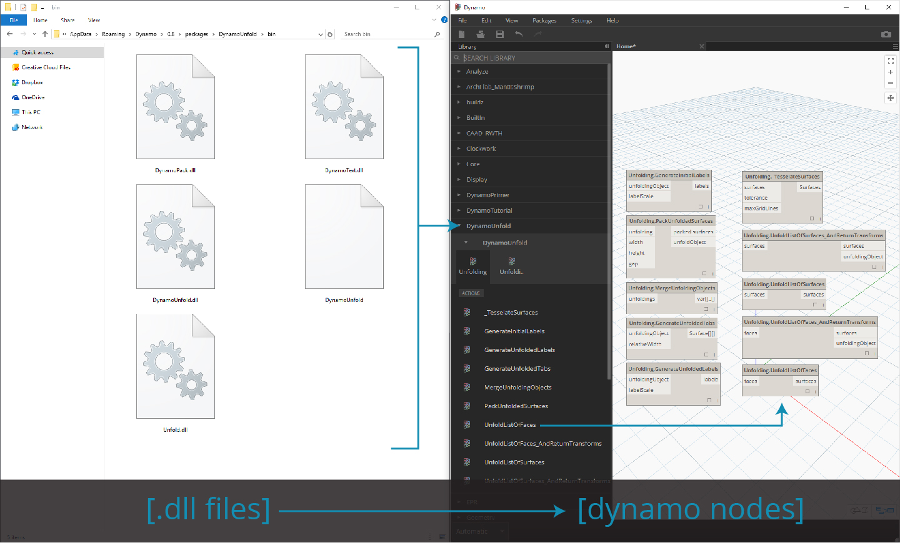

With Zero-Touch, you can actually import a library which was not necessarily developed for Dynamo and create a suite of new nodes. The current Zero-Touch functionality demonstrates the cross-platform mentality of the Dynamo Project. 

This section demonstrates how to use Zero-Touch to import a third party library.  For information on developing your own Zero-Touch Library, reference the [Dynamo wiki page](https://github.com/DynamoDS/Dynamo/wiki/Zero-Touch-Plugin-Development).

###Zero-Touch Packages
Zero-touch packages are a good complement to user-defined custom nodes.  A few packages which use C# libraries are listed in the table below. For more detailed information on packages, visit the [Packages section ](../Appendix/A-3_packages.md)in the Appendix.


<table width="100%">
    <tr>
    <td width="20%"><b>Logo/Image</b></td>
    <td><b>Name</b></td>

  </tr>
  <tr>
    <td></img></td>
    <td><a href="https://github.com/DynamoDS/Dynamo/wiki/Dynamo-Mesh-Toolkit">Mesh Toolkit</td></a>
  </tr>
  <tr>
    <td></img></td>
    <td><a href="http://dynamobim.com/dynamounfold/">Dynamo Unfold</td></a>
  </tr>
  <tr>
    <td></img></td>
    <td><a href="http://www.case-inc.com/blog/what-is-rhynamo">Rhynamo</td></a>
  </tr>
  <tr>
    <td></img></td>
    <td><a href="https://github.com/BPOpt/Optimo">Optimo</td></a>
  </tr>
</table>


### Case Study - Importing AForge
In this case study, we'll show how to import the [AForge](http://www.aforgenet.com/) external *.dll* library.  AForge is a robust library which offers a range of functionality from image processing to artificial intelligence.  We'll reference the imaging class in AForge to do a few image processing exercises below.


>Download and unzip the example files that accompany this package case study (Right click and "Save Link As..."). A full list of example files can be found in the Appendix. [Zero-Touch-Examples.zip](datasets/10-5/Zero-Touch-Examples.zip).

> 1. Let's beging by downloading AForge. On the [AForge download page](http://www.aforgenet.com/framework/downloads.html), select *[Download Installer]* and install after download has completed. 

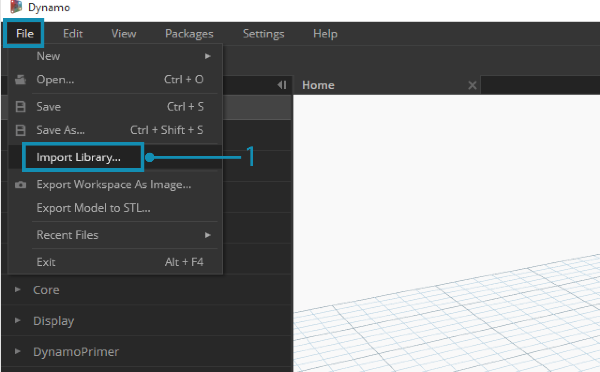
>1. In Dynamo, create a new file and select *File > Import Library...*


>1. In the pop-up window, navigate to the release folder in your Dynamo install. This will likely be in a folder similar to this one: *C:\Program Files (x86)\AForge.NET\Framework\Release*.
2. **AForge.Imaging.dll:** We only want to use this one file from the AForge library for this case study. Select this *.dll* and hit *"Open".*

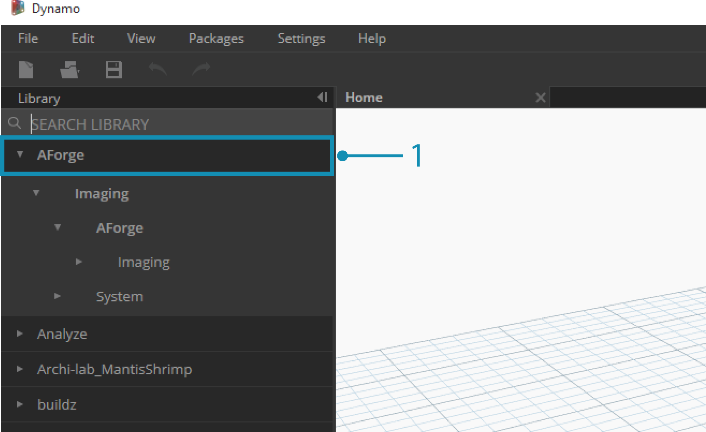
>1. Back in Dynamo, you should see an *"AForge" *group of nodes added to your Library Toolbar.  We now have access to the AForge imaging library from our visual program!

### Exercise 1 - Edge Detection

Now that the library's imported, we'll start off simple with this first exercise.  We'll do some basic image processing on a sample image to show how AForge image filters.  We'll use the *"Watch Image"* node to show our results and apply filters in Dynamo similar to those in Photoshop. 

>Download and unzip the example files that accompany this package case study (Right click and "Save Link As..."). A full list of example files can be found in the Appendix. [ZeroTouchImages.zip](datasets/10-5/ZeroTouchImages.zip)

Now that the library's imported, we'll start off simple with this first exercise (*01-EdgeDetection.dyn*).  We'll do some basic image processing on a sample image to show how AForge image filters.  We'll use the *"Watch Image"* node to show our results and apply filters in Dynamo similar to those in Photoshop 

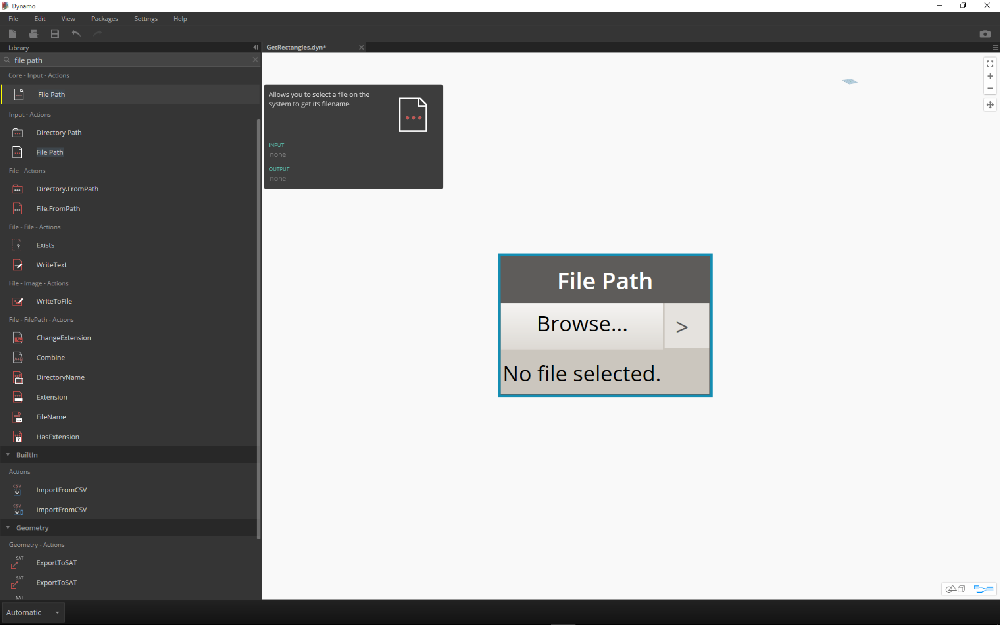
> First, we want to import an image to work with. Add a *File Path* node to the canvas and select "soapbubbles.jpg" from the downloaded exercise folder (photo cred: [flickr](https://www.flickr.com/photos/wwworks/667298782)).


> 1. The File Path node simply provides a String of the path to the image we've selected.  We need to convert this File Path to an image in the Dynamo environment.
2. Connect the File Path node to the File.FromPath node.
3. To convert this File into an Image, we'll use the Image.ReadFromFile node.
4. Last, let's see the result! Drop a Watch Image node onto the canvas and connect to Image.ReadFromFile.  We haven't used AForge yet, but we've successfully imported and image into Dynamo.

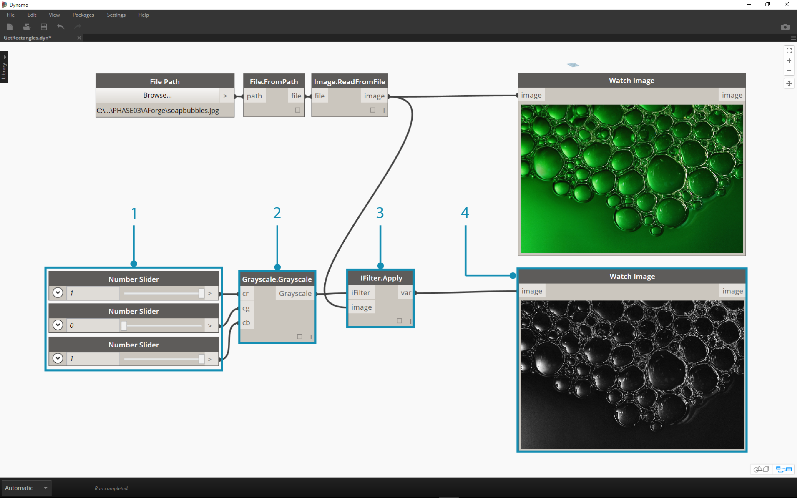
> Under AForge.Imaging.AForge.Filters (in the navigation menu), you'll notice that there is a wide array of filters available.  We're going to use one of these filters now to desaturate an image based on threshold values.
1. Drop three sliders onto the canvas, change their ranges to be from 0 to 1 and their step values to be 0.01.
2. Add the Grayscale.Grayscale node to the canvas.  This is an AForge filter which applies a grayscale filter to an image.  Connect the three sliders from step 1 into cr, cg, and cb.  Change the top and bottom sliders to have a value of 1 and the middle slider to have a value of 0.
3. In order to apply the Grayscale filter, we need an action to perform on our image.  For this, we use IFilter.Apply.  Connect the image into the image input and Grayscale.Grayscale into the iFilter input.
4. Plugging into a Watch Image node, we get a desaturated image.

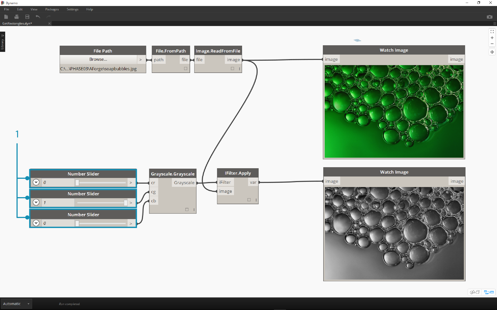
> We can have control over how to desaturate this image based on threshold values for red, green, and blue.  These are defined by the inputs to the Grayscale.Grayscale node.  Notice that the image looks pretty dim - this is because the green value is set to 0 from our slider.
1. Change the top and bottom sliders to have a value of 0 and the middle slider to have a value of 1. This way we get a more legible desaturated image.


> Let's use the desaturated image, and apply another filter on top of it.  The desaturated image has some contrast, so we we're going to test some edge detection.
1. Add a SobelEdgeDetector.SobelEdgeDetector node to the canvas.  Connect this as the IFilter to a new IFilter node, and connect the desaturated image to the image input of the IFilter node.
2. The Sobel Edge Detector has highlighted the edges in a new image.

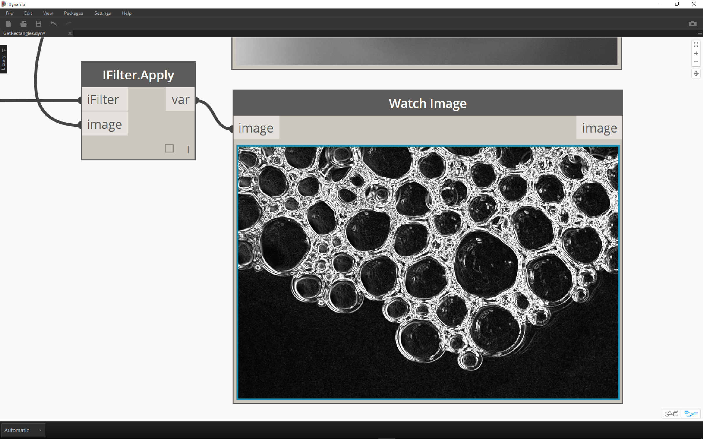
> Zooming in, the edge detector has called out the outlines of the bubbles with pixels.  The AForge library has tools to take results like this and create Dynamo geometry. We'll explore that in the next exercise.

### Exercise 2 - Rectangle Creation

>Download and unzip the example files that accompany this package case study (Right click and "Save Link As..."). A full list of example files can be found in the Appendix. [ZeroTouchImages.zip](datasets/10-5/ZeroTouchImages.zip)

Now that we're introduced to some basic image processing, let's use an image to drive Dynamo geometry! On an elementary level, in this exercise we're aiming to do a *"Live Trace"* of an image using AForge and Dynamo.  We're going to keep it simple and extract rectangles from a reference image, but there are tools available in AForge for more complex operations.  We'll be working with *02-RectangleCreation.dyn* from the downloaded exercise files.

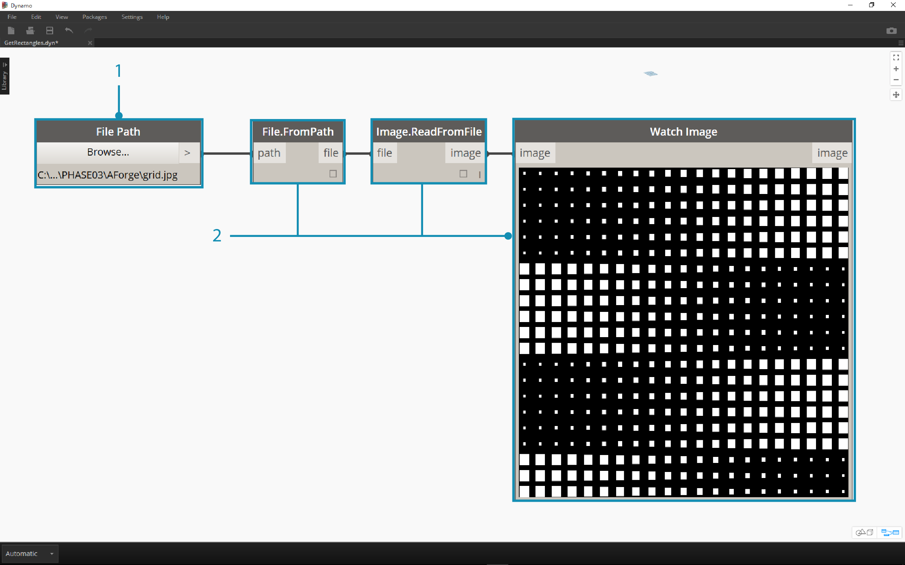
> 1. With the File Path node, navigate to grid.jpg in the exercise folder.
2. Connect the remaining series of nodes above to reveal a course parametric grid.

In this next step, we want to reference the white squares in the image and convert them to actual Dynamo geometry. AForge has a lot of powerful Computer Vision tools, and here we're going to use a particularly important one for the library called [BlobCounter](http://www.aforgenet.com/framework/docs/html/d7d5c028-7a23-e27d-ffd0-5df57cbd31a6.htm).

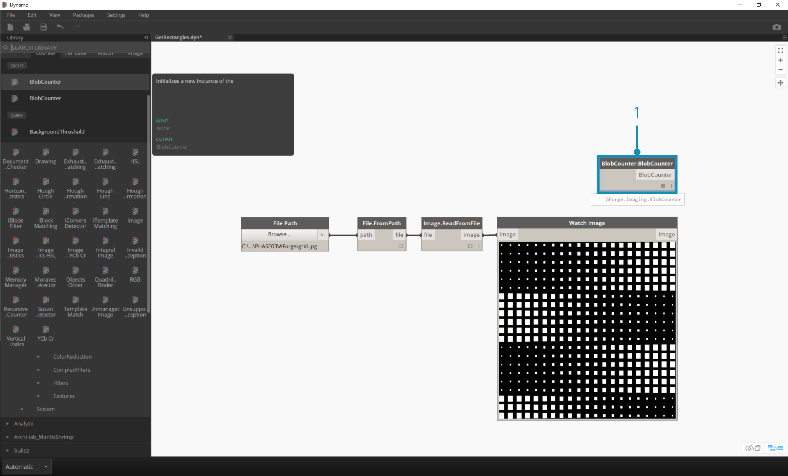
> 1. After adding a BlobCounter to the canvas, we need a way to process the image (similar to the IFilter tool in the previous exercise). Unfortunately the "Process Image" node is not immediately visible in the Dynamo library.  This is because the function may not be visible in the AForge source code.  In order to fix this, we'll need to find a work-around.

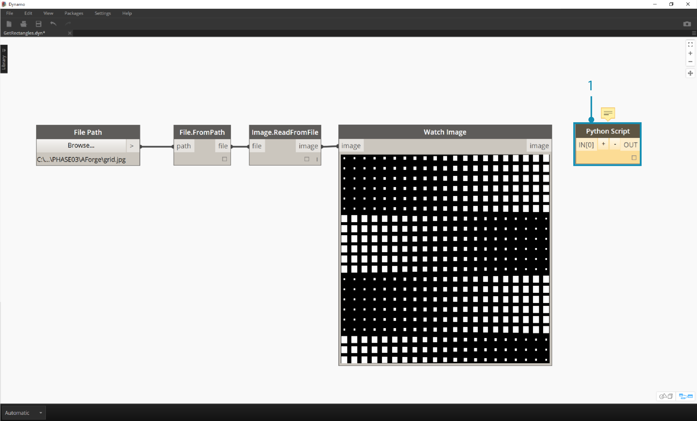
> 1. Add a Python node to the canvas.

```
import clr
clr.AddReference('AForge.Imaging')
from AForge.Imaging import *

bc= BlobCounter()
bc.ProcessImage(IN[0])
OUT=bc

```
> Add the code above to the Python node.  This code imports the AForge library and then processes the imported image.


> Connecting the image output to the Python node input, we get an AForge.Imaging.BlobCounter result from the Python node.

The next steps will do some tricks that demonstrate familiarity with the [AForge Imaging API](http://www.aforgenet.com/framework/docs/html/d087503e-77da-dc47-0e33-788275035a90.htm).  It's not necessary to learn all of this for Dynamo work.  This is more of a demonstration of working with external libraries within the flexibility of the Dynamo environment.

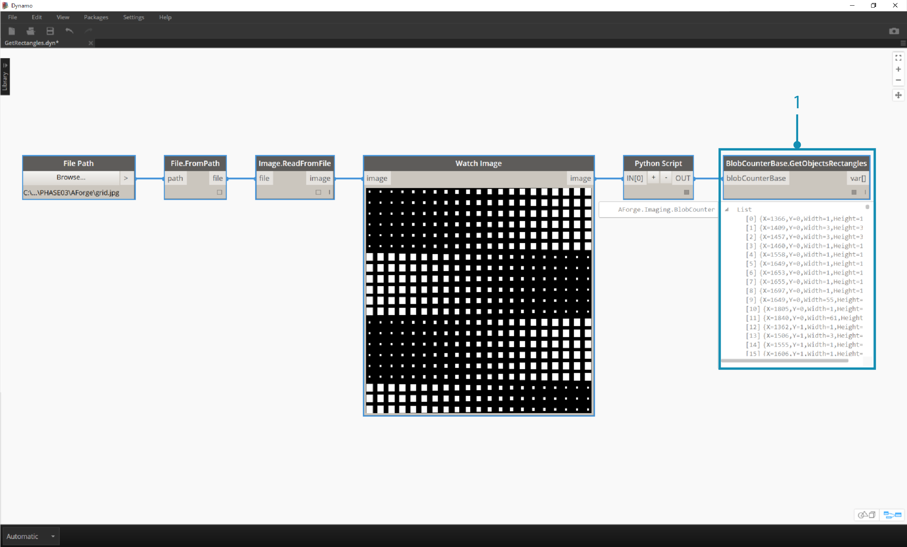
> 1. Connect the output of the Python script to BlobCounterBase.GetObjectRectangles.  This reads objects in an image, based on a threshold value, and extracts quantified rectangles from the pixel space.

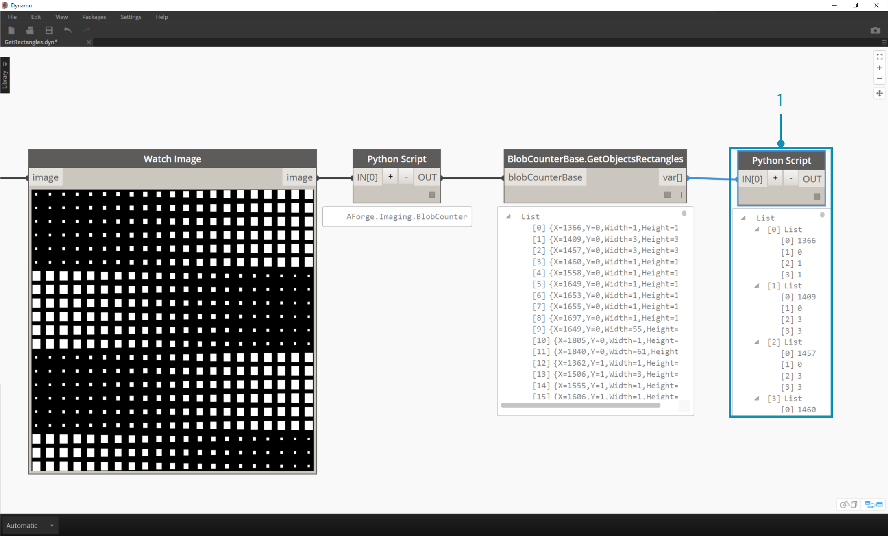
> 1. Adding another Python node to the canvas, connect to the GetObjectRectangles, and input the code below.  This will create an organized list of Dynamo objects.

```
OUT = []
for rec in IN[0]:
	subOUT=[]
	subOUT.append(rec.X)
	subOUT.append(rec.Y)
	subOUT.append(rec.Width)
	subOUT.append(rec.Height)
	OUT.append(subOUT)
	```

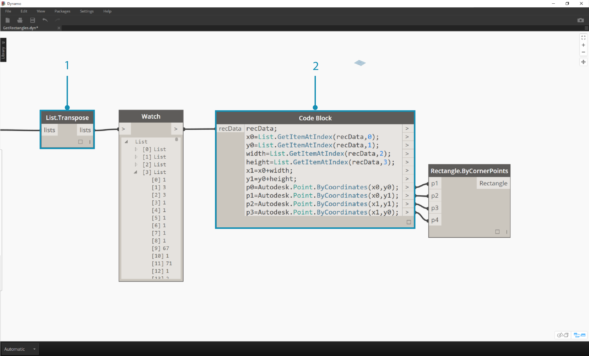
> 1. Transpose the output of the Python node from the previous step.  This creates 4 lists, each representing X,Y, Width, and Height for each rectangle.
>2. Using Code Block, we organize the data into a structure that accommodates the Rectangle.ByCornerPoints node (code below).

```
recData;
x0=List.GetItemAtIndex(recData,0);
y0=List.GetItemAtIndex(recData,1);
width=List.GetItemAtIndex(recData,2);
height=List.GetItemAtIndex(recData,3);
x1=x0+width;
y1=y0+height;
p0=Autodesk.Point.ByCoordinates(x0,y0);
p1=Autodesk.Point.ByCoordinates(x0,y1);
p2=Autodesk.Point.ByCoordinates(x1,y1);
p3=Autodesk.Point.ByCoordinates(x1,y0);
```

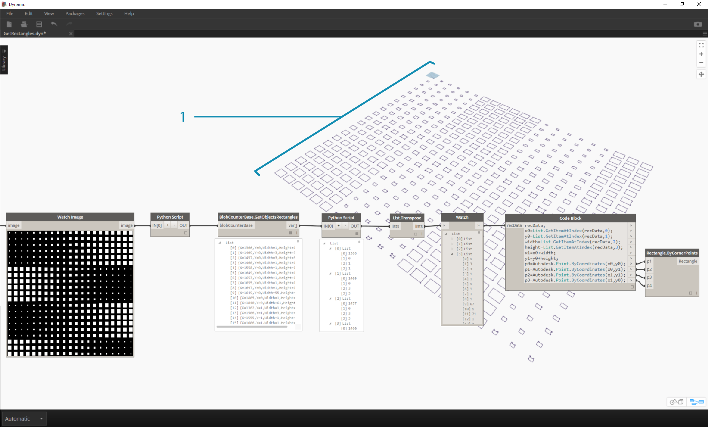
> Zooming out, we have an array of rectangles representing the white squares in the image.  Through programming, we've done something (roughly) similar to a live trace in Illustrator!


> We still need some cleanup, however.  Zooming in, we can see that we have a bunch of small, unwanted rectangles.

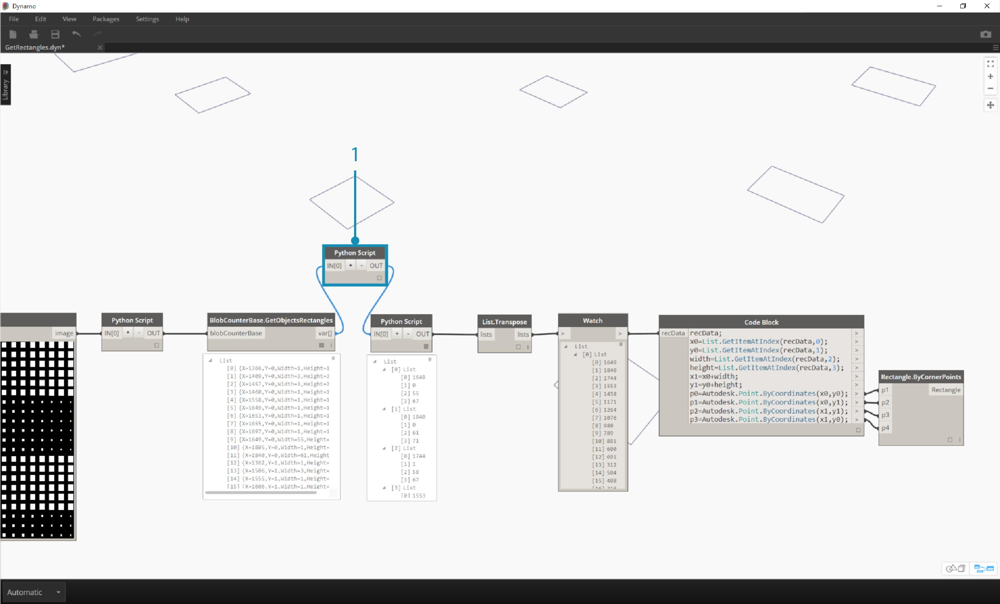
> 1. We get rid of the unwanted rectangles by inserting a Python node in between the GetObjectRectangles node and another Python node.  The node's code is below, and removes all rectangles which are below a given size.

```
rectangles=IN[0]
OUT=[]
for rec in rectangles:
 if rec.Width>8 and rec.Height>8:
  OUT.append(rec)
  ```

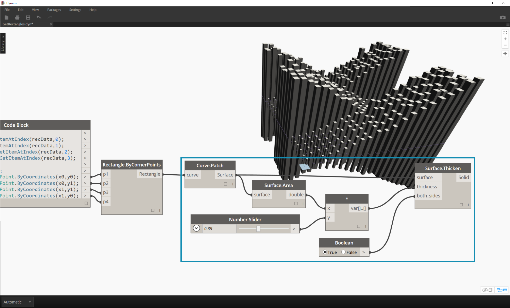
> With the superfluous rectangles gone, just for kicks, let's create a surface from these rectangles and extrude them by a distance based on their areas.

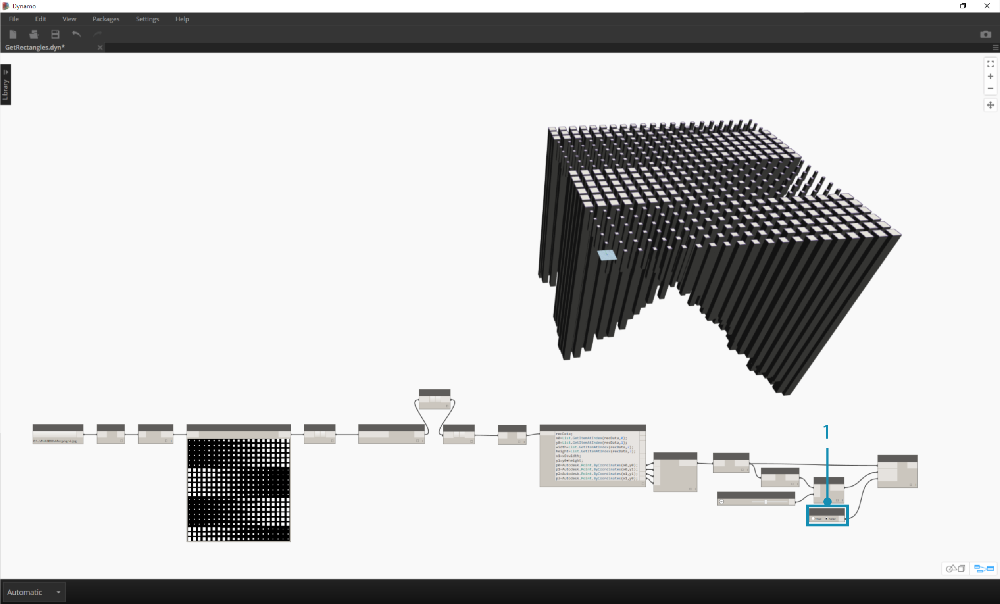
> 1. Last, change the both_sides input to false and we get an extrusion in one direction.  Dip this baby in resin and you've got yourself one super nerdy table.

These are basic examples, but the concepts outlined here are transferable to exciting real-world applications.  Computer vision can be used for a whole host of processes. To name a few: barcode readers, perspective matching, [projection mapping](https://www.youtube.com/watch?v=XSR0Xady02o), and [augmented reality](http://aforgenet.com/aforge/articles/gratf_ar/). For more advanced topics with AForge related to this exercise, have a read through [this article](http://aforgenet.com/articles/shape_checker/).


