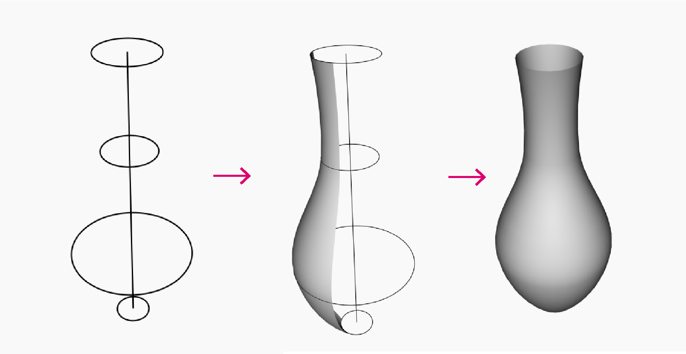
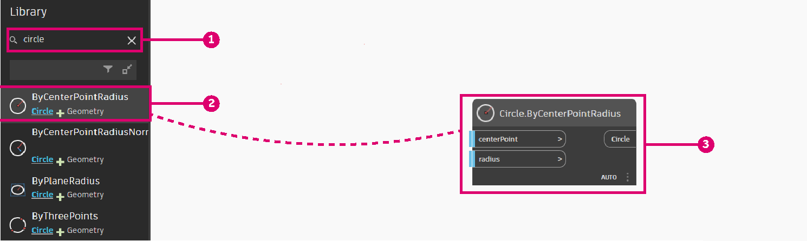
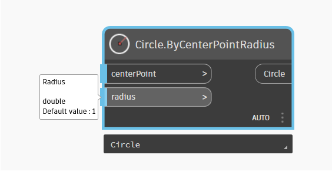
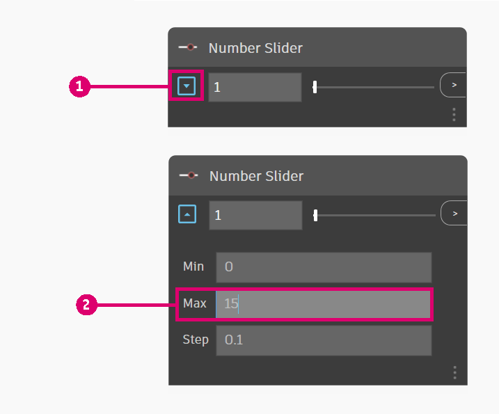
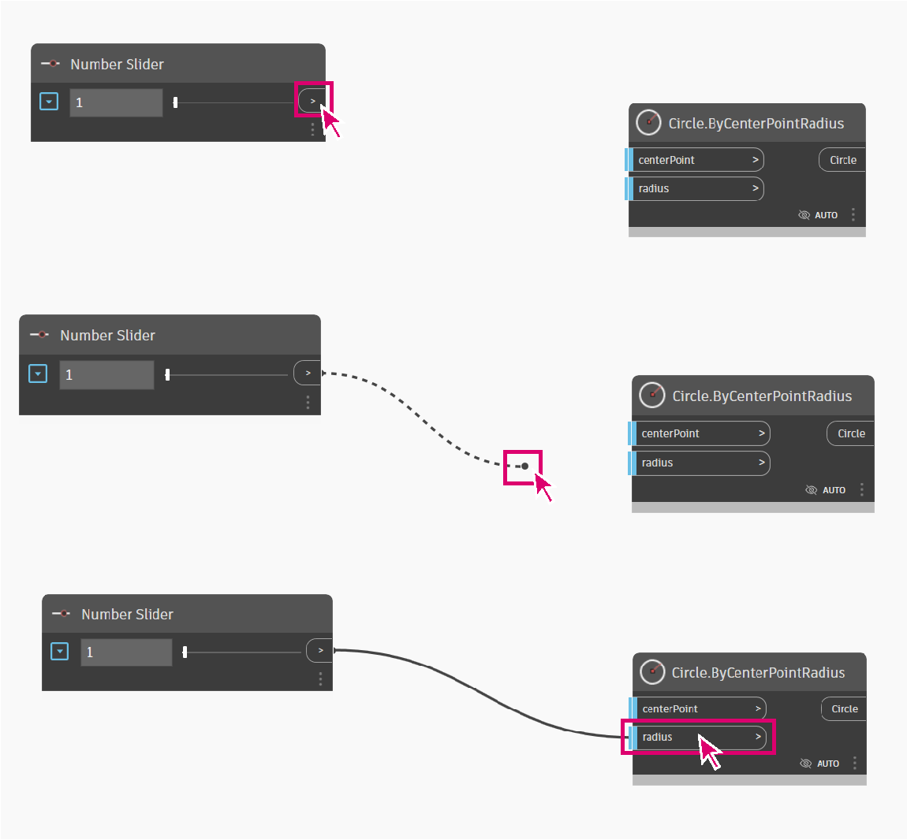
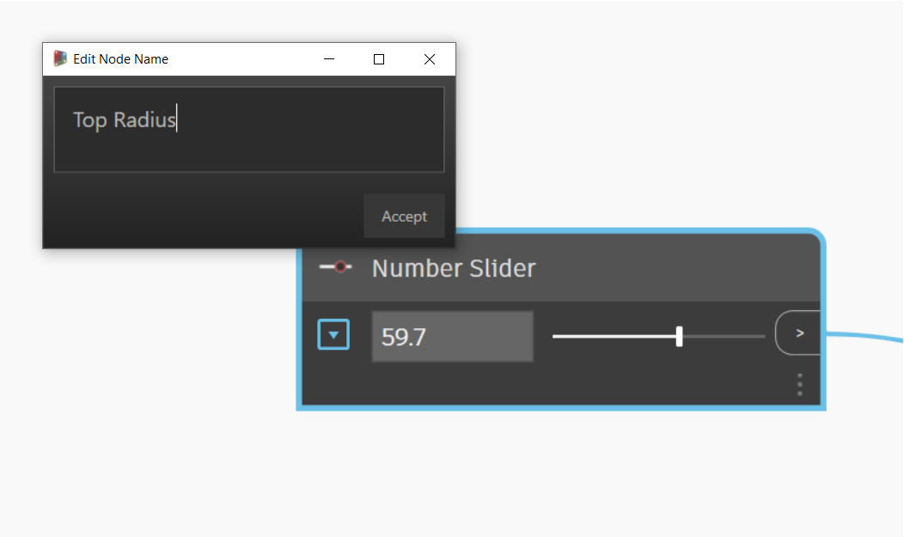
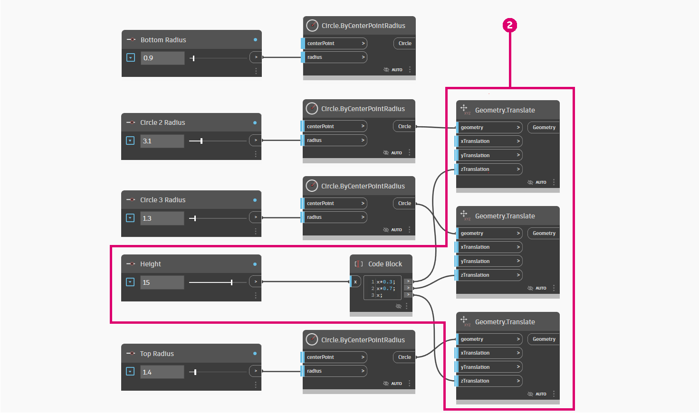
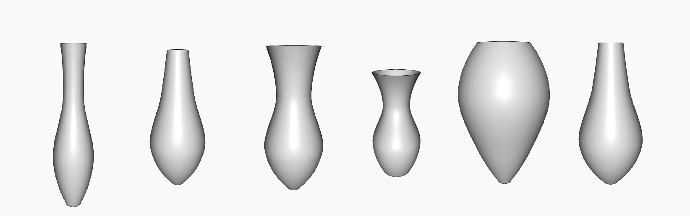

# Parametric Vase

Creating a parametric vase is a great way to start learning Dynamo.

This workflow will teach you how to:

* Use number sliders to control variables in your design.
* Create and modify geometric elements using nodes.
* Visualize design results in real-time.

.gif>)

## Defining Our Objectives

Before jumping into dynamo let's conceptually design our vase.

Let's say we are going to design a clay vase that takes into account manufacturing practices used by ceramists. Ceramists normally use a pottery wheel to fabricate cylindrical vases. Then, by applying pressure on various heights of the vase they can alter the shape of the vase and create varied designs.

We would use a similar methodology to define our vase. We will create 4 circles at different heights and radii and we will then create a surface by lofting those circles.

## Getting Started

> Download the example file by clicking on the link below.
>
> A full list of example files can be found in the Appendix.

We need the nodes that will represent the sequence of actions Dynamo will execute. Since we know we are trying to create a circle, let's start by locating a node that does so. Use the **Search field** or browse through the **Library** to find the **Circle.ByCenterPointRadius** node and add it to the Workspace

> 1. Search > "Circle..."
> 2. Select > "ByCenterPointRadius"
> 3. Node will appear in workspace

Let's take a closer look at this node. On the left side, you have the node's inputs (_centerPoint_ and _radius_) and on the right side, you have the node's output (Circle). Notice that the outputs have a light blue line. This means that the input has a default value. To get more information about the input hover over its name. The _radius_ input needs a double input and has a default value of 1.

We will leave the default value of _centerPoint_ but add a **Number Slider** to control the radius. As we did with the **Circle.ByCenterPointRadius** node, use the library to search for **Number Slider** and add it to your graph.

This node is a bit different than our previous node as it contains a slider. You can use the interface to change the output value of the slider.

.gif>)

The slider can be configured using the dropdown button at the left of the node. Let's limit the slider to a maximum value of 15.

Let's place it on the left of our **Circle.ByCenterPointRadius** node and connect both nodes by selecting the **Number Slider** output and connecting it to the Radius input.

Let's also change the Number Slider name to "Top Radius" by double-clicking on the node's name.

## Next steps

Let's continue adding some nodes and connections to our logic to define our vase.

### Creating Circles of Different Radii

Let's copy these nodes 4 times so that these circles define our surface, change the Number Slider's names as shown below.

.png>)

> 1. Circles are created by a center point and a radius

### Moving Circles Through the Vase Height

We are missing a key parameter to our vase, its height. In order to control the vase's height, we create another number slider. We also add a **Code Block** node. Code blocks can help as add personalized code snippets to our workflow. We will use the code block to multiply the height slider by different factors so that we can position our circles along the vase's height.

.png>)

We then use a **Geometry.Translate** node to place circles at the desired height. Since we want to distribute our circles through the vase we use code blocks to multiply the height parameter by a factor.

> 2\. Circles are translated (moved) by a variable in the z axis.

### Creating the Surface

In order to create a surface using the **Surface.ByLoft** node we need to combine all of our translated circles into a list. We use the **List.Create** to combine all of our circles into a single list, and then finally output this list to the **Surface.ByLoft** node to view results.

Let's also turn off the preview in other nodes to only display the Surface.ByLoft display.

.png>)

> 3\. A surface is created by lofting the translated circles.

## Results

Our workflow is ready! We can now use the **Number Sliders** we defined in our script to create different vase designs.

.gif>)

