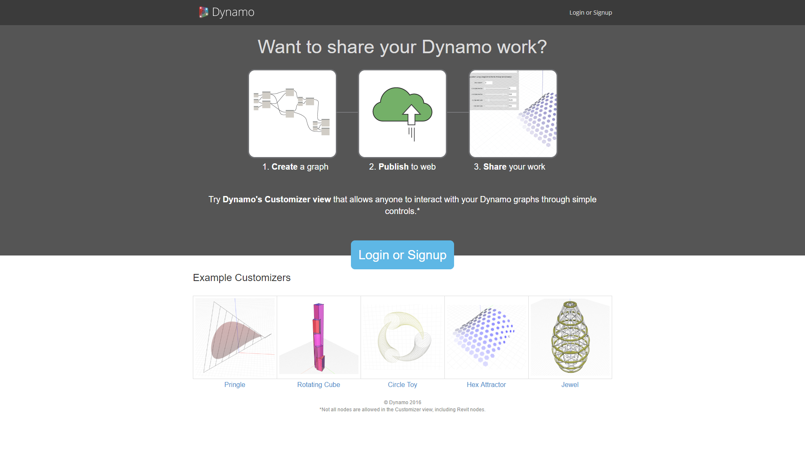

##Dynamo Web Experience

The Dynamo Customizer allows you to publish Dynamo scripts to the web for others to interact with via a pared down interface consisting of allowable inputs such as sliders, numbers, and booleans. This makes your scripts accessible to a wider group of users who may not be familiar with Dynamo or Visual Programming.

