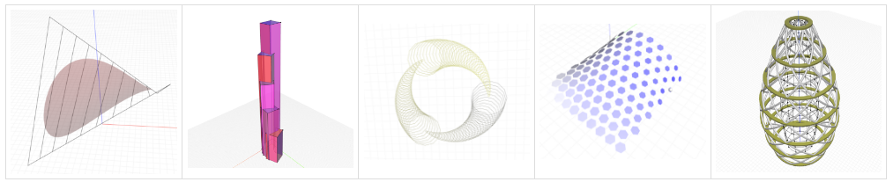
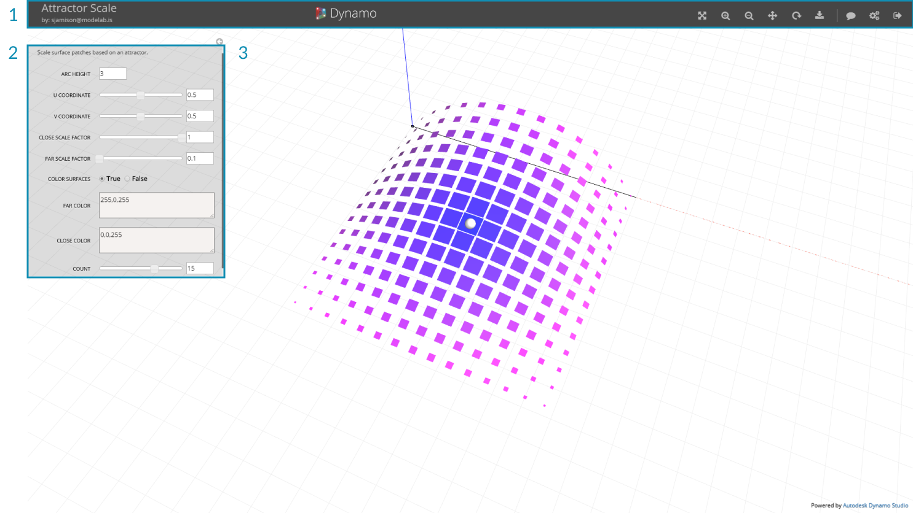
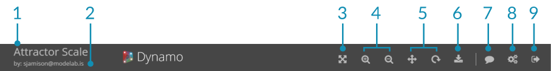
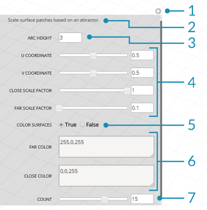

##The Customizer View

The Dynamo Customizer allows you to publish Dynamo scripts to the web for others to interact with via a pared down interface consisting of inputs such as sliders, numbers, and booleans. 

By condensing complex graphs into a simple interface, the Customizer makes your scripts accessible to a wider community of users who may not be familiar with Dynamo, Visual Programming, or 3D modeling. Anyone with an Autodesk account can access your Customizer through a shared link, allowing them to interact with your script without a Dynamo license.

The Customizer also allows users to export geometry as an STL mesh for rapid prototyping, or as a Dynamo file. 

>Some customizer examples available at https://dynamo.autodesk.com/

###Customizer UI

The Customizer view consists of a menu bar, a flyout menu containing a description of the file and user inputs, and a 3D view, similar to the Dynamo workspace:

> 1. Menu Bar
2.	Controls
3.	3D Preview

###Menu

The Customizer Menu Bar includes file information, navigation controls, and download options.

>1.	Title - The name of the file
2.	Author - The owner of the file
3.	Zoom to Extent - Zoom to the extent of the geometry
4.	Zoom In/Out - Control the zoom
5.	Pan/Orbit - Toggle between orbit and pan
6.	Download - Save the file as an STL or DYN
7.	Feedback - Send comments, suggestions, or issues
8.	Manage/About - Useful information about Dynamo
9.	Logout - Log out of your account and exit the Customizer view

###Controls

The controls menu contains the inputs to the Dynamo script including numbers, sliders, strings, and booleans, as well as a short description of the file. This menu can be collapsed by clicking the arrow icon.

>1. Collapse/expand controls
2. File Description
2. Number Input
2. Number Sliders
3. Boolean
4. Strings
5. Integer Slider
