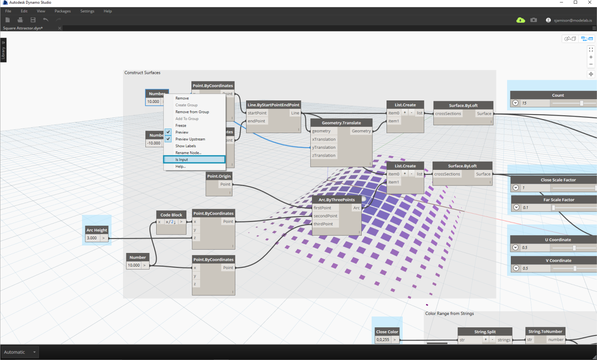
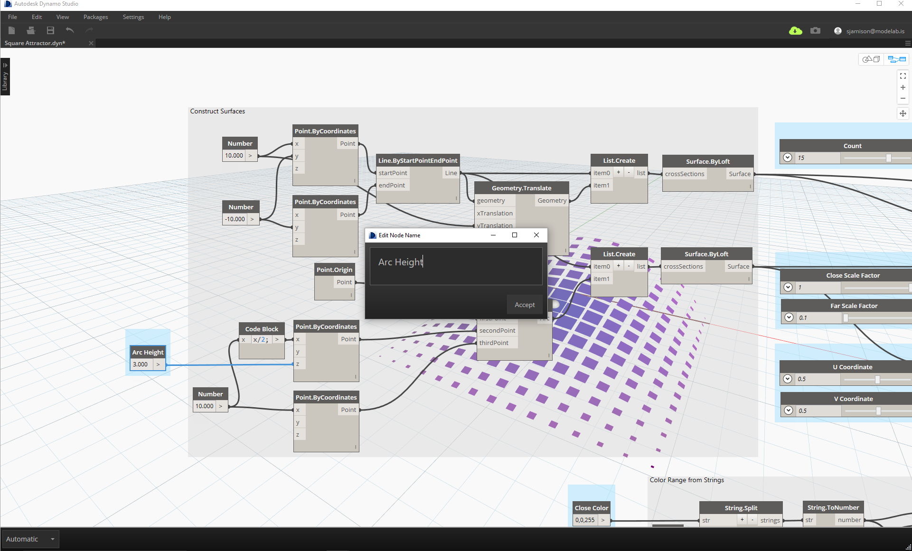
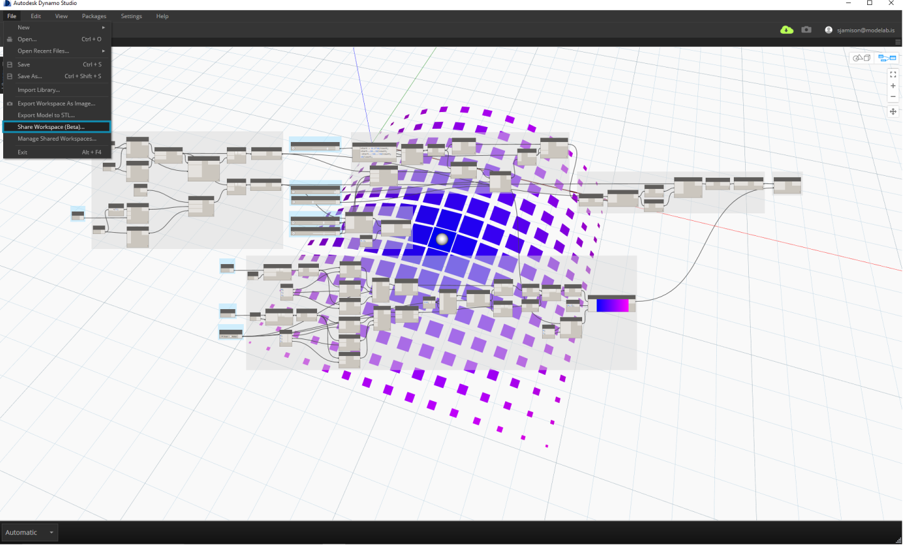
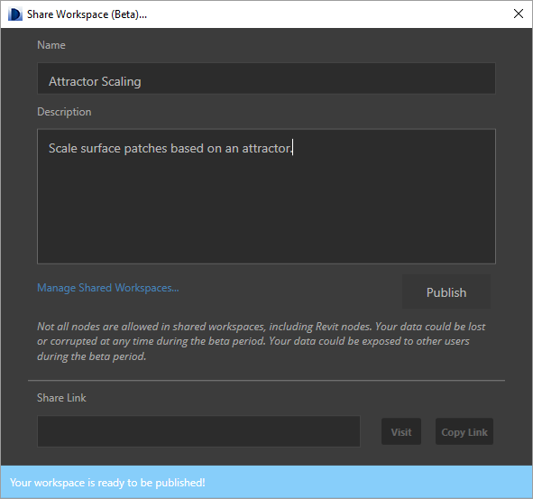
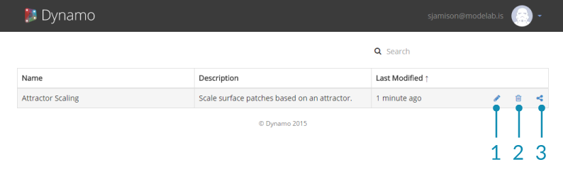

##Publishing Files

Publishing your files to the web is quick and easy. However, you may want to spend some time selecting and labeling your inputs and making your file user-friendly.

###Preparing to Publish

To prepare your script for publishing, first decide which inputs will be accessible to users. Allowable inputs include sliders, numbers, strings, and booleans. Code Blocks and File Paths cannot be used as inputs. Turn off “Is Input” via the context menu on any inputs that you don’t want to be exposed in the Customizer. Make sure any slider inputs have reasonable minimum and maximum values.

>Uncheck “Is Input” via the context menu on any inputs that you don't want to be exposed in the Customizer.

Second, ensure that your inputs are clearly labelled. 

>Label the inputs by double clicking the node name to edit it.

Include preview geometry that makes your script easy to understand. In this example, a sphere shows the attractor location, and surfaces are colored based on their distance to the attractor. This makes the attractor influence easy to visualize and understand.

###Publish Your File

When you are ready to publish your file, select “Share Workspace” from the File menu. 

Enter a description of your file and any instructions needed to get started. 
Once your file is published, you can send a link to anyone with an Autodesk account. The file will be published with the current input values and previews.

###Managing Published Files

To manage your published scripts, visit https://dynamo.autodesk.com and sign in to your account. Select “Manage” from the drop down in the top right. On this page, you can edit, share, or delete customizers that you have already published.

>1. Edit Customizer
2. Delete Customizer
3. Share Link

