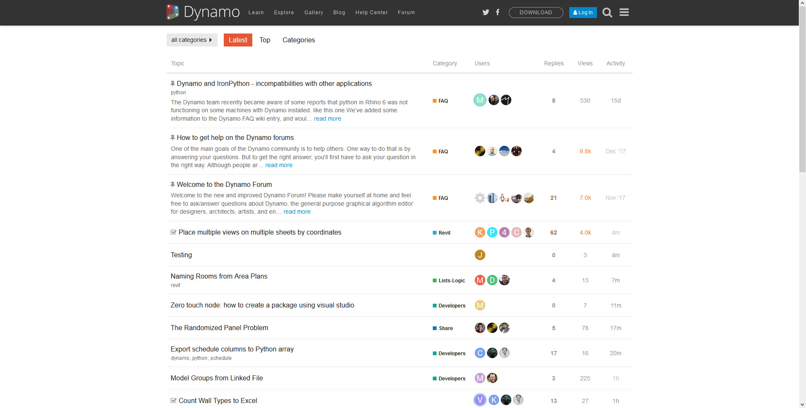

# Primer User Guide, Dynamo Community & Platform

This Primer includes chapters developed with Mode Lab. These chapters focus on the essentials you will need to get up and running developing your own visual programs with Dynamo and key insights on how to take Dynamo further.&#x20;

### Primer User Guide

This guide is designed to cater to readers from different backgrounds and skill levels. General introduction about Dynamo setup, user interface and key concepts can be found in the following sections, we recommend new users to cover the following topics:

* [What is Dynamo & How Does It Work?](1-what-is-dynamo.md)
* [Setup for Dynamo](../2\_setup\_for\_dynamo/)
* [User Interface](../3\_user\_interface/)
* [Nodes and Wires](../4\_nodes\_and\_wires/)

For users who would like to develop a more in-depth understanding of each element such as a specific Nodes and the concept behind it, we cover the fundamentals in its own chapter.

* [Essential Nodes & Concepts](../5\_essential\_nodes\_and\_concepts/)

If you would like to see the demonstration of Dynamo workflows, we have included some graphs in the Sample Workflows section. Follow the attached instructions to create your own Dynamo graphs.

* [Parametric Vase](../10\_sample\_workflow/10-1\_getting-started-workflows/1-parametric-vase.md)

.gif>)

* [Attractor points](../10\_sample\_workflow/10-1\_getting-started-workflows/2-attractor-points.md)

.gif>)


There are more topic specific exercises can be found in later chapters as we cover different topics about Dynamo. **Exercises** can usually be found in the last section of each page.


### The Community

Dynamo wouldn't be what it is without a strong group of avid users and active contributors. Engage the community by following the [Blog](http://dynamobim.org/blog/), adding your work to the Gallery, or discussing Dynamo in the [Forum](https://forum.dynamobim.com).

### The Platform

Dynamo is envisioned as a visual programming tool for designers, allowing us to make tools that make use of external libraries or any Autodesk product that has an API. With Dynamo Sandbox we can develop programs in a "Sandbox" style application - but the Dynamo ecosystem continues to grow.

The source code for the project is open-source, enabling us to extend its functionality to our hearts content. Check out the project on GitHub and browse the Works in Progress of users customizing Dynamo.

> Browse, Fork, and start extending Dynamo for your needs
