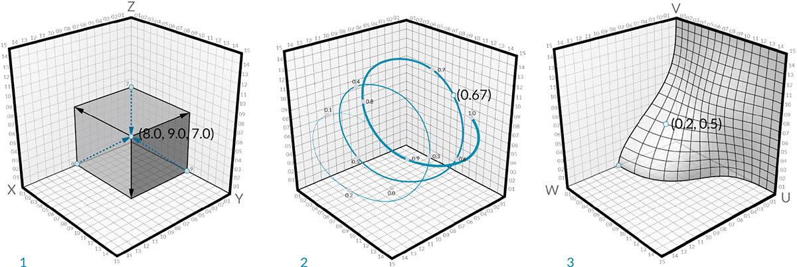

# Points

## Points in Dynamo

### What is a Point?

A [Point](5-3\_points.md#point-as-coordinates) is defined by nothing more than one or more values called coordinates. How many coordinate values we need to define the Point depends upon the Coordinate System or context in which it resides.

### 2D & 3D Point

The most common kind of Point in Dynamo exists in our three-dimensional World Coordinate System and has three coordinates \[X,Y,Z] (3D Point in Dynamo).

A 2D Point in Dynamo has two coordinates \[X,Y].

### Point on Curves and Surfaces

Parameters for both Curves and Surfaces are continuous and extend beyond the edge of the given geometry. Since the shapes that define the Parameter Space reside in a three-dimensional World Coordinate System, we can always translate a Parametric Coordinate into a "World" Coordinate. The point \[0.2, 0.5] on the surface for example is the same as point \[1.8, 2.0, 4.1] in world coordinates.

> 1. Point in assumed World XYZ Coordinates
> 2. Point relative to a given Coordinate System (Cylindrical)
> 3. Point as UV Coordinate on a Surface

> Download the example file by clicking on the link below.
>
> A full list of example files can be found in the Appendix.



## Deep Dive into...

If Geometry is the language of a model, then Points are the alphabet. Points are the foundation upon which all other geometry is created - we need at least two Points to create a Curve, we need at least three Points to make a Polygon or a Mesh Face, and so on. Defining the position, order, and relationship among Points (try a Sine Function) allows us to define higher order geometry like things we recognize as Circles or Curves.

> 1. A Circle using the functions `x=r*cos(t)` and `y=r*sin(t)`
> 2. A Sine Curve using the functions `x=(t)` and `y=r*sin(t)`

### Point as Coordinates

Points can exist in a two-dimensional Coordinate System as well. Convention has different letter notation depending upon what kind of space we are working with - we might be using \[X,Y] on a Plane or \[U,V] if we are on a surface.

> 1. A Point in Euclidean Coordinate System: \[X,Y,Z]
> 2. A Point in a Curve Parameter Coordinate System: \[t]
> 3. A Point in a Surface Parameter Coordinate System: \[U,V]
