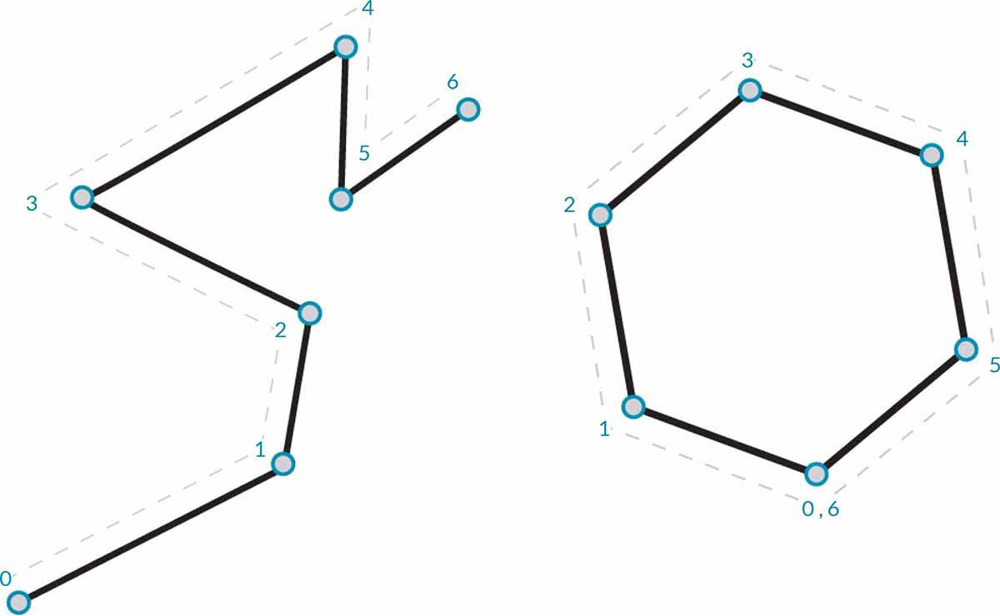
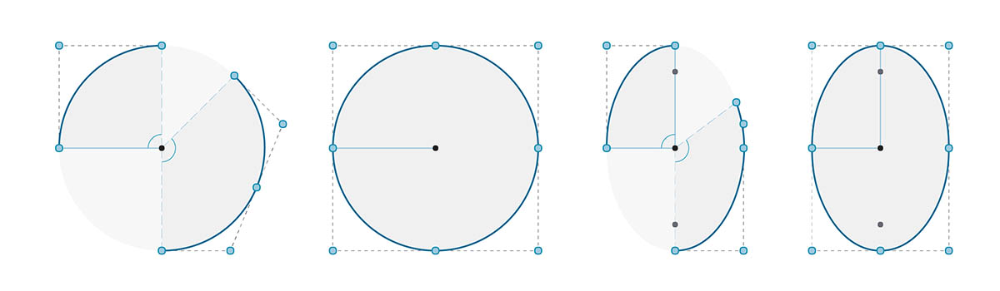

# Curves

## Curves in Dynamo

### What is Curve?

[Curves ](5-4\_curves.md#curve)are the first Geometric Data Type we've covered that have a more familiar set of shape descriptive properties - How curvey or straight? How long or short? And remember that Points are still our building blocks for defining anything from a line to a spline and all the Curve types in between.

> 1. Line
> 2. Polyline
> 3. Arc
> 4. Circle
> 5. Ellipse
> 6. NURBS Curve
> 7. Polycurve

### Line

[Line ](5-4\_curves.md#lines)is made of a set of points, each line has at least 2 points. One of the most common way to create line in Dynamo is using `Line.ByStartPointEndPoint`  to create a Line in Dynamo.

### NURBS Curve

[NURBS](5-4\_curves.md#nurbs-+-polycurves) is a model used for representing curves and surfaces accurately. A sine curve in Dynamo using two different methods to create NURBS Curves to compare the results.

> 1. _NurbsCurve.ByControlPoints_ uses the List of Points as Control Points
> 2. _NurbsCurve.ByPoints_ draws a Curve through the List of Points

> Download the example file by clicking on the link below.
>
> A full list of example files can be found in the Appendix.



## Deep Dive into...

### Curves

The term **Curve** is generally a catch-all for all different sort of curved (even if straight) shapes. Capital "C" Curve is the parent categorization for all of those shape types - Lines, Circles, Splines, etc. More technically, a Curve describes every possible Point that can be found by inputting "t" into a collection of functions, which may range from the simple (`x = -1.26*t, y = t`) to functions involving calculus. No matter what kind of Curve we are working with, this **Parameter** called "t" is a property we can evaluate. Furthermore, regardless of the look of the shape, all Curves also have a start point and end point, which coincidentally align with the minimum and maximum t values used to create the Curve. This also helps us understand its directionality.

> It's important to note that Dynamo assumes that the domain of "t" values for a Curve is understood to be 0.0 to 1.0.

All Curves also possess a number of properties or characteristics which can be used to describe or analyze them. When the distance between the start and end points is zero, the curve is "closed." Also, every curve has a number of control-points, if all these points are located in the same plane, the curve is "planar." Some properties apply to the curve as a whole, while others only apply to specific points along the curve. For example, planarity is a global property while a tangent vector at a given t value is a local property.

### Lines

**Lines** are the simplest form of Curves. They may not look curvy but they are in fact Curves - just without any curvature. There are a few different ways to create Lines, the most intuitive being from Point A to Point B. The shape of the Line AB will be drawn between the points but mathematically it extends infinitely in both directions.

When we connect two Lines together, we have a **Polyline**. Here we have a straightforward representation of what a Control Point is. Editing any of these point locations will change the shape of the Polyline. If the Polyline is closed, we have a Polygon. If the Polygon's edge lengths are all equal, it is described as regular.

### Arcs, Circles, Ellipse Arcs, and Ellipses

As we add more complexity to the Parametric Functions that define a shape, we can take one step further from a Line to create an **Arc**, **Circle**, **Ellipse Arc**, or **Ellipse** by describing one or two radii. The differences between the Arc version and the Circle or Ellipse is only whether or not the shape is closed.

### NURBS + Polycurves

**NURBS** (Non-uniform Rational Basis Splines) are mathematical representations that can accurately model any shape from a simple two dimensional Line, Circle, Arc, or Rectangle to the most complex three-dimensional free-form organic Curve. Because of their flexibility (relatively few control points, yet smooth interpolation based on Degree settings) and precision (bound by a robust math), NURBS models can be used in any process from illustration and animation to manufacturing.

**Degree**: The Degree of the Curve determines the range of influence the Control Points have on a Curve; where the higher the degree, the larger the range. The Degree is a positive whole number. This number is usually 1, 2, 3 or 5, but can be any positive whole number. NURBS lines and polylines are usually Degree 1 and most free-form Curves are Degree 3 or 5.

**Control Points**: The Control Points are a list of at least Degree+1 Points. One of the easiest ways to change the shape of a NURBS Curve is to move its Control Points.

**Weight**: Control Points have an associated number called a Weight. Weights are usually positive numbers. When a Curve’s Control Points all have the same weight (usually 1), the Curve is called non-rational, otherwise the Curve is called rational. Most NURBS curves are non-rational.

**Knots**: Knots are a list of (Degree+N-1) numbers, where N is the number of Control Points. The Knots are used together with the weights to control the influence of the Control Points on the resulting Curve. One use for Knots is to create kinks at certain points in the curve.

> 1. Degree = 1
> 2. Degree = 2
> 3. Degree = 3


Note that the higher the degree value, the more Control Points are used to interpolate the resulting Curve.

