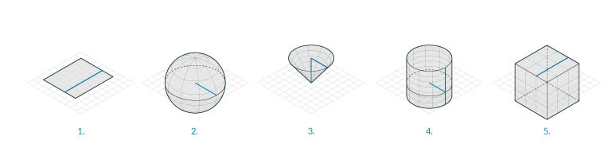
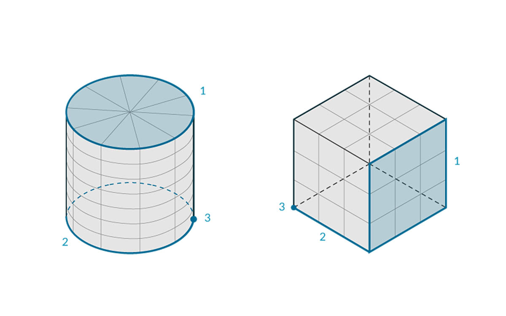
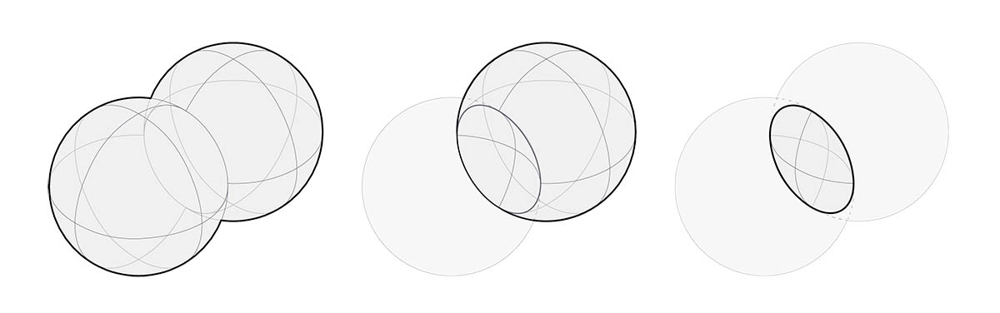

# Solids

## Solids in Dynamo

### What is Solid?

If we want to construct more complex models that cannot be created from a single surface or if we want to define an explicit volume, we must now venture into the realm of [Solids ](5-6\_solids.md#solids)(and Polysurfaces). Even a simple cube is complex enough to need six surfaces, one per face. Solids give access to two key concepts that Surfaces do not - a more refined topological description (faces, edges, vertices) and Boolean operations.

### Boolean Operation to Create Spiky Ball Solid

You can use [Boolean operations](5-6\_solids.md#boolean-operations) to modify solids. Let's use a few Boolean operations to create a spiky ball.

> 1. **Sphere.ByCenterPointRadius**: Create the base Solid.
> 2. **Topology.Faces**, **Face.SurfaceGeometry**: Query the faces of the Solid and convert to surface geometry—in this case, the Sphere has only one Face.
> 3. **Cone.ByPointsRadii**: Construct cones using points on the surface.
> 4. **Solid.UnionAll**: Union the Cones and the Sphere.
> 5. **Topology.Edges**: Query the edges of the new Solid
> 6. **Solid.Fillet**: Fillet the Edges of the spiky ball

> Download the example file by clicking on the link below.
>
> A full list of example files can be found in the Appendix.



### Freezing

Boolean operations are complex and can be slow to calculate. Use Freeze functionality to suspend the execution of selected nodes and affected downstream nodes.

> 1.Use the right-click contextual menu to Freeze the Solid Union operation
>
> 2\. The selected node and all downstream nodes will preview in a light grey ghosted mode, and affected wires will be displayed as dashed lines. The affected geometry preview will also be ghosted. You can now change values upstream without calculating the boolean union.
>
> 3\. To unfreeze the nodes, right-click and uncheck Freeze.
>
> 4\. All affected nodes and associated geometry previews will update and revert to the standard preview mode.

## Deep Dive into...

### Solids

Solids consist of one or more Surfaces that contain volume by way of a closed boundary that defines "in" or "out." Regardless of how many of these Surfaces there are, they must form a "watertight" volume to be considered a Solid. Solids can be created by joining Surfaces or Polysurfaces together or by using operations such as loft, sweep, and revolve. Sphere, Cube, Cone and Cylinder primitives are also Solids. A Cube with at least one face removed counts as a Polysurface, which has some similar properties, but it is not a Solid.

> 1. A Plane is made of a single Surface and is not a Solid.
> 2. A Sphere is made of one Surface but _is_ a Solid.
> 3. A Cone is made of two surfaces joined together to make a Solid.
> 4. A Cylinder is made of three surfaces joined together to make a Solid.
> 5. A Cube is made of six surfaces joined together to make a Solid.

### Topology

Solids are made up of three types of elements: Vertices, Edges, and Faces. Faces are the surfaces that make up the Solid. Edges are the Curves that define the connection between adjacent faces, and vertices are the start and end points of those Curves. These elements can be queried using the Topology nodes.

> 1. Faces
> 2. Edges
> 3. Vertices

### Operations

Solids can be modified by filleting or chamfering their edges to eliminate sharp corners and angles. The chamfer operation creates a ruled surface between two faces, while a fillet blends between faces to maintain tangency.

> 1. Solid Cube
> 2. Chamfered Cube
> 3. Filleted Cube

### Boolean Operations

Solid Boolean operations are methods for combining two or more Solids. A single Boolean operation actually means performing four operations:

1. **Intersect** two or more objects.
2. **Split** them at the intersections.
3. **Delete** unwanted portions of the geometry.
4. **Join** everything back together.

This makes Solid Booleans a powerful time-saving process. There are three Solid Boolean operations that distinguish which parts of the geometry are kept. 

> 1. **Union:** Remove the overlapping portions of the Solids and join them into a single Solid.
> 2. **Difference:** Subtract one Solid from another. The Solid to be subtracted is referred to as a tool. Note that you could switch which Solid is the tool to keep the inverse volume.
> 3. **Intersection:** Keep only the intersecting volume of the two Solids.

In addition to these three operations, Dynamo has **Solid.DifferenceAll** and **Solid.UnionAll** nodes for performing difference and union operations with multiple Solids. 

> 1. **UnionAll:** Union operation with sphere and outward-facing cones
> 2. **DifferenceAll:** Difference operation with sphere and inward-facing cones

##
