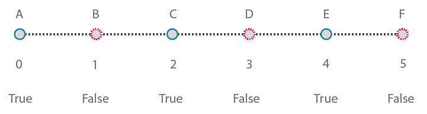

# Working with Lists

### Working with Lists

Now that we've established what a list is, let's talk about operations we can perform on it. Imagine a list as a deck of playing cards. A deck is the list and each playing card represents an item.

> Photo by [Christian Gidlöf](https://commons.wikimedia.org/wiki/File:Playing\_cards\_modified.jpg)

### Query

What **queries** can we make from the list? This accesses existing properties.

* Number of cards in the deck? 52.
* Number of suits? 4.
* Material? Paper.
* Length? 3.5" or 89mm.
* Width? 2.5" or 64mm.

### Action

What **actions** can we perform on the list? This changes the list based on a given operation.

* We can shuffle the deck.
* We can sort the deck by value.
* We can sort the deck by suit.
* We can split the deck.
* We can partition the deck by dealing out individual hands.
* We can select a specific card in the deck.

All of the operations listed above have analogous Dynamo nodes for working with lists of generic data. The lessons below will demonstrate some of the fundamental operations we can perform on lists.

## **Exercise**

### **List Operations**

> Download the example file by clicking on the link below.
>
> A full list of example files can be found in the Appendix.



The image below is the base graph which we are drawing lines between two circles to represent basic list operations. We'll explore how to manage data within a list and demonstrate the visual results through the list actions below.

> 1. Begin with a **Code Block** with a value of `500;`
> 2. Plug into the x input of a **Point.ByCoordinates** node.
> 3. Plug the node from the previous step into the origin input of a **Plane.ByOriginNormal** node.
> 4. Using a **Circle.ByPlaneRadius** node, plug the node from the previous step into the plane input.
> 5. Using **Code Block**, designate a value of `50;` for the radius. This is the first circle we'll create.
> 6. With a **Geometry.Translate** node, move the circle up 100 units in the Z direction.
> 7. With a **Code Block** node, define a range of ten numbers between 0 and 1 with this line of code: `0..1..#10;`
> 8. Plug the code block from the previous step into the _param_ input of two **Curve.PointAtParameter** nodes. Plug **Circle.ByPlaneRadius** into the curve input of the top node, and **Geometry.Translate** into the curve input of the node beneath it.
> 9. Using a **Line.ByStartPointEndPoint**, connect the two **Curve.PointAtParamete**_r_ nodes.

### List.Count

> Download the example file by clicking on the link below.
>
> A full list of example files can be found in the Appendix.



The _List.Count_ node is straightforward: it counts the number of values in a list and returns that number. This node gets more nuanced as we work with lists of lists, but we'll demonstrate that in the coming sections.

> 1. The **List.Count **_****_ node returns the number of lines in the **Line.ByStartPointEndPoint** node. The value is 10 in this case, which agrees with the number of points created from the original **Code Block** node.

### List.GetItemAtIndex

> Download the example file by clicking on the link below.
>
> A full list of example files can be found in the Appendix.



**List.GetItemAtIndex** is a fundamental way to query an item in the list.

> 1. First, Right click on **Line.ByStartPointEndPoint** node to switch off its preview.
> 2. Using the **List.GetItemAtIndex** node, we are selecting index _"0"_, or the first item in the list of lines.

Change slider value between 0 and 9 to select different item using **List.GetItemAtIndex**.

### List.Reverse

> Download the example file by clicking on the link below.
>
> A full list of example files can be found in the Appendix.



_List.Reverse_ reverses the order of all of the items in a list.

> 1. To properly visualize the reversed list of lines, create more lines by changing the **Code Block** to `0..1..#50;`
> 2. Duplicate the **Line.ByStartPointEndPoint** node, insert a List.Reverse node in between **Curve.PointAtParameter** and the second **Line.ByStartPointEndPoint**
> 3. Use **Watch3D** nodes to preview two different results. The first one shows the result without a reversed list. The lines connect vertically to neighboring points. The reversed list, however, will connect all of the points to the opposing order in the other list.

### List.ShiftIndices 

> Download the example file by clicking on the link below.
>
> A full list of example files can be found in the Appendix.



**List.ShiftIndices** is a good tool for creating twists or helical patterns, or any other similar data manipulation. This node shifts the items in a list a given number of indices.

> 1. In the same process as the reverse list, insert a **List.ShiftIndices** into the **Curve.PointAtParameter** and **Line.ByStartPointEndPoint**.
> 2. Using a **Code Block**, designated a value of "1" to shift the list one index.
> 3. Notice that the change is subtle, but all of the lines in the lower **Watch3D** node have shifted one index when connecting to the other set of points.

By changing to **Code Block** to a larger value, _"30"_ for example, we notice a significant difference in the diagonal lines. The shift is working like a camera's iris in this case, creating a twist in the original cylindrical form.

### List.FilterByBooleanMask 

> Download the example file by clicking on the link below.
>
> A full list of example files can be found in the Appendix.



**List.FilterByBooleanMask** will remove certain items based on a list of booleans, or values reading "true" or "false".

In order to create a list of values reading "true" or "false", we need to a little more work...

> 1. Using a **Code Block**, define an expression with the syntax: `0..List.Count(list);`. Connect the **Curve.PointAtParameter** node to the _list_ input. We'll walk through this setup more in the code block chapter, but the line of code in this case is giving us a list representing each index of the **Curve.PointAtParameter** node.
> 2. Using a _**%**_** (modulus)** node, connect the output of the _code block_ into the _x_ input, and a value of _4_ into the _y_ input. This will give us the remainder when dividing the list of indices by 4. Modulus is a really helpful node for pattern creation. All values will read as the possible remainders of 4: 0, 1, 2, 3.
> 3. From the  _**%**_** (modulus)** node, we know that a value of 0 means that the index is divisible by 4 (0,4,8,etc...). By using a **==** node, we can test for the divisibility by testing it against a value of _"0"_.
> 4. The **Watch** node reveals just this: we have a true/false pattern which reads: _true,false,false,false..._.
> 5. Using this true/false pattern, connect to the mask input of two **List.FilterByBooleanMask** nodes.
> 6. Connect the **Curve.PointAtParameter** node into each list input for the **List.FilterByBooleanMask**.
> 7. The output of **Filter.ByBooleanMask** reads _"in"_ and _"out"_. _"In"_ represents values which had a mask value of _"true"_ while _"out"_ represents values which had a value of _"false"_. By plugging the _"in"_ outputs into the _startPoint_ and _endPoint_ inputs of a **Line.ByStartPointEndPoint** node, we've created a filtered list of lines.
> 8. The **Watch3D** node reveals that we have fewer lines than points. We've selected only 25% of the nodes by filtering only the true values!
