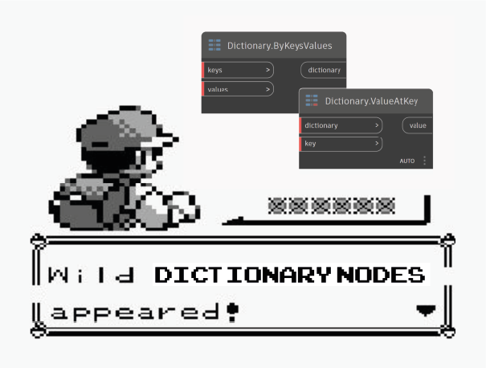

# Dictionaries in Dynamo

Dictionaries represent a collection of data that is related to another piece of data known as a key. Dictionaries expose the ability to search for, delete and insert data into a collection.

Essentially, we can think of a dictionary as a really smart way to look something up.

_While dictionary functionality has been available in Dynamo for some time, Dynamo 2.0 introduces a new way of managing this data type._

Original image courtesy of: [_sixtysecondrevit.com_](http://sixtysecondrevit.com/2018-01-22-new-dictionary-nodes-in-dynamobim-daily-build/)
