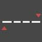
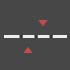
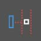
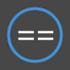

# Index of Nodes

This index provides additional information on all the nodes used in this primer, as well as other components you might find useful. This is just an introduction to some of the 500 nodes available in Dynamo.

## Display

### Color

|                                                |                                                                                                                       |                                                                     |
| ---------------------------------------------- | --------------------------------------------------------------------------------------------------------------------- | ------------------------------------------------------------------- |
|                                                | CREATE                                                                                                                |                                                                     |
|      | 
<strong>Color.ByARGB</strong> Construct a color by alpha, red, green, and blue components.
                  |          |
|       | 
<strong>Color Range</strong> Get a color from a color gradient between a start color and an end color.
      | .jpg>)      |
|                                                | ACTIONS                                                                                                               |                                                                     |
|  | 
<strong>Color.Brightness</strong> Gets the brightness value for this color.
                                 | .jpg>) |
|   | 
<strong>Color.Components</strong> Lists the components for the color in the order: alpha, red, green, blue.
 |       |
|  | 
<strong>Color.Saturation</strong> Gets the saturation value for this color
                                  |      |
|         | 
<strong>Color.Hue</strong> Gets the hue value for this color.
                                               |             |
|                                                | QUERY                                                                                                                 |                                                                     |
| .jpg>)  | 
<strong>Color.Alpha</strong> Find the alpha component of a color, 0 to 255.
                                 |           |
|        | 
<strong>Color.Blue</strong> Find the blue component of a color, 0 to 255.
                                   |            |
| .jpg>)  | 
<strong>Color.Green</strong> Find the green component of a color, 0 to 255.
                                 |           |
|         | 
<strong>Color.Red</strong> Find the red component of a color, 0 to 255.
                                     |             |

|                                                                |                                                                                           |                                                                                 |
| -------------------------------------------------------------- | ----------------------------------------------------------------------------------------- | ------------------------------------------------------------------------------- |
|                                                                | CREATE                                                                                    |                                                                                 |
|  | 
<strong>GeometryColor.ByGeometryColor</strong> Displays geometry using a color.
 |  |

### Watch

|                                             |                                                                               |                                                                 |
| ------------------------------------------- | ----------------------------------------------------------------------------- | --------------------------------------------------------------- |
|                                             | ACTIONS                                                                       |                                                                 |
|     | 
<strong>View.Watch</strong> Visualize the output of node.
           |        |
|  | 
<strong>View.Watch 3D</strong> Shows a dynamic preview of geometry.
 |  |

## Input

|                                              |                                                                                                          |                                                               |
| -------------------------------------------- | -------------------------------------------------------------------------------------------------------- | ------------------------------------------------------------- |
|                                              | ACTIONS                                                                                                  |                                                               |
|           | 
<strong>Boolean</strong> Selection between a true and false.
                                   | .jpg>)    |
| .jpg>) | 
<strong>Code Block</strong> Allows for DesignScript code to be authored directly.
              | .jpg>) |
|  | 
<strong>Directory Path</strong> Allows you to select a directory on the system to get its path
 |  |
|       | 
<strong>File Path</strong> Allows you to select a file on the system to get its filenam
        |       |
|  | 
<strong>Integer Slider</strong> A slider that produces integer values.
                         |  |
|            | 
<strong>Number</strong> Creates a number.
                                                      | .jpg>)     |
|   | 
<strong>Number Slider</strong> A slider that produces numeric values.
                          |   |
|            | 
<strong>String</strong> Creates a string.
                                                      |          |
|  | 
<strong>Object.IsNull</strong> Determines if the given object is null.
                         |  |

## List

|                                                          |                                                                                                                                                                                                                                               |                                                                         |
| -------------------------------------------------------- | --------------------------------------------------------------------------------------------------------------------------------------------------------------------------------------------------------------------------------------------- | ----------------------------------------------------------------------- |
|                                                          | CREATE                                                                                                                                                                                                                                        |                                                                         |
|                 | 
<strong>List.Create</strong> Makes a new list out of the given inputs.
                                                                                                                                                              | .jpg>)          |
|                | 
<strong>List.Combine</strong> Applies a combinator to each element in two sequences
                                                                                                                                                 |              |
|                         | 
<strong>Number Range</strong> Creates a sequence of numbers in the specified range
                                                                                                                                                  | .jpg>)                |
|                      | 
<strong>Number Sequence</strong> Creates a sequence of numbers.
                                                                                                                                                                     |                  |
|                                                          | ACTIONS                                                                                                                                                                                                                                       |                                                                         |
|                   | 
<strong>List.Chop</strong> Chop a list into a set of lists each containing the given amount of items.
                                                                                                                               |                 |
|                         | 
<strong>List.Count</strong> Returns the number of items stored in the given list.
                                                                                                                                                   | .jpg>)           |
|                | 
<strong>List.Flatten</strong> Flattens a nested list of lists by a certain amount.
                                                                                                                                                  |              |
|    | 
<strong>List.FilterByBoolMask</strong> Filters a sequence by looking up corresponding indices in a separate list of booleans.
                                                                                                       |  |
|      | 
<strong>List.GetItemAtIndex</strong> Gets an item from the given list that's located at the specified index.
                                                                                                                        |    |
|                                                          | 
<strong>List.Map</strong> Applies a function over all elements of a list, generating a new list from the results
                                                                                                                    |                  |
|                                                          | 
<strong>List.Reverse</strong> Creates a new list containing the items of the given list but in reverse order
                                                                                                                        |              |
|  | 
<strong>List.ReplaceItemAtIndex</strong> Replace an item from the given list that's located at the specified index
                                                                                                                  |     |
|          | 
<strong>List.ShiftIndices</strong> Shifts indices in the list to the right by the given amount
                                                                                                                                      |        |
|    | 
<strong>List.TakeEveryNthItem</strong> Fetches items from the given list at indices that are multiples of the given value, after the given offset.
                                                                                  |  |
|              | 
<strong>List.Transpose</strong> Swaps rows and columns in a list of lists. If there are some rows that are shorter than others, null values are inserted as place holders in the resultant array such that it is always rectangular
 |            |

## Logic

|                                      |                                                                                                                                                                                                              |                                                   |
| ------------------------------------ | ------------------------------------------------------------------------------------------------------------------------------------------------------------------------------------------------------------ | ------------------------------------------------- |
|                                      | ACTIONS                                                                                                                                                                                                      |                                                   |
| .jpg>) | 
<strong>If</strong> Conditional statement. Checks the boolean value of the test input. If the test input is true, the result outputs the true input, otherwise the result outputs the false input.
 |  |

## Math

|                                                       |                                                                                                                              |                                                                        |
| ----------------------------------------------------- | ---------------------------------------------------------------------------------------------------------------------------- | ---------------------------------------------------------------------- |
|                                                       | ACTIONS                                                                                                                      |                                                                        |
|                 | 
<strong>Math.Cos</strong> Fines the cosine of an angle.
                                                            |                 |
|  | 
<strong>Math.DegreesToRadians</strong> Converts an angle in degrees to an angle in radians.
                        |  |
|                 | 
<strong>Math.Pow</strong> Raises a number to the specified power.
                                                  |                 |
|  | 
<strong>Math.RadiansToDegrees</strong> Converts an angle in radians to an angle in degrees.
                        |  |
|         | 
<strong>Math.RemapRange</strong> Adjusts the range of a list of numbers while preserving the distribution ratio.
   |         |
|                 | 
<strong>Math.Sin</strong> Finds the sine of an angle.
                                                              |                 |
|                    | 
<strong>Formula</strong> Evaluates mathematical formulas. Uses NCalc for evaluation. See http://ncalc.codeplex.com
 |                  |
|                        | 
<strong>Map</strong> Maps a value into an input range
                                                              |                 |

## String

|                                                |                                                                                                                                                      |                                                                 |
| ---------------------------------------------- | ---------------------------------------------------------------------------------------------------------------------------------------------------- | --------------------------------------------------------------- |
|                                                | ACTIONS                                                                                                                                              |                                                                 |
|     | 
<strong>String.Concat</strong> Concatenates multiple strings into a single string.
                                                         |     |
|   | 
<strong>String.Contains</strong> Determines if the given string contains the given substring.
                                              |   |
|       | 
<strong>String.Join</strong> Concatenates multiple strings into a single string, inserting the given separator between each joined string.
 |       |
|      | 
<strong>String.Split</strong> Divides a single string into a list of strings, with divisions determined by the given separater strings.
    |      |
|  | 
<strong>String.ToNumber</strong> Converts a string to an integer or a double.
                                                              |  |

## Geometry

### Circle

|                                                             |                                                                                                                                                          |                                                                                     |
| ----------------------------------------------------------- | -------------------------------------------------------------------------------------------------------------------------------------------------------- | ----------------------------------------------------------------------------------- |
|                                                             | CREATE                                                                                                                                                   |                                                                                     |
|  | 
<strong>Circle.ByCenterPointRadius</strong> Creates a Circle with input center Point and radius in the world XY plane, with world Z as normal.
 |  |
|         | 
<strong>Circle.ByPlaneRadius</strong> Create a Circle centered at the input Plane origin (root), lying in the input Plane, with given radius.
  |                |

|                                                                            |                                                                                                                                                                                                    |                                                                                              |
| -------------------------------------------------------------------------- | -------------------------------------------------------------------------------------------------------------------------------------------------------------------------------------------------- | -------------------------------------------------------------------------------------------- |
|                                                                            | CREATE                                                                                                                                                                                             |                                                                                              |
|                   | 
<strong>CoordinateSystem.ByOrigin</strong> Create a CoordinateSystem with origin at input Point, with X and Y Axes set as WCS X and Y axes
                                               |                   |
|  | 
<strong>CoordinateSystem.ByCyclindricalCoordinates</strong> Creates a CoordinateSystem at the specified cylindrical coordinate parameters with respet to the specified coordinate system
 |  |

### Cuboid

|                                                                       |                                                                                                                                            |                                                                                    |
| --------------------------------------------------------------------- | ------------------------------------------------------------------------------------------------------------------------------------------ | ---------------------------------------------------------------------------------- |
|                                                                       | CREATE                                                                                                                                     |                                                                                    |
| .jpg>)                    | 
<strong>Cuboid.ByLengths</strong> Create a Cuboid centered at WCS origin, with width, length, and height.
                        |                    |
|                  | 
<strong>Cuboid.ByLengths</strong> (origin)

Create a Cuboid centered at input Point, with specified width, length, and height.
 |             |
| .jpg>) | 
<strong>Cuboid.ByLengths</strong> (coordinateSystem)

Create a Cuboid centered at WCS origin, with width, length, and height.
  |  |
|                        | 
<strong>Cuboid.ByCorners</strong>

Create a Cuboid spanning from low Point to high Point.
                                      |                    |
| .jpg>)                       | 
<strong>Cuboid.Length</strong>

Return the input dimensions of the Cuboid, NOT the actual world space dimensions. **
           |                        |
|                             | 
<strong>Cuboid.Width</strong>

Return the input dimensions of the Cuboid, NOT the actual world space dimensions. **
            |                         |
| .jpg>)                       | 
<strong>Cuboid.Height</strong>

Return the input dimensions of the Cuboid, NOT the actual world space dimensions. **
           |                        |
| .jpg>)              | 
<strong>BoundingBox.ToCuboid</strong>

Get the Bounding Box as a solid Cuboid
                                                  |               |


\*\*In other words, if you create a Cuboid width (X-axis) length 10, and transform it to a CoordinateSystem with 2 times scaling in X, the width will still be 10. ASM does not allow you to extract the Vertices of a body in any predictable order, so it is impossible to determine the dimensions after a transform.


### Curve

|                                                        |                                                                                                                                                  |                                                                         |
| ------------------------------------------------------ | ------------------------------------------------------------------------------------------------------------------------------------------------ | ----------------------------------------------------------------------- |
|                                                        | ACTIONS                                                                                                                                          |                                                                         |
|             | 
<strong>Curve.Extrude</strong> (distance) Extrudes a Curve in the normal Vector direction.
                                             |             |
|  | 
<strong>Curve.PointAtParameter</strong> Get a Point on the Curve at a specified parameter between StartParameter() and EndParameter().
 |  |

### Geometry Modifiers

|                                                        |                                                                                                                                    |                                                                         |
| ------------------------------------------------------ | ---------------------------------------------------------------------------------------------------------------------------------- | ----------------------------------------------------------------------- |
|                                                        | ACTIONS                                                                                                                            |                                                                         |
|      | 
<strong>Geometry.DistanceTo</strong> Obtain the distance from this Ge ometry to another.
                                 |      |
|          | 
<strong>Geometry.Explode</strong> Separates compound or non-separated elements into their component parts
                |          |
|  | 
<strong>Geometry.ImportFromSAT</strong> List of imported geometries
                                                      |  |
|           | 
<strong>Geometry.Rotate</strong> (basePlane) Rotates an object around the Plane origin and normal by a specified degree.
 |           |
|        | 
<strong>Geometry.Translate</strong> Translates any geometry type by the given distance in the given direction.
           |        |

### Line

|                                                                    |                                                                                                                                                          |                                                                                     |
| ------------------------------------------------------------------ | -------------------------------------------------------------------------------------------------------------------------------------------------------- | ----------------------------------------------------------------------------------- |
|                                                                    | CREATE                                                                                                                                                   |                                                                                     |
|       | 
<strong>Line.ByBestFitThroughPoints</strong> Creates a Line best approximating a scatter plot of Points.
                                       |       |
|  | 
<strong>Line.ByStartPointDirectionLength</strong> Create a straight Line starting at Point, extending in Vector direction by specified length.
 |  |
|         | 
<strong>Line.ByStartPointEndPoint</strong> Creates a straight Line between two input Points.
                                                   |         |
|                      | 
<strong>Line.ByTangency</strong> Create a Line tangent to the input Curve, positioned at the parameter Point of the input Curve.
               |                      |
|                                                                    | QUERY                                                                                                                                                    |                                                                                     |
|                        | 
<strong>Line.Direction</strong> The direction of the Curve.
                                                                                    |                        |

### NurbsCurve

|                                                             |                                                                                                               |                                                                              |
| ----------------------------------------------------------- | ------------------------------------------------------------------------------------------------------------- | ---------------------------------------------------------------------------- |
|                                                             | Create                                                                                                        |                                                                              |
|  | 
<strong>NurbsCurve.ByControlPoints</strong> Create a BSplineCurve by using explicit control points.
 |  |
|          | 
<strong>NurbsCurve.ByPoints</strong> Create a BSplineCurve by interpolating between points
          |          |

### NurbsSurface

|                                                               |                                                                                                                                                                                            |                                                                                |
| ------------------------------------------------------------- | ------------------------------------------------------------------------------------------------------------------------------------------------------------------------------------------ | ------------------------------------------------------------------------------ |
|                                                               | Create                                                                                                                                                                                     |                                                                                |
|  | 
<strong>NurbsSurface.ByControlPoints</strong> Create a NurbsSurface by using explicit control Points with specified U and V degrees.
                                             |  |
|          | 
<strong>NurbsSurface.ByPoints</strong> Creates a NurbsSurface with specified interpolated points and U and V degrees. The resultant surface will pass through all of the points.
 |          |

### Plane

|                                                      |                                                                                                                  |                                                                       |
| ---------------------------------------------------- | ---------------------------------------------------------------------------------------------------------------- | --------------------------------------------------------------------- |
|                                                      | CREATE                                                                                                           |                                                                       |
|  | 
<strong>Plane.ByOriginNormal</strong> Create a Plane centered at root Point, with input normal Vector.
 |  |
|                | 
<strong>Plane.XY</strong> Creates a plane in the world XY
                                              |                |

### Point

|                                                              |                                                                                                                                           |                                                                               |
| ------------------------------------------------------------ | ----------------------------------------------------------------------------------------------------------------------------------------- | ----------------------------------------------------------------------------- |
|                                                              | CREATE                                                                                                                                    |                                                                               |
|  | 
<strong>Point.ByCartesianCoordinates</strong> Form a Point in th egiven coordinate system with 3 cartesian coordinates
          |  |
|         | 
<strong>Point.ByCoordinates</strong> (2d) Form a Point in the XY plane given two 2 Cartesian coordinates. The Z component is 0.
 |         |
|         | 
<strong>Point.ByCoordinates</strong> (3d) Form a Point given 3 Cartesian coordinates.
                                           |         |
|                    | 
<strong>Point.Origin</strong> Get the Origin point (0,0,0)
                                                                      |                    |
|                                                              | ACTIONS                                                                                                                                   |                                                                               |
|                       | 
<strong>Point.Add</strong> Add a vector to a point. The same as Translate (Vector).
                                             |                       |
|                                                              | QUERY                                                                                                                                     |                                                                               |
|                         | 
<strong>Point.X</strong> Get the X component of a point
                                                                         |                         |
|                         | 
<strong>Point.Y</strong> Get the Y component of a point
                                                                         |                         |
|                         | 
<strong>Point.Z</strong> Get the Z component of a point
                                                                         |                         |

### Polycurve

|                                                   |                                                                                                                                                                                       |                                                                    |
| ------------------------------------------------- | ------------------------------------------------------------------------------------------------------------------------------------------------------------------------------------- | ------------------------------------------------------------------ |
|                                                   | CREATE                                                                                                                                                                                |                                                                    |
|  | 
<strong>Polycurve.ByPoints</strong> Make PolyCurve from sequence of lines connecting points. For closed curve last point should be in the same location as the start point.
 |  |

Rectangle

|                                                         |                                                                                                                                                                               |                                                                          |
| ------------------------------------------------------- | ----------------------------------------------------------------------------------------------------------------------------------------------------------------------------- | ------------------------------------------------------------------------ |
|                                                         | CREATE                                                                                                                                                                        |                                                                          |
|  | 
<strong>Rectangle.ByWidthLength</strong> (Plane) Create a Rectangle centered at input Plane root, with input width (Plane X axis length) and (Plane Y axis length).
 |  |

### Sphere

|                                                             |                                                                                                                             |                                                                              |
| ----------------------------------------------------------- | --------------------------------------------------------------------------------------------------------------------------- | ---------------------------------------------------------------------------- |
|                                                             | CREATE                                                                                                                      |                                                                              |
|  | 
<strong>Sphere.ByCenterPointRadius</strong> Create a Solid Sphere centered at the input Point, with given radius.
 |  |

### Surface

|                                                          |                                                                                                                                                      |                                                                           |
| -------------------------------------------------------- | ---------------------------------------------------------------------------------------------------------------------------------------------------- | ------------------------------------------------------------------------- |
|                                                          | CREATE                                                                                                                                               |                                                                           |
|             | 
<strong>Surface.ByLoft</strong> Create a Surface by lofting between input cross section Curves
                                             |             |
| .jpg>)       | 
<strong>Surface.ByPatch</strong> Create a Surface by filling in the interior of a closed boundary defined by input Curves.
                 |            |
|                                                          | ACTIONS                                                                                                                                              |                                                                           |
| .jpg>)         | 
<strong>Surface.Offset</strong> Offset Surface in direction of Surface normal by specified distance
                                        |              |
|  | 
<strong>Surface.PointAtParameter</strong> Return the Point at a specified U and V parameters.
                                              |  |
| .jpg>)        | 
<strong>Surface.Thicken</strong> Thicken Surface into a Solid, extruding in the direction of Surface normals on both sides of the Surface.
 |             |

### UV

|                                                 |                                                                           |                                                                  |
| ----------------------------------------------- | ------------------------------------------------------------------------- | ---------------------------------------------------------------- |
|                                                 | CREATE                                                                    |                                                                  |
|  | 
<strong>UV.ByCoordinates</strong> Create a UV from two doubles.
 |  |

### Vector

|                                                     |                                                                                          |                                                                      |
| --------------------------------------------------- | ---------------------------------------------------------------------------------------- | -------------------------------------------------------------------- |
|                                                     | CREATE                                                                                   |                                                                      |
|  | 
<strong>Vector.ByCoordinates</strong> Form a Vector by 3 Euclidean coordinates
 |  |
|          | 
<strong>Vector.XAxis</strong> Gets the canonical X axis Vector (1,0,0)
         |               |
|          | 
<strong>Vector.YAxis</strong> Gets the canonical Y axis Vector (0,1,0)
         |               |
| .jpg>)     | 
<strong>Vector.ZAxis</strong> Gets the canonical Z axis Vector (0,0,1)
         |               |
|                                                     | ACTIONS                                                                                  |                                                                      |
|      | 
<strong>Vector.Normalized</strong> Get the normalized version of a vector
      |      |

## CoordinateSystem

|                                                                            |                                                                                                                                                                                                    |                                                                                              |
| -------------------------------------------------------------------------- | -------------------------------------------------------------------------------------------------------------------------------------------------------------------------------------------------- | -------------------------------------------------------------------------------------------- |
|                                                                            | CREATE                                                                                                                                                                                             |                                                                                              |
|                   | 
<strong>CoordinateSystem.ByOrigin</strong> Create a CoordinateSystem with origin at input Point, with X and Y Axes set as WCS X and Y axes
                                               |                   |
|  | 
<strong>CoordinateSystem.ByCyclindricalCoordinates</strong> Creates a CoordinateSystem at the specified cylindrical coordinate parameters with respet to the specified coordinate system
 |  |

## Operators

|                                                  |                                                                                                                         |                                                               |
| ------------------------------------------------ | ----------------------------------------------------------------------------------------------------------------------- | ------------------------------------------------------------- |
| .jpg>)       | 
<strong>+</strong> Addition
                                                                                   |        |
|           | 
<strong>-</strong> Subtraction
                                                                                |     |
| .jpg>) | 
<strong>*</strong> Multiplication
                                                                             |  |
|              | 
<strong>/</strong> Division
                                                                                   |        |
|                     | 
<strong>%</strong> Modular Division finds the remainder of the first input after dividing by the second input
 |               |
| .jpg>)      | 
<strong>&#x3C;</strong> Less Than
                                                                             |       |
|        | 
<strong>></strong> Greater Than
                                                                               |    |
|                    | 
<strong>==</strong> Equality tests for equality between two values.
                                           |              |
