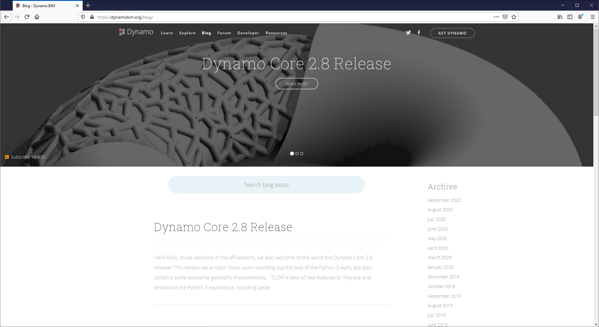

# The Revit Connection

Dynamo for Revit extends buildin g information modeling with the data and logic environment of a graphical algorithm editor. Its flexibility, coupled with a robust Revit database, offers a new perspective for BIM.

This chapter focuses on the Dynamo workflows for BIM. Sections are primarily exercise-based, since jumping right into a project is the best way to get familiar with a graphical algorithm editor for BIM. But first, let's talk about the beginnings of the program.

### Revit Version Compatibility

As both Revit and Dynamo continue to evolve, you may notice that the Revit version you are working with is not compatible with the Dynamo for Revit version you have installed on your machine. Below outlines which versions of Dynamo for Revit are compatible with Revit.

| Revit Version | First Stable Dynamo Version                                                       | Last Supported Dynamo for Revit Version                                                                                                                                |
| ------------- | --------------------------------------------------------------------------------- | ---------------------------------------------------------------------------------------------------------------------------------------------------------------------- |
| 2013          | [0.6.1](http://dyn-builds-data.s3-us-west-2.amazonaws.com/DynamoInstall0.6.1.exe) | [0.6.3](http://dyn-builds-data.s3-us-west-2.amazonaws.com/DynamoInstall0.6.3.exe)                                                                                      |
| 2014          | [0.6.1](http://dyn-builds-data.s3-us-west-2.amazonaws.com/DynamoInstall0.6.1.exe) | [0.8.2](http://dyn-builds-data.s3-us-west-2.amazonaws.com/DynamoInstall0.8.2.exe)                                                                                      |
| 2015          | [0.7.1](http://dyn-builds-data.s3-us-west-2.amazonaws.com/DynamoInstall0.7.1.exe) | [1.2.1](http://dyn-builds-data.s3-us-west-2.amazonaws.com/DynamoInstall1.2.1.exe)                                                                                      |
| 2016          | [0.7.2](http://dyn-builds-data.s3-us-west-2.amazonaws.com/DynamoInstall0.7.2.exe) | [1.3.2](http://dyn-builds-data.s3-us-west-2.amazonaws.com/DynamoInstall1.3.2.exe)                                                                                      |
| 2017          | [0.9.0](http://dyn-builds-data.s3-us-west-2.amazonaws.com/DynamoInstall0.9.0.exe) | [1.3.4](http://dyn-builds-data.s3-us-west-2.amazonaws.com/DynamoInstall1.3.4.exe) / [2.0.3](https://dyn-builds-data.s3-us-west-2.amazonaws.com/DynamoInstall2.0.3.exe) |
| 2018          | [1.3.0](http://dyn-builds-data.s3-us-west-2.amazonaws.com/DynamoInstall1.3.0.exe) | [1.3.4](http://dyn-builds-data.s3-us-west-2.amazonaws.com/DynamoInstall1.3.4.exe) / [2.0.3](https://dyn-builds-data.s3-us-west-2.amazonaws.com/DynamoInstall2.0.3.exe) |
| 2019          | [1.3.3](http://dyn-builds-data.s3-us-west-2.amazonaws.com/DynamoInstall1.3.3.exe) | [1.3.4](http://dyn-builds-data.s3-us-west-2.amazonaws.com/DynamoInstall1.3.4.exe) / [2.0.4](https://dyn-builds-data.s3-us-west-2.amazonaws.com/DynamoInstall2.0.4.exe) |
| 2020+         | 2.1.0 - Revit 2020+ now includes Dynamo and receives updates as Revit does.)      | N/A                                                                                                                                                                    |

### History of Dynamo

With a dedicated team of developers and a passionate community, the project has come a long way from its humble beginnings.

Dynamo was originally created to streamline AEC workflows in Revit. While Revit creates a robust database for every project, it can be difficult for an average user to access this information outside of the constraints of the interface. Revit hosts a comprehensive API (Application Program Interface), allowing third-party developers to create custom tools. And programmers have been using this API for years, but text-based scripting isn't accessible to everyone. Dynamo seeks to democratize Revit data through an approachable graphical algorithm editor.

Using the core Dynamo nodes in tandem with custom Revit ones, a user can substantially expand parametric workflows for interoperability, documentation, analysis, and generation. With Dynamo, tedious workflows can be automated while design explorations can thrive.

### Running Dynamo in Revit

In a Revit project or family editor, navigate to Addins and click Dynamo.\*


\*Dynamo will run only in the file in which it was opened.


When opening Dynamo in Revit, there is a new category called "Revit". This is a comprehensive addition to the UI which offers nodes specifically catering to Revit workflows.\*


\*By using the Revit-specific family of nodes, the Dynamo graph will only work when opening in Dynamo for Revit. If a Dynamo for Revit graph is opened in Dynamo Sandbox for example, the Revit nodes will be missing.


### Freezing Nodes

Since Revit is a platform which provides robust project management, parametric operations in Dynamo can be complex and slow to calculate. If Dynamo is taking a long time to calculate nodes, you may want to use the "freeze" node functionality in order to pause the execution of Revit operations while you develop your graph. For more information on freezing nodes, check out the "[Freezing](../essential-nodes-and-concepts/5\_geometry-for-computational-design/5-6\_solids.md#freezing)" section in the solids chapter.

### Community & Dynamo Blog

Since Dynamo was originally created for AEC, its large and growing community is a great resource for learning from and connecting with experts in the industry. Dynamo’s community is made of architects, engineers, programmers, and designers who all have a passion for sharing and making.

Dynamo is an open-source project that is constantly evolving, and a lot of development is Revit-related. If you're new to the game, get on the discussion forum and start [posting questions](http://dynamobim.org/forums/forum/dyn/)! If you're a programmer and want to get involved in Dynamo's development, check out the [github page](https://github.com/DynamoDS/Dynamo). Also, a great resource for third-party libraries is the [Dynamo package manager](http://dynamopackages.com). Many of these packages are made with AEC in mind, and we'll take a look at third-party packages for panelization in this chapter.

Dynamo also maintains an active blog. Read up on recent posts to learn about the latest developments!

