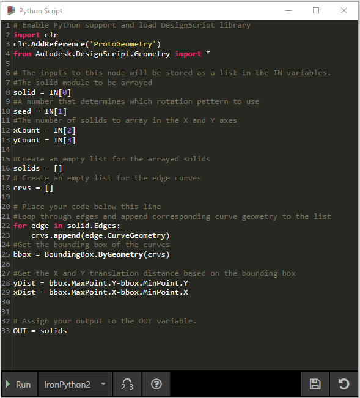

# Python Nodes

Why would you use textual programming in Dynamo's visual programming environment? [Visual programming](../../a\_appendix/visual-programming-and-dynamo.md) has many advantages. It allows you to create programs without learning special syntax in an intuitive visual interface. However, a visual program can become cluttered, and can at times fall short in functionality. For example, Python offers much more achieveable methods for writing conditional statements (if/then) and looping. Python is a powerful tool that can extend the capabilities of Dynamo and allow you to replace many nodes with a few concise lines of code.

**Visual Program:**


**Textual Program:**

```
import clr
clr.AddReference('ProtoGeometry')
from Autodesk.DesignScript.Geometry import *

solid = IN[0]
seed = IN[1]
xCount = IN[2]
yCount = IN[3]

solids = []

yDist = solid.BoundingBox.MaxPoint.Y-solid.BoundingBox.MinPoint.Y
xDist = solid.BoundingBox.MaxPoint.X-solid.BoundingBox.MinPoint.X

for i in xRange:
	for j in yRange:
		fromCoord = solid.ContextCoordinateSystem
		toCoord = fromCoord.Rotate(solid.ContextCoordinateSystem.Origin,Vector.ByCoordinates(0,0,1),(90*(i+j%val)))
		vec = Vector.ByCoordinates((xDist*i),(yDist*j),0)
		toCoord = toCoord.Translate(vec)
		solids.append(solid.Transform(fromCoord,toCoord))

OUT = solids
```

### The Python Node

Like code blocks, Python nodes are a scripting interface within a visual programming environment. The Python node can be found under Script>Editor>Python Script in the library.


Double clicking the node opens the python script editor (you can also right click on the node and select _Edit..._). You’ll notice some boilerplate text at the top, which is meant to help you reference the libraries you’ll need. Inputs are stored in the IN array. Values are returned to Dynamo by assigning them to the OUT variable


The Autodesk.DesignScript.Geometry library allows you to use dot notation similar to Code Blocks. For more information on Dynamo syntax, refer to [7-2\_design-script-syntax.md](../../coding-in-dynamo/7\_code-blocks-and-design-script/7-2\_design-script-syntax.md "mention") as well as the [DesignScript Guide](https://dynamobim.org/wp-content/links/DesignScriptGuide.pdf) (To download this PDF doc, please right-click on link and choose "Save link as..."). Typing a geometry type such as 'Point.' will bring up a list of methods for creating and querying points.


> Methods include constructors such as _ByCoordinates_, actions like _Add_, and queries like _X_, _Y_ and _Z_ coordinates.

## Exercise: Custom Node with Python Script for Creating Patterns from Solid Module

### Part I: Setting Up Python Script

> Download the example file by clicking on the link below.
>
> A full list of example files can be found in the Appendix.



In this example, we will write a python script that creates patterns from a solid module, and turn it into a custom node. First, let’s create our solid module using Dynamo nodes.


> 1. **Rectangle.ByWidthLength:** Create a rectangle that will be the base of our solid.
> 2. **Surface.ByPatch:** Connect the rectangle to the ‘_closedCurve_’ input to create the bottom surface.


> 1. **Geometry.Translate:** Connect the rectangle to the ‘_geometry_’ input to move it up, using a code block to specify the base thickness of our solid.
> 2. **Polygon.Points:** Query the translated rectangle to extract the corner points.
> 3. **Geometry.Translate:** Use a code block to create a list of four values corresponding to the four points, translating one corner of the solid up.
> 4. **Polygon.ByPoints:** Use the translated points to reconstruct the top polygon.
> 5. **Surface.ByPatch:** Connect the polygon to create the top surface.

Now that we have our top and bottom surfaces, let’s loft between the two profiles to create the sides of the solid.


> 1. **List.Create:** Connect the bottom rectangle and the top polygon to the index inputs.
> 2. **Surface.ByLoft:** Loft the two profiles to create the sides of the solid.
> 3. **List.Create:** Connect the top, side, and bottom surfaces to the index inputs to create a list of surfaces.
> 4. **Solid.ByJoinedSurfaces:** Join the surfaces to create the solid module.

Now that we have our solid, let’s drop a Python Script node onto the workspace.


> 1. To add additional inputs to the node, click the + icon on the node. The inputs are named IN\[0], IN\[1], etc. to indicate that they represent items in a list.

Let’s start by defining our inputs and output. Double click the node to open the python editor. Follow the code below to modify the code in the editor.


```
# Load the Python Standard and DesignScript Libraries
import sys
import clr
clr.AddReference('ProtoGeometry')
from Autodesk.DesignScript.Geometry import *

# The inputs to this node will be stored as a list in the IN variables.
#The solid module to be arrayed
solid = IN[0]

#A Number that determines which rotation pattern to use
seed = IN[1]

#The number of solids to array in the X and Y axes
xCount = IN[2]
yCount = IN[3]

#Create an empty list for the arrayed solids
solids = []

# Place your code below this line


# Assign your output to the OUT variable.
OUT = solids
```

This code will make more sense as we progress in the exercise. Next we need to think about what information is required in order to array our solid module. First, we will need to know the dimensions of the solid to determine the translation distance. Due to a bounding box bug, we will have to use the edge curve geometry to create a bounding box.



> Take a look at the Python node in Dynamo. Notice that we're using the same syntax as we see in the titles of the nodes in Dynamo. Check out the commented code below.

```
# Load the Python Standard and DesignScript Libraries
import sys
import clr
clr.AddReference('ProtoGeometry')
from Autodesk.DesignScript.Geometry import *

# The inputs to this node will be stored as a list in the IN variables.
#The solid module to be arrayed
solid = IN[0]

#A Number that determines which rotation pattern to use
seed = IN[1]

#The number of solids to array in the X and Y axes
xCount = IN[2]
yCount = IN[3]

#Create an empty list for the arrayed solids
solids = []
#Create an empty list for the edge curves
crvs = []

# Place your code below this line
#Loop through edges an append corresponding curve geometry to the list
for edge in solid.Edges:
    crvs.append(edge.CurveGeometry)
    
#Get the bounding box of the curves
bbox = BoundingBox.ByGeometry(crvs)

#Get the x and y translation distance based on the bounding box
yDist = bbox.MaxPoint.Y-bbox.MinPoint.Y
xDist = bbox.MaxPoint.X-bbox.MinPoint.X

# Assign your output to the OUT variable.
OUT = solids
```

Since we will be both translating and rotating the solid modules, let’s use the Geometry.Transform operation. By looking at the Geometry.Transform node, we know that we will need a source coordinate system and a target coordinate system to transform the solid. The source is the context coordinate system of our solid, while the target will be a different coordinate system for each arrayed module. That means we will have to loop through the x and y values to transform the coordinate system differently each time.


```
# Load the Python Standard and DesignScript Libraries
import sys
import clr
clr.AddReference('ProtoGeometry')
from Autodesk.DesignScript.Geometry import *

# The inputs to this node will be stored as a list in the IN variables.
#The solid module to be arrayed
solid = IN[0]

#A Number that determines which rotation pattern to use
seed = IN[1]

#The number of solids to array in the X and Y axes
xCount = IN[2]
yCount = IN[3]

#Create an empty list for the arrayed solids
solids = []
#Create an empty list for the edge curves
crvs = []

# Place your code below this line
#Loop through edges an append corresponding curve geometry to the list
for edge in solid.Edges:
    crvs.append(edge.CurveGeometry)
    
#Get the bounding box of the curves
bbox = BoundingBox.ByGeometry(crvs)

#Get the x and y translation distance based on the bounding box
yDist = bbox.MaxPoint.Y-bbox.MinPoint.Y
xDist = bbox.MaxPoint.X-bbox.MinPoint.X

#Get the source coordinate system
fromCoord = solid.ContextCoordinateSystem

#Loop through x and y
for i in range(xCount):
    for j in range(yCount):
        #Rotate and translate the coordinate system
        toCoord = fromCoord.Rotate(solid.ContextCoordinateSystem.Origin, Vector.ByCoordinates(0,0,1), (90*(i+j%seed)))
        vec = Vector.ByCoordinates((xDist*i),(yDist*j),0)
        toCoord = toCoord.Translate(vec)
        #Transform the solid from the source coord syste, to the target coord system and append to the list
        solids.append(solid.Transform(fromCoord,toCoord))

# Assign your output to the OUT variable.
OUT = solids
```

Click Run then Save the code. Connect the Python node with our existing script as following.


> 1. Connect the output from **Solid.ByJoinedSurfaces** as the first input for the Python Node and use a Code Block to define the other inputs.
> 2. Create a **Topology.Edges** node and use the output from Python node as its input.
> 3. Finally, create an **Edge.CurveGeometry** node and use the output from Topology.Edges as its input.

Try changing the seed value to create different patterns. You can also change the parameters of the solid module itself for different effects.


### Part II: Turn Your Python Script Node into Custom Node

Now that we have created a useful python script, let’s save it as a custom node. Select the python script node, right-click on Workspace and select ‘Create Custom Node.’


Assign a name, description and category.


This will open a new workspace in which to edit the custom node.


> 1. **Inputs:** Change the input names to be more descriptive and add data types and default values.
> 2. **Output:** Change the output name

Save the node as a .dyf file and you should see the custom node reflects the changes we just made.


