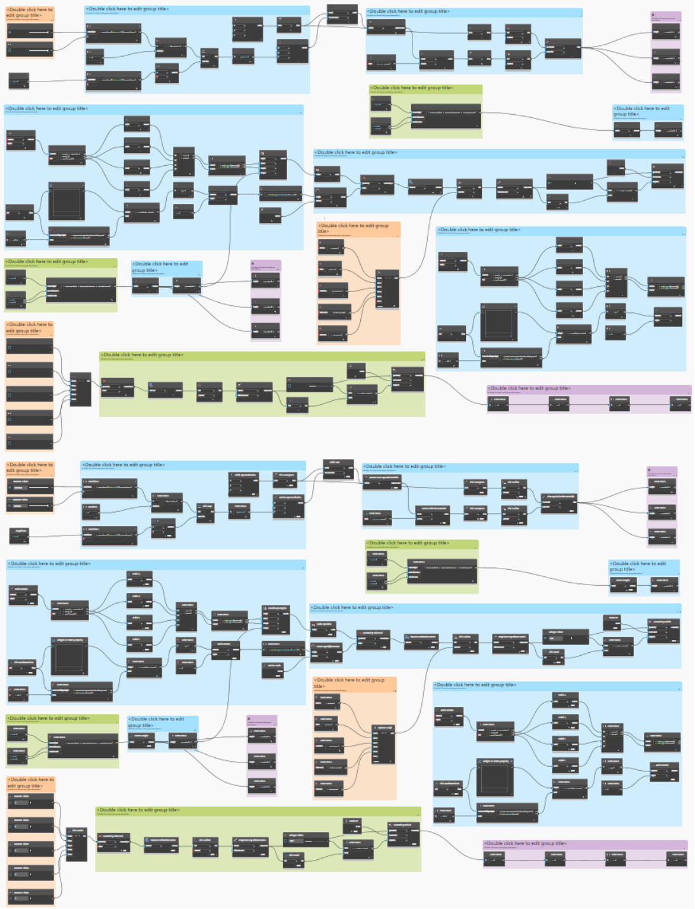

# Best Practices

This part of the primer is organized in the spirit of a journal of “best practices”. It sheds light on several strategies that we have learned, through experience and research, to be most conducive to quality parametric workflows. As designers and programmers, our metric for quality is primarily concerned with the maintainability, dependability, usability, and efficiency of our tools. While these best practices have specific examples for either visual or text-based scripting, the principles are applicable to all programming environments and can inform many computational workflows.

