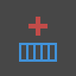
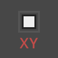

# INDEX OF NODES

##### This index provides additional information on all the nodes used in this primer, as well as other components you might find useful. This is just an introduction to some of the 500 nodes available in Dynamo.

Bulitin Functions
--

||||
|--|--|--|
|Flatten|Returns the flattened 1D list of the multidimensional input list.|

Core
--

####Core.Color
||||
|--|--|--|
|**Create**|||
|Color.ByARGB|Construct a color by alpha, red, green, and blue components.||
|Color .BuildColorFromRange|Get a color from a color gradient between a start color and an end color.||
|**Actions**|||
|Color.Brightness|Gets the brightness value for this color.||
|Color.Components|Lists the components for the color in the order: alpha, red, green, blue.||
|Color.Saturation|Gets the saturation value for this color||
|Color.Hue|Gets the hue value for this color.||
|**Query**|||
|Color.Alpha|Find the alpha component of a color, 0 to 255.||
|Color.Blue|Find the blue component of a color, 0 to 255.||
|Color.Green|Find the green component of a color, 0 to 255.||
|Color.Red|Find the red component of a color, 0 to 255.||

####Core.Input
||||
|--|--|--|
|**Actions**|||
|Boolean|Selection between a true and false.|
|Code Block|Allows for DesignScript code to be authored directly.|
|Integer Slider|A slider that produces integer values.|
|Number| Creates a number.|
|Number Slider| A slider that produces numeric values.|
|String|Creates a string.|

####Core.List
||||
|--|--|--|
|**Create**|||
|List.Create|Makes a new list out of the given inputs.|
|Number Sequence|Creates a sequence of numbers.|
|**Actions**|||
|List.Chop|Chop a list into a set of lists each containing the given amount of items.|
|List.Flatten|Flattens a nested list of lists by a certain amount.|

####Core.View
||||
|--|--|--|
|**Actions**|||
|View.Watch|Visualize the output of node.|

Geometry
--

####Geometry.Circle
||||
|--|--|--|
|**Create**|||
|Circle .ByCenterPointRadius|Creates a Circle with input center Point and radius in the world XY plane, with world Z as normal.|

####Geometry.Geometry
||||
|--|--|--|
|**Actions**|||
|Geometry.DistanceTo|Obtain the distance from this Geometry to another.|

####Geometry.Point
||||
|--|--|--|
|**Create**|||
|Point.ByCoordinates (2d)| Form a Point in the XY plane given two 2 cartesian coordinates.  The Z component is 0.||
|Point.ByCoordinates (3d)|Form a Point given 3 cartesian coordinates.||

####Geometry.UV
||||
|--|--|--|
|**Create**|||
|UV.ByCoordinates|Create a UV from two doubles.|

Operators
--

||||
|--|--|--|
|+|Addition|
|*|Multiplication|