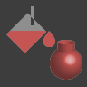
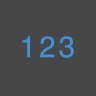
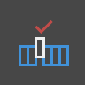
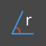
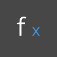
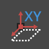
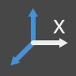

# INDEX OF NODES

##### This index provides additional information on all the nodes used in this primer, as well as other components you might find useful. This is just an introduction to some of the 500 nodes available in Dynamo.

Bulitin Functions
--

||||
|--|--|--|
|Count|Returns number of items in the specified list.|
|Flatten|Returns the flattened 1D list of the multidimensional input list.|
|Map|Maps a value into an input range|

Core
--

####Core.Color
||||
|--|--|--|
|**Create**|||
|Color.ByARGB|Construct a color by alpha, red, green, and blue components.||
|Color Range|Get a color from a color gradient between a start color and an end color.||
|**Actions**|||
|Color.Brightness|Gets the brightness value for this color.||
|Color.Components|Lists the components for the color in the order: alpha, red, green, blue.||
|Color.Saturation|Gets the saturation value for this color||
|Color.Hue|Gets the hue value for this color.||
|**Query**|||
|Color.Alpha|Find the alpha component of a color, 0 to 255.||
|Color.Blue|Find the blue component of a color, 0 to 255.||
|Color.Green|Find the green component of a color, 0 to 255.||
|Color.Red|Find the red component of a color, 0 to 255.||

####Core.Display
||||
|--|--|--|
|**Create**|||
|Display .ByGeometryColor|Displays geometry using a color.|

####Core.Input
||||
|--|--|--|
|**Actions**|||
|Boolean|Selection between a true and false.|
|Code Block|Allows for DesignScript code to be authored directly.|
|Directory Path|Allows you to select a directory on the system to get its path|
|File Path|Allows you to select a file on the system to get its filename.|
|Integer Slider|A slider that produces integer values.|
|Number| Creates a number.|
|Number Slider| A slider that produces numeric values.|
|String|Creates a string.|

####Core.List
||||
|--|--|--|
|**Create**|||
|List.Create|Makes a new list out of the given inputs.|
|Number Range|Creates a sequence of numbers in the specified range.|
|Number Sequence|Creates a sequence of numbers.|
|**Actions**|||
|List.Chop|Chop a list into a set of lists each containing the given amount of items.|
|List.Count|Gets the number of items stored in the given list.|
|List.Flatten|Flattens a nested list of lists by a certain amount.|
|List .FilterByBoolMask|Filters a sequence by looking up corresponding indices in a separate list of booleans.|
|List .GetItemAtIndex|Gets an item from the given list that's located at the specified index.|
|List .TakeEveryNthItem|Fetches items from the given list at indices that are multiples of the given value, after the given offset.|

####Core.Logic
||||
|--|--|--|
|**Actions**|||
|If|Conditional statement. Checks the boolean value of the test input. If the test input is true, the result outputs the true input, otherwise the result outputs the false input.|

####Core.Math
||||
|--|--|--|
|**Actions**|||
|Math.Cos|Fines the cosine of an angle.|
|Math .DegreesToRadians|Converts an angle in degrees to an angle in radians.|
|Math.Pow|Raises a number to the specified power.|
|Math .RadiansToDegrees|Converts an angle in radians to an angle in degrees.|
|Math.RemapRange|Adjusts the range of a list of numbers while preserving the distribution ratio.|
|Math.Sin|Finds the sine of an angle.|

####Core.Object
||||
|--|--|--|
|**Actions**|||
|Object.IsNull|Determines if the given object is null.|

####Core.Scripting
||||
|--|--|--|
|**Actions**|||
|Formula|Evaluates mathematical formulas. Uses NCalc for evaluation. See http://ncalc.codeplex.com |

####Core.String
||||
|--|--|--|
|**Actions**|||
|String.Concat|Concatenates multiple strings into a single string.|
|String.Contains|Determines if the given string contains the given substring.|
|String.Join|Concatenates multiple strings into a single string, inserting the given separator between each joined string.|
|String.Split|Divides a single string into a list of strings, with divisions determined by the given separater strings.|
|String.ToNumber|Converts a string to an integer or a double.|

####Core.View
||||
|--|--|--|
|**Actions**|||
|View.Watch|Visualize the output of node.|
|View.Watch 3D|Shows a dynamic preview of geometry.|
Geometry
--

####Geometry.Circle
||||
|--|--|--|
|**Create**|||
|Circle .ByCenterPointRadius|Creates a Circle with input center Point and radius in the world XY plane, with world Z as normal.|
|Circle .ByPlaneRadius|Create a Circle centered at the input Plane origin (root), lying in the input Plane, with given radius.|

####Geometry.Cuboid
||||
|--|--|--|
|**Create**|||
|Cuboid.ByLengths (origin)|Create a Cuboid centered at input Point, with specified width, length, and height.|

####Geometry.Curve
||||
|--|--|--|
|**Actions**|||
|Curve.Extrude (distance)|Extrudes a Curve in the normal Vector direction.|
|Curve .PointAtParameter|Get a Point on the Curve at a specified parameter between StartParameter() and EndParameter().|

####Geometry.Geometry
||||
|--|--|--|
|**Actions**|||
|Geometry.DistanceTo|Obtain the distance from this Geometry to another.|
|Geometry.Rotate (basePlane)|Rotates an object around the Plane origin and normal by a specified degree.|

####Geometry.Plane
||||
|--|--|--|
|**Create**|||
|Plane.ByOriginNormal|Create a Plane centered at root Point, with input normal Vector.|
|Plane.XY|Creates a plane in the world XY|

####Geometry.Point
||||
|--|--|--|
|**Create**|||
|Point.ByCoordinates (2d)| Form a Point in the XY plane given two 2 cartesian coordinates.  The Z component is 0.||
|Point.ByCoordinates (3d)|Form a Point given 3 cartesian coordinates.||

####Geometry.Polycurve
||||
|--|--|--|
|**Create**|||
|Polycurve.ByPoints|Make PolyCurve from sequence of lines connecting points. For clode curve last point should be in the same location as the start point.|

####Geometry.Sphere
||||
|--|--|--|
|**Create**|||
|Sphere .ByCenterPointRadius|Create a Solid Sphere centered at the input Point, with given radius.|

####Geometry.Surface
||||
|--|--|--|
|**Actions**|||
|Surface.Thicken|Thicken Surface into a Solid, extruding in the direction of Surface normals on both sides of the Surface.|

####Geometry.UV
||||
|--|--|--|
|**Create**|||
|UV.ByCoordinates|Create a UV from two doubles.|

####Geometry.Vector
||||
|--|--|--|
|**Create**|||
|Vector.XAxis|Gets the canonical X axis Vector (1,0,0)|
|Vector.YAxis|Gets the canonical Y axis Vector (0,1,0)|
|Vector.ZAxis|Gets the canonical Z axis Vector (0,0,1)|

Operators
--
||||
|--|--|--|
|+|Addition|
|*|Multiplication|
|%|Modular Division|
|<|Less Than|
|>|Greater Than|
|==|Equality boolean operater. Tests for equality between two values.|