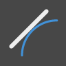
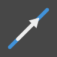

# INDEX OF NODES

##### This index provides additional information on all the nodes used in this primer, as well as other components you might find useful. This is just an introduction to some of the 500 nodes available in Dynamo.

Geometry
--

####Geometry.Line
|||||
|--|--|--|--|
||**Create**|||
||Line .ByBestFitThroughPoints|Creates a Line best approximating a scatter plot of Points.|
||Line .ByStartPointDirectionLength|Create a straight Line starting at Point, extending in Vector direction by specified length.|
||Line .ByStartPointEndPoint|Creates a straight Line between two input Points.|
||Line.ByTangency|Create a Line tangent to the input Curve, positioned at the parameter Point of the input Curve.|
||**Query**|||
||Line.Direction|The direction of the Curve.|

