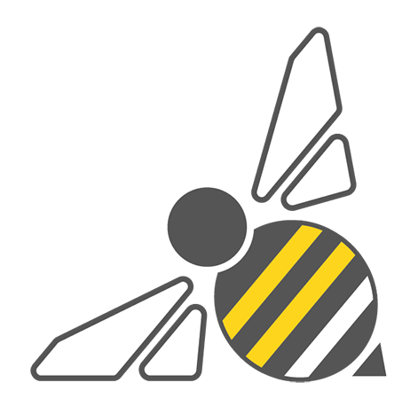
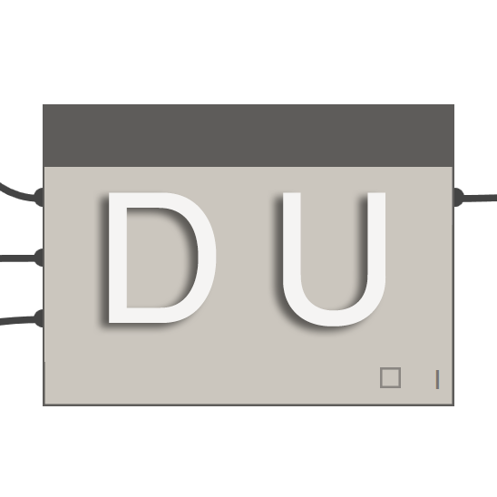
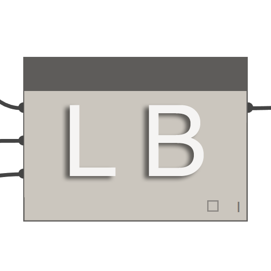
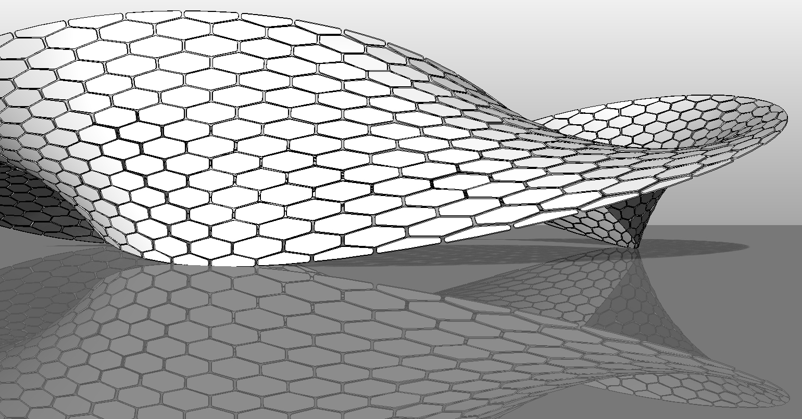
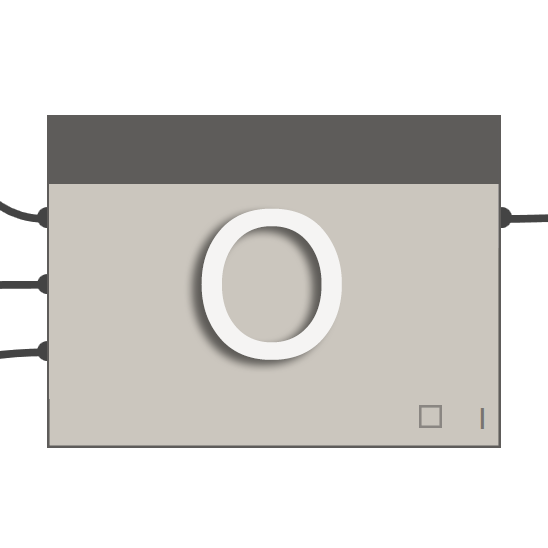

##Dynamo Packages

<table>
  <tr>
    <td width="10%"></img></td>
    <td width="55%"><b>BUMBLEBEE FOR DYNAMO</b></td>
    <td><a href="http://archi-lab.net/bumblebee-dynamo-and-excel-interop/">Visit the Official BumbleBee Site</td></a>
  </tr>
  <tr>
    <td colspan="2">Bumblebee is an Excel and Dynamo interoperability plugin that vastly improves Dynamo’s ability to read and write Excel files. </td>
    <td></img></td>
  </tr>
</table>

<table>
  <tr>
    <td width="10%"></img></td>
    <td width="55%"><b>CLOCKWORK FOR DYNAMO</b></td>
    <td><a href="http://archi-lab.net/bumblebee-dynamo-and-excel-interop/">Visit the Clockwork For Dynamo GitHub</td></a>
  </tr>
  <tr>
    <td colspan="2">Clockwork is a collection of custom nodes for the Dynamo visual programming environment. It contains many Revit-related nodes, but also lots of nodes for various other purposes such as list management, mathematical operations, string operations, unit conversions, geometric operations (mainly bounding boxes, meshes, planes, points, surfaces, UVs and vectors) and paneling. </td>
    <td></img></td>
  </tr>
</table>

<table>
  <tr>
    <td width="10%"></img></td>
    <td width="55%"><b>DYNAMO UNFOLD</b></td>
    <td><a href="https://github.com/mjkkirschner/DynamoUnfold">Visit the DynamoUnfold GitHub</td></a>
  </tr>
  <tr>
    <td colspan="2">This library extends Dynamo/Revit functionality by enabling users to unfold surface and poly-surface geometry. The library allows users to first translate surfaces into planar tessellated topology, then unfold them using Protogeometry tools in Dynamo. This package also includes some experimental nodes as well as a few basic sample files. </td>
    <td></img></td>
  </tr>
</table>

<table>
  <tr>
    <td width="10%"></img></td>
    <td width="55%"><b>FIREFLY FOR DYNAMO</b></td>
    <td><a href="http://dynamopackages.com/">Download Firefly at the Dynamo Package Manager</td></a>
  </tr>
  <tr>
    <td colspan="2">Firefly is a collection of nodes which enable dynamo to talk to input/output devices, like the Arduino micro controller. Because the data flow happens “live”, Firefly opens up many opportunities for interactive prototyping between the digital and physical worlds through web cams, mobile phones, game controllers, sensors and more. </td>
    <td></img></td>
  </tr>
</table>

<table>
  <tr>
    <td width="10%"></img></td>
    <td width="55%"><b>LUNCHBOX FOR DYNAMO</b></td>
    <td><a href="http://provingground.io/tools/lunchbox/">Checkout Lunchbox for Dynamo on the Proving Ground</td></a>
  </tr>
  <tr>
    <td colspan="2">LunchBox is a collection of reusable geometry and data management nodes. The tools have been tested with Dynamo 0.8.1 and Revit 2016. The tool includes nodes for surface paneling, geometry, Revit data collection, and more!. After installation, search a 'LunchBox' category will appear in Dynamo. For versions compatible with Dynamo 0.6, please install version 2014.6.5 or earlier.  </td>
    <td></img></td>
  </tr>
</table>

<table>
  <tr>
    <td width="10%"></img></td>
    <td width="55%"><b>MESH TOOLKIT</b></td>
    <td><a href="https://github.com/DynamoDS/Dynamo/wiki/Dynamo-Mesh-Toolkit">Visit the Dynamo Mesh Toolkit GitHub</td></a>
  </tr>
  <tr>
    <td colspan="2">The Dynamo Mesh Toolkit provides many useful tools for working with mesh geometry. The functionality of this package includes the ability to import meshes from external file formats, generate meshes from pre-existing Dynamo geometry objects, and manually build meshes through vertices and connectivity information. Additionally, this toolkit includes tools to modify and repair mesh geometry. </td>
    <td></img></td>
  </tr>
</table>

<table>
  <tr>
    <td width="10%"></img></td>
    <td width="55%"><b>OPTIMO</b></td>
    <td><a href="https://github.com/BPOpt/Optimo/wiki/0_-Home">Visit the Optimo GitHub</td></a>
  </tr>
  <tr>
    <td colspan="2">Optimo provides dynamo users with the capability to optimize self-defined design problems by using various evolutionary algorithms. Users can define the problem objective or set of objectives as well as specific fitness functions. </td>
    <td></img></td>
  </tr>
</table>

<table>
  <tr>
    <td width="10%"></img></td>
    <td width="55%"><b>RHYNAMO</b></td>
    <td><a href="https://bitbucket.org/caseinc/rhynamo">Visit the Rhynamo Bitbucket</td></a>
  </tr>
  <tr>
    <td colspan="2">The Rhynamo node library provides users with the ability to read and write Rhino 3DM files from within Dynamo. Rhynamo translates Rhino geometry into usable Dynamo geometry by using McNeel’s OpenNURBS library allowing for new workflows that can exchange geometry and data fluidly between Rhino and Revit. This package also contains some experimental nodes that allow for “live” access to the Rhino command line. </td>
    <td></img></td>
  </tr>
</table>

