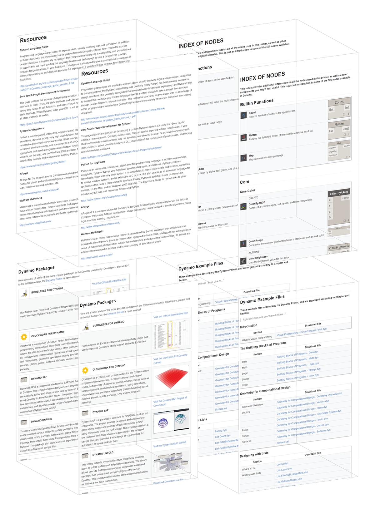

# Appendix

Once you have created a few Custom Nodes the very next step is to begin organizing and publishing them by way of Packages - a convenient way to store and share your nodes with the Dynamo Community.
In this section, we've compiled additional resources for taking your Dynamo game one step further. We've also added an index of important nodes, a collection of packages, and a repository of the example files in this primer. Please feel free to add to this section, and remember, the [Dynamo Primer](https://github.com/modelab/dynamo-primer). is open source!

