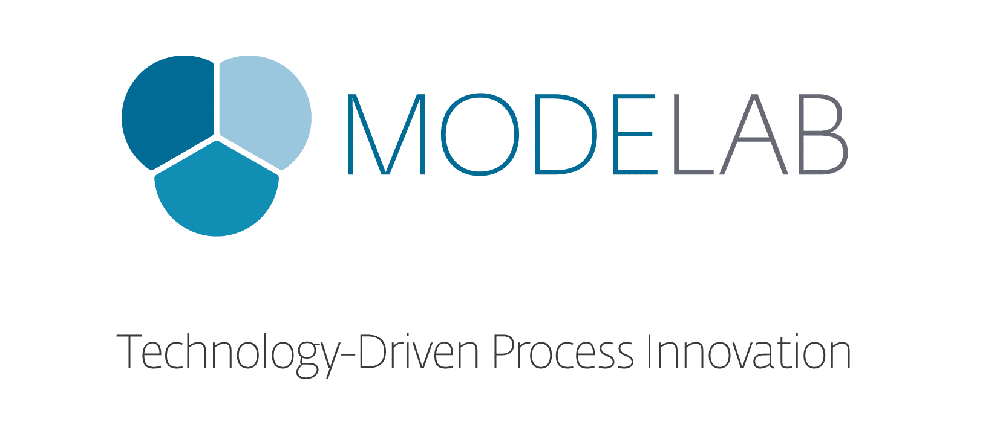

#The Dynamo Primer
##First Edition V1.0

> Dynamo is a platform for toolmakers to make better tools by providing access to the core of Autodesk software, thereby enabling us to connect the dots.

### Welcome
You have just opened the First Edition of the Dynamo Primer, a comprehensive guide to visual programming for the ecosystem of Autodesk design software. This primer is an on-going, collaborative project between the development team at Autodesk, Mode Lab, and you to document and explore: fundamental concepts; best practices; cross-disciplinary applications; and more with Dynamo.

Version 1.0 of this primer includes the first four chapters of a planned twelve chapters to be released in the coming months. These first chapters focus on the essentials you will need to get up and running using the "Sandbox" version of **Dynamo**. The power of Dynamo as a platform resides in the ability for us to develop visual programs for a wide array of creative softwares from the Autodesk suite, so later chapters will survey some of the most exciting connections.

We are excited to go on this journey together. Let's get started!

---
### The Dynamo Primer Project
This project was initiated by Matt Jezyk and the Dynamo Development team. The First Edition has been developed by **Mode Lab**. http://modelab.is

### Acknowledgements

A special thanks to Ian Keough for initiating and guiding the Dynamo project.

Thank you to Matt Jezyk, Ian Keough, Zach Kron, and Colin McCrone for enthusiastic collaboration and the opportunity to participate on a wide array of Dynamo projects.

### Software and Resources
**Dynamo** The current stable release of Dynamo is Version 0.8.

http://dynamobim.com/download/

**DynamoBIM** The best source for additional information, learning content, and forums is the DynamoBIM website.

http://dynamobim.org

**Dynamo GitHub** Dynamo is an open-source development project on Github. To contribute, check out DynamoDS hosted by Ian Keough.

https://github.com/ikeough/Dynamo

### License
This primer's text, illustrations, and datasets are licensed under a (**confirm**) License.
