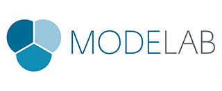

#The Dynamo Primer
##First Edition V1.0

> Dynamo is an open source visual programming platform for designers.

### Welcome
You have just opened the First Edition of the Dynamo Primer, a comprehensive guide to visual programming in Autodesk Dynamo Studio. This primer is an on-going project to share the fundamentals of programming. Topics include working with computational geometry, best practices for rules-based design, cross-disciplinary programming applications, and more with the Dynamo Platform.

The power of Dynamo can be found in a wide variety of design-related activities. Dynamo enables an expanding list of readiliy accessible ways for you to get started:
* **Explore** visual programming for the first time
* **Connect** workflows in various software
* **Engage** an active community of users, contributors, and developers
* **Develop** an open-source platform for continued improvement

In the midst of this activity and exciting opportunity for working with Dynamo, we need a document of the same caliber, the Dynamo Primer.

Version 1.0 of this Primer includes the first four chapters of a planned twelve chapters to be written by Mode Lab and released in the coming months. These first chapters focus on the essentials you will need to get up and running developing your own visual programs with Dynamo. Here's what you can expect to learn from the primer:

* **Context** - What exactly is "Visual Progamming" and what are the concepts I need to understand to dive in to Dynamo?
* **Getting Started** - How do I get Dynamo and create my first program?
* **What's in a Program** - What are the functional parts of Dynamo and how do I use them?
* **Building Blocks** - What is "Data" and what are some fundamental types I can start using in my programs?

This is an exciting time to be learning about, working with, and developing for Dynamo. Let's get started!

---
### The Dynamo Primer Project
The Dynamo Primer is an open source project, initiated by Matt Jezyk and the Dynamo Development team at Autodesk.

**Mode Lab** was commissioned to write the First Edition of the primer. http://modelab.is

### Acknowledgements

A special thanks to Ian Keough for initiating and guiding the Dynamo project.

Thank you to Matt Jezyk, Ian Keough, Zach Kron, and Colin McCrone for enthusiastic collaboration and the opportunity to participate on a wide array of Dynamo projects.

### Software and Resources
**Dynamo** The current stable release of Dynamo is Version 0.8.

http://dynamobim.com/download/

**DynamoBIM** The best source for additional information, learning content, and forums is the DynamoBIM website.

http://dynamobim.org

**Dynamo GitHub** Dynamo is an open-source development project on Github. To contribute, check out DynamoDS hosted by Ian Keough.

https://github.com/ikeough/Dynamo

### License
This primer's text, illustrations, and datasets are licensed under a (**confirm**) License.
