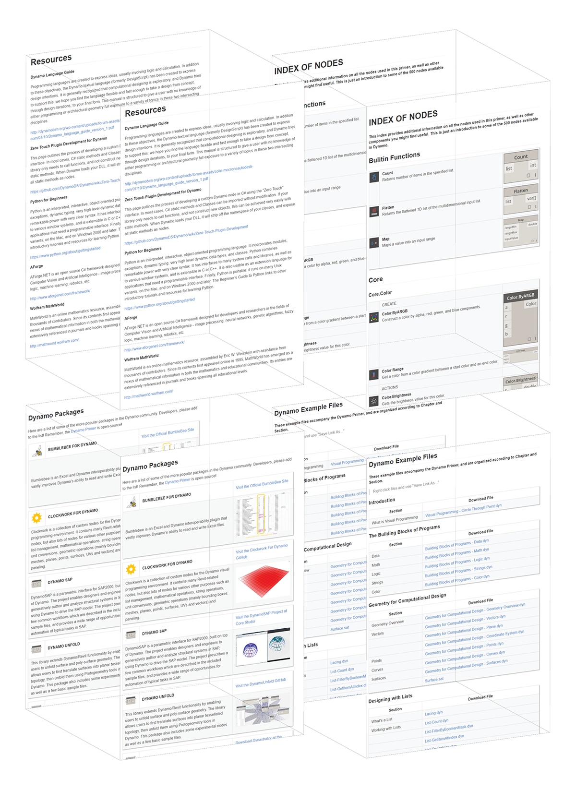

# Appendix

In this section, you can find additional resources for taking your Dynamo game one step further. We've also added an index of important nodes, a collection of useful packages, and a repository of the example files in this primer. Please feel free to add to this section...remember, the [Dynamo Primer](https://github.com/DynamoDS/DynamoPrimer) is open source!

&#x20;

