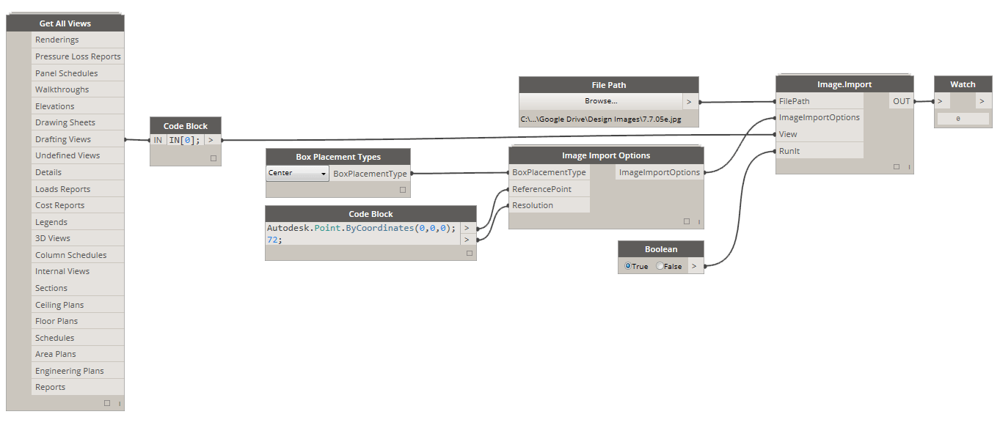

# Useful Packages

Here are a list of some of the more popular packages in the Dynamo community. Developers, please add to the list! Remember, the [Dynamo Primer](https://github.com/DynamoDS/DynamoPrimer) is open-source!

| **ARCHI-LAB**                                                                                                                                                                                                                                               | [Visit the Official archi-lab Site](http://archi-lab.net) |
| -------------------------------------------------------------------------------------------------------------------------------------------------------------------------------------------------------------------------------------------------------------------------------------------------- | --------------------------------------------------------- |
| archi-lab is a collection of over 50+ custom packages that vastly extend Dynamo's ability to interact with Revit. Nodes contained in archi-lab package vary from basic list operations to advanced Analysis Visualization Framework nodes for Revit. archi-lab is available on the package manager |                  |

|  **BIMORPH NODES**                                                                                                                                                                                                                                                                                                                                             | [Visit the BimorphNodes Dictionary](https://bimorph.com/bimorph-nodes/) |
| ------------------------------------------------------------------------------------------------------------------------------------------------------------------------------------------------------------------------------------------------------------------------------------------------------------------------------------------------------------------------------------------------------------------------------ | ----------------------------------------------------------------------- |
| BimorphNodes is a versatile collection of powerful utility nodes. The package highlights include ultra-efficient clash detection and geometry intersection nodes, ImportInstance (CAD) curve conversion nodes, and linked element collectors that resolve limitations in the Revit API. To learn about the full range of nodes available, visit the BimorphNodes dictionary. BimorphNodes is available on the package manager. |    |

|  **BUMBLEBEE FOR DYNAMO**                                                                   | [Visit the Official BumbleBee Site](http://archi-lab.net/bumblebee-dynamo-and-excel-interop/) |
| ----------------------------------------------------------------------------------------------------------------------------- | --------------------------------------------------------------------------------------------- |
| Bumblebee is an Excel and Dynamo interoperability plugin that vastly improves Dynamo’s ability to read and write Excel files. |                                                       |

| **CLOCKWORK FOR DYNAMO**                                                                                                                                                                                                                                                                                                                            | [Visit the Clockwork For Dynamo GitHub](https://github.com/CAAD-RWTH/ClockworkForDynamo) |
| ------------------------------------------------------------------------------------------------------------------------------------------------------------------------------------------------------------------------------------------------------------------------------------------------------------------------------------------------------------------------------------- | ---------------------------------------------------------------------------------------- |
| Clockwork is a collection of custom nodes for the Dynamo visual programming environment. It contains many Revit-related nodes, but also lots of nodes for various other purposes such as list management, mathematical operations, string operations, unit conversions, geometric operations (mainly bounding boxes, meshes, planes, points, surfaces, UVs and vectors) and paneling. |                                                  |

|  **DATA\|SHAPES**                                                                                                                                                                                                                      | [Visit Data\|Shapes on GitHub](https://github.com/MostafaElAyoubi/Data-shapes) |
| ------------------------------------------------------------------------------------------------------------------------------------------------------------------------------------------------------------------------------------------------------------------------------- | ------------------------------------------------------------------------------ |
| DataShapes is a package that aims to extend the user functionality of Dynamo scripts. This has a heavy focus on adding greater functionality to Dynamo player. For more infor visit https://data-shapes.net/. Want to create awesome Dynamo player workflows? Use this package. |                                   |

|  **DYNAMO SAP**                                                                                                                                                                                                                                                                                                                                                           | [Visit the DynamoSAP Project at Core Studio](http://core.thorntontomasetti.com/dynamosap-is-now-open-source/) |
| ---------------------------------------------------------------------------------------------------------------------------------------------------------------------------------------------------------------------------------------------------------------------------------------------------------------------------------------------------------------------------------------------------------- | ------------------------------------------------------------------------------------------------------------- |
| DynamoSAP is a parametric interface for SAP2000, built on top of Dynamo. The project enables designers and engineers to generatively author and analyze structural systems in SAP, using Dynamo to drive the SAP model. The project prescribes a few common workflows which are described in the included sample files, and provides a wide range of opportunities for automation of typical tasks in SAP. |                                                                           |

|  **DYNAMO UNFOLD**                                                                                                                                                                                                                                                                                       | [Visit the DynamoUnfold GitHub](https://github.com/mjkkirschner/DynamoUnfold) |
| --------------------------------------------------------------------------------------------------------------------------------------------------------------------------------------------------------------------------------------------------------------------------------------------------------------------------------------------------- | ----------------------------------------------------------------------------- |
| This library extends Dynamo/Revit functionality by enabling users to unfold surface and poly-surface geometry. The library allows users to first translate surfaces into planar tessellated topology, then unfold them using Protogeometry tools in Dynamo. This package also includes some experimental nodes as well as a few basic sample files. |                                    |

|  **DYNASTRATOR**                                                                                           | [Download Dynastrator at the Package Manager](http://dynamopackages.com) |
| ---------------------------------------------------------------------------------------------------------------------------------------------------- | ------------------------------------------------------------------------ |
| Import vector art from Illustrator or the web using .svg. This allows you to import manually created drawings into Dynamo for parametric operations. |                              |

|  **ENERGY ANALYSIS FOR DYNAMO**                                                                                                                                                                                                                                                                                                                                              | [Visit the Energy Analysis for Dynamo Project on GitHub](https://github.com/tt-acm/EnergyAnalysisForDynamo) |
| ------------------------------------------------------------------------------------------------------------------------------------------------------------------------------------------------------------------------------------------------------------------------------------------------------------------------------------------------------------------------------------------------------------- | ----------------------------------------------------------------------------------------------------------- |
| Energy Analysis for Dynamo allows for parametric energy modeling and whole-building energy analysis workflows in Dynamo 0.8. Energy Analysis for Dynamo allows the user to configure the energy model from Autodesk Revit, submit to Green Building Studio for DOE2 energy analysis, and dig into the results returned from the analysis. The package is being developed by Thornton Tomasetti's CORE studio. |                                                                          |

|  **FIREFLY FOR DYNAMO**                                                                                                                                                                                                                                                                               | [Download Firefly at the Dynamo Package Manager](http://dynamopackages.com) |
| ------------------------------------------------------------------------------------------------------------------------------------------------------------------------------------------------------------------------------------------------------------------------------------------------------------------------------------------- | --------------------------------------------------------------------------- |
| Firefly is a collection of nodes which enable dynamo to talk to input/output devices, like the Arduino micro controller. Because the data flow happens “live”, Firefly opens up many opportunities for interactive prototyping between the digital and physical worlds through web cams, mobile phones, game controllers, sensors and more. |                                       |

|  **GENIUS LOCI**                                                                                                                                                             | [Visit the Genius Loci GitHub](https://github.com/albandechasteigner/GeniusLociForDynamo) |
| -------------------------------------------------------------------------------------------------------------------------------------------------------------------------------------------------------------------------- | ----------------------------------------------------------------------------------------- |
| Genius Loci is a compilation of Nodes for Dynamo. It consists useful Nodes that benefits Revit users. Install the package  to explore some of the features, such as interact easily with linked files and Revit Documents. |                             |

|  **MANTIS SHRIMP**                                                               | [Visit the official Mantis Shrimp site.](http://archi-lab.net/mantis-shrimp-getting-started/) |
| ---------------------------------------------------------------------------------------------------------------------------- | --------------------------------------------------------------------------------------------- |
| Mantis Shrimp is an interoperability project that allows you to easily import Grasshopper and/or Rhino geometry into Dynamo. |                                                            |

|  **MESH TOOLKIT**                                                                                                                                                                                                                                                                                                                                              | [Visit the Dynamo Mesh Toolkit GitHub](https://github.com/DynamoDS/Dynamo/wiki/Dynamo-Mesh-Toolkit) |
| -------------------------------------------------------------------------------------------------------------------------------------------------------------------------------------------------------------------------------------------------------------------------------------------------------------------------------------------------------------------------------------------------------- | --------------------------------------------------------------------------------------------------- |
| The Dynamo Mesh Toolkit provides many useful tools for working with mesh geometry. The functionality of this package includes the ability to import meshes from external file formats, generate meshes from pre-existing Dynamo geometry objects, and manually build meshes through vertices and connectivity information. Additionally, this toolkit includes tools to modify and repair mesh geometry. |                                                           |

| 🧐 **MONOCLE**                                                                                                                                                                                                                                                                                                       | [Visit the Monocle GitHub](https://github.com/johnpierson/MonocleForDynamo) |
| -------------------------------------------------------------------------------------------------------------------------------------------------------------------------------------------------------------------------------------------------------------------------------------------------------------------- | --------------------------------------------------------------------------- |
| Monocle is a View Extension for Dynamo 2.0.x. Monocle contains a set of useful tools for package identification, graph cleanup and more! Monocle aims to add functionality to the Dynamo UI in a seemless way that leaves you thinking, _"is this built into dynamo?"_. Monocle is available on the package manager. |                                     |

|  **OPTIMO**                                                                                                                                                                                       | [Visit the Optimo GitHub](https://github.com/BPOpt/Optimo/wiki/0\_-Home) |
| -------------------------------------------------------------------------------------------------------------------------------------------------------------------------------------------------------------------------------------- | ------------------------------------------------------------------------ |
| Optimo provides dynamo users with the capability to optimize self-defined design problems by using various evolutionary algorithms. Users can define the problem objective or set of objectives as well as specific fitness functions. |                                     |

|  **RHYNAMO**                                                                                                                                                                                                                                                                                                                                                                          | [Visit the Rhynamo Bitbucket](https://bitbucket.org/caseinc/rhynamo) |
| --------------------------------------------------------------------------------------------------------------------------------------------------------------------------------------------------------------------------------------------------------------------------------------------------------------------------------------------------------------------------------------------------------------------------- | -------------------------------------------------------------------- |
| The Rhynamo node library provides users with the ability to read and write Rhino 3DM files from within Dynamo. Rhynamo translates Rhino geometry into usable Dynamo geometry by using McNeel’s OpenNURBS library allowing for new workflows that can exchange geometry and data fluidly between Rhino and Revit. This package also contains some experimental nodes that allow for “live” access to the Rhino command line. |                                |

|  **RHYTHM**                                                                                                                                                                                                                                                            | [Visit Rhythm on GitHub](https://github.com/sixtysecondrevit/RhythmForDynamo) |
| ----------------------------------------------------------------------------------------------------------------------------------------------------------------------------------------------------------------------------------------------------------------------------------------------------------- | ----------------------------------------------------------------------------- |
| Rhythm is a set of useful nodes to help your Revit project maintain a good rhythm with Dynamo. basically it does some pretty okay stuff. Rhythm is open source and primarily built in C#, and adds Revit nodes, core nodes and a view extension to your Dynamo. Rhythm is available on the package manager. |                                      |

|  **Spring Nodes**                                                                                                                                                                                                                                                                                                                      | [Visit Spring ](https://github.com/dimven/SpringNodes)[Nodes on GitHub](https://github.com/dimven/SpringNodes) |
| ---------------------------------------------------------------------------------------------------------------------------------------------------------------------------------------------------------------------------------------------------------------------------------------------------------------------------------------------------------------------------- | -------------------------------------------------------------------------------------------------------------- |
| Spring nodes main focus is to improve Dynamo's interaction with Revit. The wider goal is to explore any and all means that can help accelerate BIM focused work-flows. Many of the nodes use either IronPython or DesignScript and can be a good starting point for learning the specific syntax and finer points of both. Spring nodes is available on the package manager. |                                                                  |
