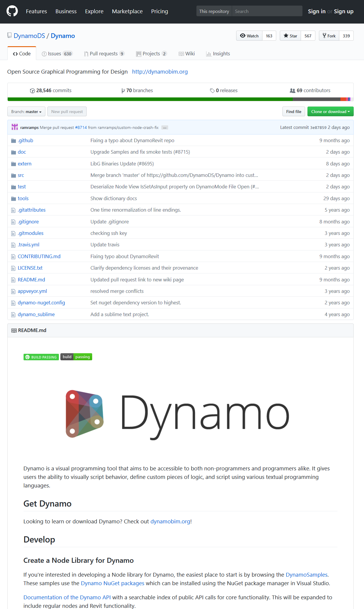

## Co je aplikace Dynamo?

Charakter aplikace Dynamo určuje její uživatel. Aplikaci lze používat samostatně nebo ve spojení s dalším softwarem společnosti Autodesk, provádět v ní vizuální programování nebo se zapojit do komunity uživatelů a přispěvatelů.

### Aplikace

Aplikaci Dynamo lze stáhnout a spustit samostatně v režimu „Sandbox“ nebo jako doplněk pro jiné aplikace, například Revit nebo Maya. Aplikaci lze popsat takto:

> Dynamo je nástroj pro vizuální programování, který je určen programátorům i uživatelům bez znalostí programování. Umožňuje uživatelům vizuálně skriptovat chování, definovat vlastní logiky a skriptovat pomocí různých textových programovacích jazyků.

> 1. Podívejte se na spolupráci aplikací Dynamo a Revit
> 2. Stáhněte si instalační program

### Proces

Po instalaci aplikace Dynamo v ní bude možné vizuálně programovat, tedy propojovat prvky, určovat mezi nimi vazby a vytvářet tak algoritmy složené z posloupnosti akcí. Tyto algoritmy lze použít pro širokou škálu aplikací – od zpracování dat po generování geometrií – vše v reálném čase a bez jediného řádku `code`.

> Vytvářejte a spouštějte vizuální programy jednoduchým propojováním prvků.

### Komunita

Aplikace Dynamo by nemohla být taková, jaká je bez široké komunity uživatelů a přispěvatelů. Zapojte se do komunity tím, že budete sledovat blog, přidáte svou práci do galerie nebo budete diskutovat na fóru.

### Platforma

Aplikace Dynamo je navržena jako nástroj vizuálního programování pro konstruktéry, který umožňuje vytvářet nástroje využívající externí knihovny nebo rozhraní API jakéhokoliv produktu společnosti Autodesk. V aplikaci Dynamo Sandbox lze vyvíjet programy v režimu „Sandbox“ – zde však ekosystém aplikace Dynamo ani zdaleka nekončí.

Projekt má otevřený zdrojový kód, takže jej lze rozšiřovat o požadované funkce. Navštivte projekt na GitHubu a podívejte se na probíhající práce na aplikaci Dynamo.

> Prohlédněte si a forkněte repozitář a začněte jej rozšiřovat o nové funkce
