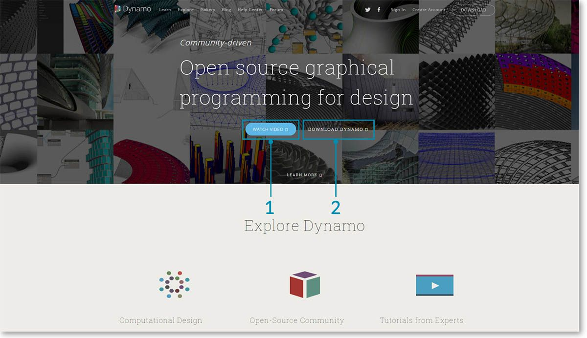
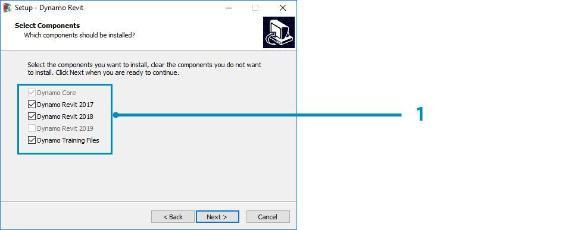
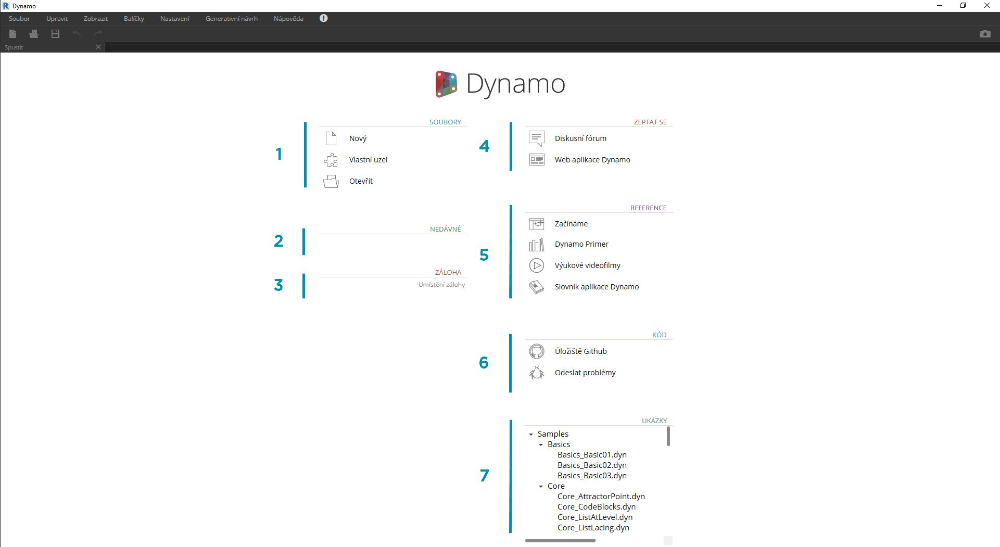

## Instalace a spuštění aplikace Dynamo

Aplikace Dynamo je aktivní projekt s otevřeným zdrojovým kódem, instalační programy jsou k dispozici ve dvou variantách: oficiální verze a denní vydání. Začněte tím, že si stáhnete oficiální verzi, nebo pomozte s vývojem prostřednictvím denních vydání nebo na GitHub projektu.

### Stahování

Chcete-li stáhnout oficiální verzi aplikace Dynamo, navštivte [web aplikace Dynamo](http://dynamobim.com/). Stahování můžete zahájit přímo z domovské stránky nebo můžete přejít na stránku pro stahování.

> 1. Podívejte se na video o výpočetním návrhu v architektuře s aplikací Dynamo
2. Nebo přejděte na stránku pro stahování

Zde si můžete stáhnout nejnovější vývojové verze nebo přejít do projektu [Dynamo na Githubu](https://github.com/DynamoDS/Dynamo).

> 1. Stažení oficiální verze instalačního programu
2. Stažení denních vydání instalačních programů
3. Vlastní balíčky od vývojářské komunity
4. Zapojit se do vývoje aplikace Dynamo na GitHubu

### Instalace

Přejděte do adresáře se staženým instalačním programem a spusťte jej. Během instalace budete moci určit, které komponenty mají být nainstalovány.

> 1. Vyberte komponenty k instalaci

V této části je nutné rozhodnout, zda se mají zahrnout komponenty, které aplikaci Dynamo propojí s ostatními nainstalovanými aplikacemi, například s aplikací Revit. Další informace o platformě Dynamo naleznete v **kapitole 1.2**.

### Spouštění

Pro spuštění aplikace Dynamo přejděte do složky \Program Files\Dynamo\Dynamo Revit\x.y a poté vyberte soubor DynamoSandbox.exe. Tím se otevře samostatná verze a zobrazí se *úvodní stránka* aplikace Dynamo. Na této stránce jsou k dispozici standardní nabídky a panely nástrojů a také sada zástupců, pomocí kterých lze přistupovat k funkcím pro soubory nebo dalším zdrojům.

> 1. Soubory – vytvoření nového souboru nebo otevření existujícího
2. Nedávné – nedávné soubory
3. Záloha – přístup k zálohám
4. Zeptat se – přímý přístup na uživatelské fórum nebo web aplikace Dynamo
5. Literatura – další výukové materiály
6. Kód – umožňuje podílet se na vývoji projektu s otevřeným zdrojovým kódem
7. Příklady – příklady, které jsou dodávány spolu s instalací

Otevřete první soubor v části příklady, zobrazí se pracovní plocha, na které si můžete ověřit, že aplikace Dynamo funguje správně. Klikněte na možnost Příklady > Základy > **Basics_Basic01.dyn**.

> 1. Ujistěte se, že na panelu spuštění je uvedeno „Automaticky“, případně klikněte na tlačítko Spustit
2. Podle uvedených pokynů připojte uzel **Number** k uzlu **+**
3. Ujistěte se, že je v uzlu Watch zobrazen výsledek

Pokud se soubor úspěšně načte, můžete spustit svůj první vizuální program v aplikaci Dynamo.

