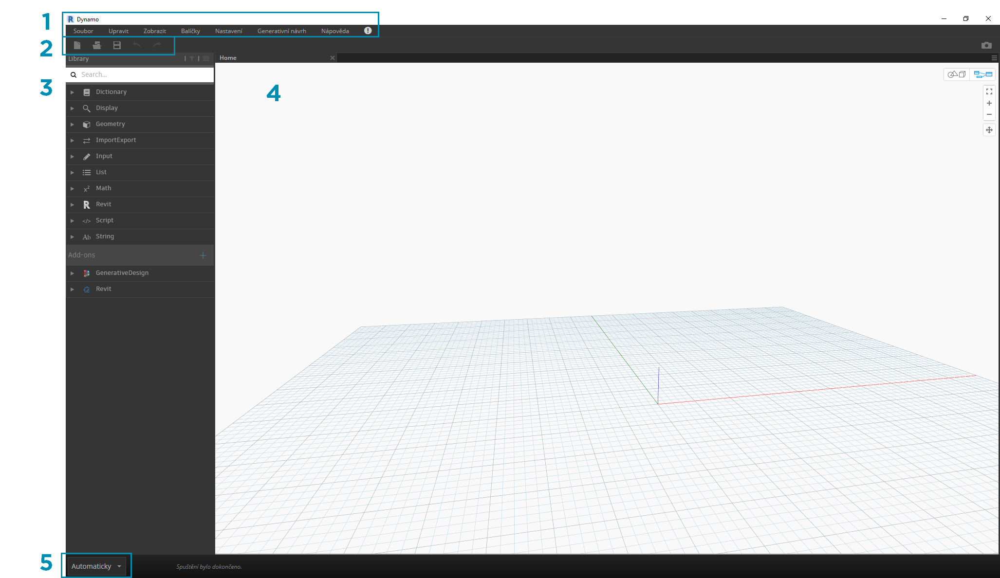
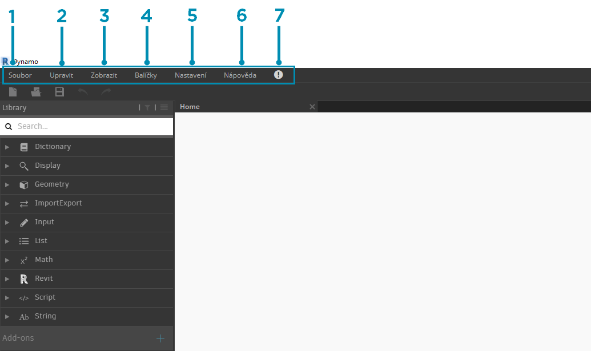
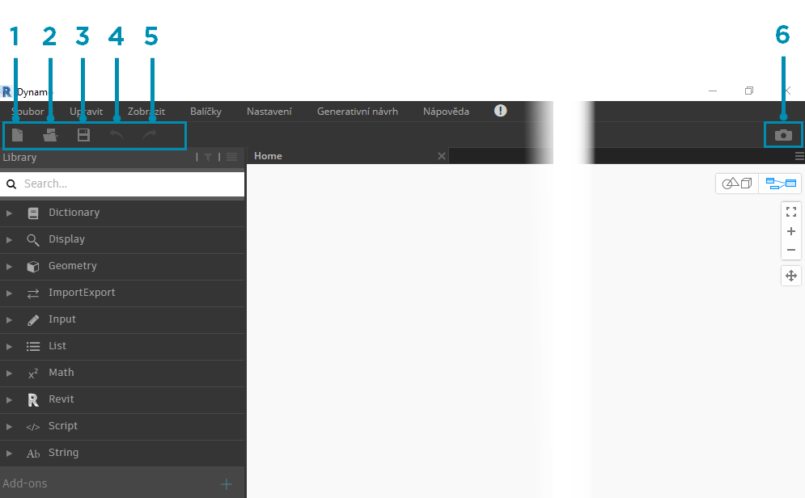
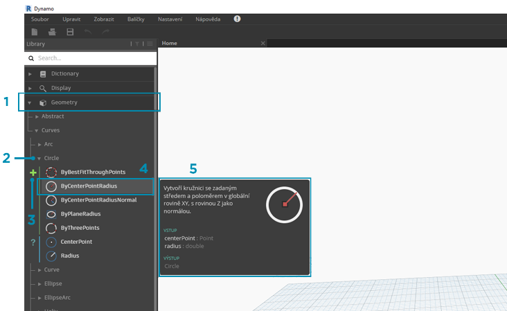
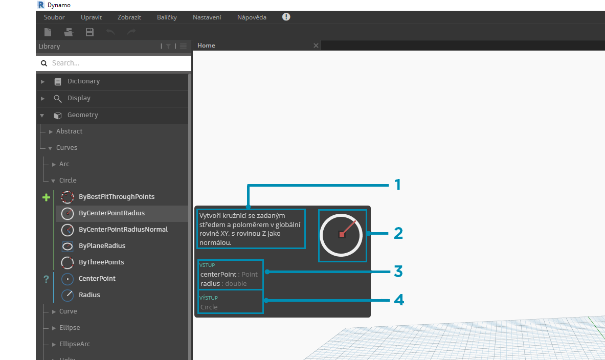
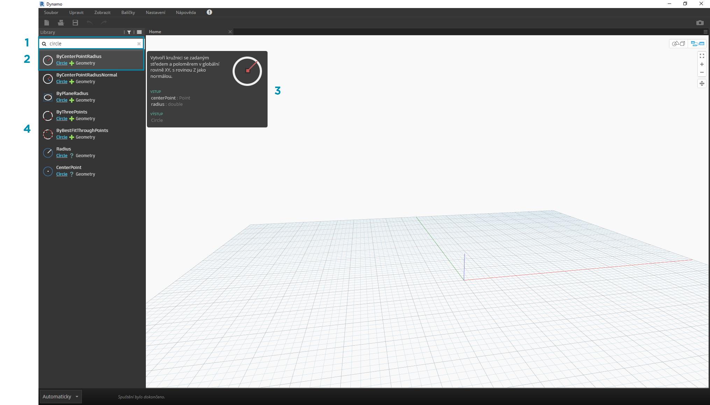
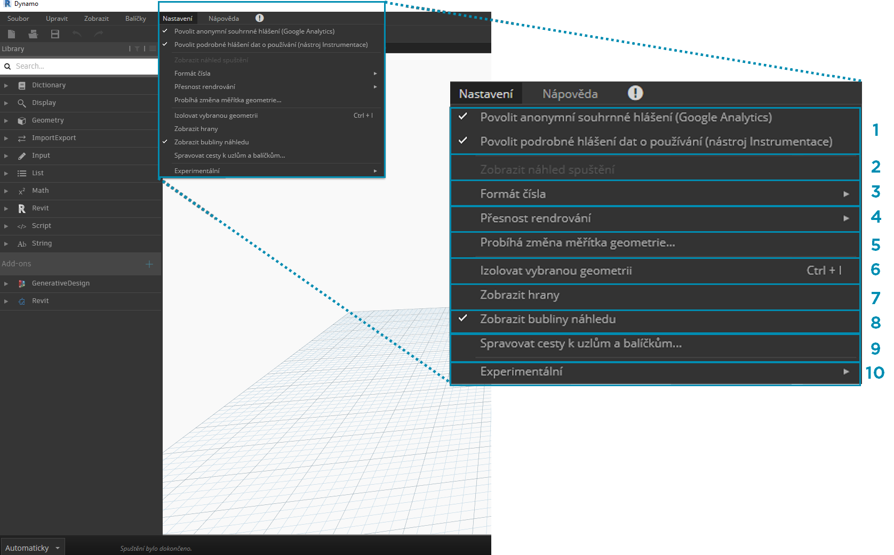
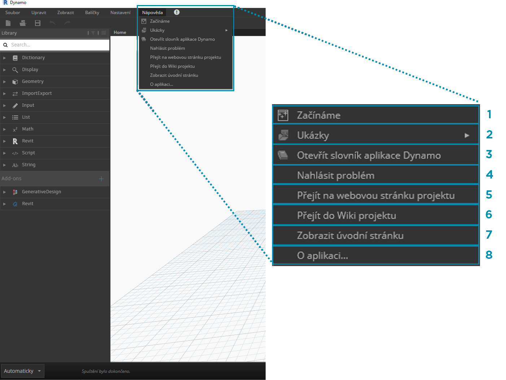

## Uživatelské rozhraní aplikace Dynamo

Uživatelské rozhraní aplikace Dynamo je uspořádáno do pěti hlavních oblastí, z nichž největší je pracovní prostor, ve kterém tvoříme naše vizuální programy.

> 1. Nabídky
2. Panel nástrojů
3. Knihovna
4. Pracovní prostor
5. Panel Provedení

Pojďme se hlouběji ponořit do uživatelského rozhraní a prozkoumat funkce jednotlivých oblastí.

#### Nabídky

Rozevírací nabídky jsou skvělým místem k vyhledání některých základních funkcí aplikace Dynamo. Podobně jako většina aplikací Windows se i akce související se správou souborů a operací pro výběr a úpravy obsahu nacházejí v prvních dvou nabídkách. Zbývající nabídky jsou specifičtější pro aplikaci Dynamo.

> 1. Soubor
2. Upravit
3. Zobrazení
4. Balíčky
5. Nastavení
6. Nápověda
7. Upozornění

#### Panel nástrojů

Panel nástrojů aplikace Dynamo obsahuje řadu tlačítek pro rychlý přístup k práci se soubory a také příkazy Zpět [Ctrl+Z] a Znovu [Ctrl+Y]. Zcela vpravo je další tlačítko, které umožňuje exportovat snímek pracovního prostoru, což je mimořádně užitečné pro dokumentaci a sdílení.

> 1. Nový – Vytvoří nový soubor .dyn
2. Otevřít – Otevře existující soubor .dyn (pracovní prostor) nebo .dyf (vlastní uzel)
3. Uložit/uložit jako – Uloží aktivní soubor .dyn nebo .dyf
4. Zpět – Vrátí zpět poslední akci
5. Znovu – Znovu provede další akci
6. Exportovat pracovní prostor jako obrázek – Exportuje viditelné pracovní prostředí jako soubor PNG

#### Knihovna

Knihovna obsahuje všechny načtené uzly, včetně výchozích uzlů, které jsou dodávány s instalací, a všech dalších načtených vlastních uzlů nebo balíčků. Uzly v knihovně jsou hierarchicky uspořádány v knihovnách, kategoriích a případně podkategoriích podle toho, zda uzly vytvářejí data **Create** provádějí nějakou akci **Action** nebo dotazují nějaká data **Query**.

##### Procházení

Ve výchozím nastavení bude **knihovna** obsahovat osm kategorií uzlů. **Tvárník** a **Geometrie** jsou skvělé nabídky pro počáteční zkoumání, protože obsahují největší množství uzlů. Procházení těchto kategorií je nejrychlejší způsob, jak pochopit hierarchii toho, co můžeme přidat do našeho pracovního prostoru, a nejlepší způsob, jak objevit nové uzly, které jste předtím nepoužili.

> Nyní se zaměříme na výchozí kolekci uzlů, ale všimněte si, že tuto knihovnu později rozšíříme o vlastní uzly, další knihovny a Správce balíčků.

> 1. Slovník
2. Zobrazení
3. Geometrie
4. ImportExport
5. Vstup
6. Seznam
7. Matematika
8. Revit
9. Skript
10. Řetězec
11. Doplňky

Procházejte knihovnu kliknutím v nabídkách. Klikněte na položky Geometrie > Křivky > Kružnice. Všimněte si nové části zobrazené nabídky, konkrétně popisků **Vytvořit** a **Dotaz**.

> 1. Knihovna
2. Kategorie
3. Podkategorie: Vytvořit/Akce/Dotaz
4. Uzel
5. Popis a vlastnosti uzlu – zobrazí se, když přesunete kurzor nad ikonu uzlu.

Ve stejné nabídce Kružnice přesuňte ukazatel myši nad položku **ByCenterPointRadius**. Okno zobrazuje podrobnější informace o uzlu za jeho názvem a ikonou. To nám umožňuje rychle pochopit, co uzel dělá, jaké bude vyžadovat vstupy a jaký bude poskytovat výstup.

> 1. Popis – prostý jazyk popisující uzel
2. Ikona – větší verze ikony v nabídce knihovny
3. Vstupy – název, datový typ a datová struktura
4. Výstupy – datový typ a struktura

##### Vyhledávání

Pokud s relativní specificitou víte, který uzel chcete přidat do pracovního prostoru, pole **Hledat** je vaším nejlepším přítelem. Pokud neupravujete nastavení nebo neurčujete hodnoty v pracovním prostoru, kurzor se vždy nachází v tomto poli. Pokud začnete psát, v knihovně aplikace Dynamo se zobrazí nejvhodnější shoda (s drobečkovými navigacemi, kde ji lze nalézt v kategoriích uzlů) a seznam alternativních shod k vyhledávání. Když stisknete klávesu Enter nebo kliknete na položku ve zkráceném prohlížeči, zvýrazněný uzel se přidá do středu pracovního prostoru.

> 1. Pole Hledat
2. Nejvhodnější výsledek / Vybrané
3. Alternativní shody

### Nastavení

Z geometrických nastavení na uživatelská nastavení jsou tyto možnosti uvedeny v nabídce **Nastavení**. Zde se můžete rozhodnout, zda chcete sdílet svá uživatelská data, abyste aplikaci Dynamo vylepšili, a také definovat přesnost výpočtů v aplikaci (počet desetinných míst) a kvalitu rendrování geometrie.

> 1. Zapnutí vytváření zpráv – Možnosti sdílení uživatelských dat za účelem zlepšení aplikace Dynamo.
2. Zobrazit náhled spuštění – Zobrazí náhled stavu provádění grafu. Uzly naplánované pro provedení budou v grafu zvýrazněny.
3. Možnosti formátu čísla – Změní nastavení počtu desetinných míst pro dokument.
4. Přesnost rendrování – Zvýší nebo sníží kvalitu rendrování dokumentu.
5. Nastavení měřítka geometrie – Výběr rozsahu geometrie, na které pracujete.
6. Izolovat vybranou geometrii – Izolovaná geometrie pozadí na základě výběru uzlu.
7. Zobrazit/skrýt hrany geometrie – Přepnutí hran 3D geometrie.
8. Zobrazit/Skrýt bubliny náhledu – Přepnutí bublin náhledů dat pod uzly.
9. Správa cest k uzlům a balíčkům – Správa cest k souborům umožňuje zobrazit uzly a balíčky v knihovně.
10. Aktivace experimentálních funkcí – V aplikaci Dynamo využijte nové beta funkce.

### Nápověda

Pokud máte problém, podívejte se do nabídky **Nápověda**. Zde najdete ukázkové soubory, které jsou dodávány s instalací, a také přístup k jednomu z referenčních webů aplikace Dynamo prostřednictvím internetového prohlížeče. Pokud je to nutné, zkontrolujte nainstalovanou verzi aplikace Dynamo a zda je aktuální pomocí možnosti **O aplikaci**.

> 1. Začínáme – Stručný úvod do používání aplikace Dynamo.
2. Ukázky – Vzorové soubory reference.
3. Otevřít slovník aplikace Dynamo – Zdroj s dokumentací o všech uzlech.
4. Hlášení chyby – Otevře problém v úložišti GitHub.
5. Přejít na web projektu – Zobrazení projektu aplikace Dynamo v úložišti GitHub.
6. Přejděte do nápovědy Wiki k projektu – Navštivte nápovědu Wiki o vývoji prostředí Dynamo API, která podporuje knihovny a nástroje.
7. Zobrazit úvodní stránku – Návrat na úvodní stránku aplikace Dynamo, když se nacházíte v dokumentu.
8. O aplikaci – Verze dat aplikace Dynamo.

