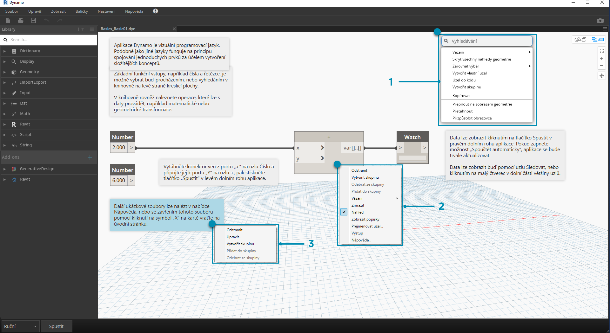

## Pracovní prostor

**Pracovní prostor** aplikace Dynamo je místo, kde vyvíjíme naše vizuální programy, ale také zde zobrazujeme náhled výsledné geometrie. Ať už pracujete v domovském pracovním prostoru nebo vlastním uzlu, můžeme se pohybovat pomocí myši nebo tlačítek vpravo nahoře. Přepínání mezi režimy v pravé dolní části určuje, který náhled procházíme.

> Poznámka: Uzly a geometrie mají pořadí kreslení, takže můžete mít objekty rendrované nad sebou. To může být matoucí, když se do posloupnosti přidá více uzlů, které mohou být rendrovány ve stejné pozici v pracovním prostoru.

> 1. Karty
2. Tlačítka Přiblížit/Posunout
3. Režim náhledu
4. Dvojité kliknutí na pracovní prostor

### Karty

Aktivní karta Pracovní prostor umožňuje procházet a upravovat program. Když otevřete nový soubor, ve výchozím nastavení se otevírá nový pracovní prostor **Výchozí**. Nový pracovní prostor **vlastního uzlu** můžete také otevřít v nabídce Soubor nebo pomocí možnosti *Nový uzel podle výběru* klikněte pravým tlačítkem, pokud je vybrána možnost Uzly (další informace o této funkci později).

> Poznámka: Může být otevřen pouze jeden výchozí pracovní prostor, ale může být otevřeno více vlastních pracovních prostorů uzlů na dalších kartách.

### Navigace v grafu a 3D náhledu

V aplikaci Dynamo se v pracovním prostoru rendruje graf i 3D výsledky grafu (pokud vytváříme geometrii). Ve výchozím nastavení je graf aktivním náhledem, takže ho můžete pomocí tlačítek Navigace nebo prostředního tlačítka myši posunovat a přibližovat. Přepínání mezi aktivními náhledy lze dosáhnout třemi způsoby:

> 1. Tlačítka přepínání náhledu v pracovním prostoru
2. Kliknutí pravým tlačítkem v pracovním prostoru a výběr možnosti *Přepnout na... pohled*
3. Klávesová zkratka (Ctrl+B)

Režim navigace 3D náhledu také umožňuje **přímou manipulaci** bodů, která je předvedena v části [Začínáme](http://primer.dynamobim.org/02_Hello-Dynamo/2-6_the_quick_start_guide.html).

### Přiblížit na střed

V režimu navigace 3D náhledu lze modely snadno posunovat, přibližovat a otáčet. Chcete-li však provést přiblížení přímo na objekt vytvořený pomocí uzlu geometrie, můžete použít ikonu Přiblížit vše s vybraným jediným uzlem.

> 1. Vyberte uzel odpovídající geometrii, na kterou bude pohled zaměřen.
2. Přepněte na navigaci v 3D náhledu.

> 1. Klikněte na ikonu Přiblížit vše v pravém horním rohu.
2. Vybraná geometrie bude vystředěna uvnitř pohledu.

### Ahoj, myško!

Podle toho, který režim náhledu je aktivní, budou se tlačítka myši chovat odlišně. Obecně lze kliknutím levým tlačítkem myši vybrat a určit vstupy, kliknutím pravým tlačítkem myši získáte přístup k možnostem a prostřední tlačítko myši umožňuje navigovat v pracovním prostoru. Kliknutím pravým tlačítkem zobrazíte možnosti podle kontextu, ve kterém kliknete.

> 1. Klikněte pravým tlačítkem na pracovní prostor.
2. Klikněte pravým tlačítkem na uzel.
3. Klikněte pravým tlačítkem na poznámku.

Zde je tabulka interakcí myši v náhledu:

|**Akce myši**|**Náhled grafu**|**3D náhled**|
| -- | -- | -- |
|Kliknutí levým tlačítkem|Výběr|Není použito|
|Kliknutí pravým tlačítkem|Kontextová nabídka|Možnosti přiblížení|
|Kliknutí prostředním tlačítkem|Posun pohledu|Posun pohledu|
|Posun|Zvětšení/Zmenšení|Zvětšení/Zmenšení|
|Dvojité kliknutí|Vytvořit blok kódu|Není použito|

### Hledání na kreslicí ploše

Použití funkce „Hledání na kreslicí ploše“ výrazně zrychluje pracovní postup aplikace Dynamo, protože vám nabízí přístup k popiskům uzlů a nápovědám, aniž byste se museli vzdálit od vašeho místa na grafu. Kliknutím pravým tlačítkem myši získáte přístup ke všem užitečným funkcím vyhledávání v knihovně, ať už pracujete kdekoli na kreslicí ploše.

> 1. Kliknutím pravým tlačítkem myši na kreslicí plochu zobrazíte vyhledávací funkci. Pokud je panel vyhledávání prázdný, rozevírací seznam bude zobrazovat nabídku náhledu.
2. Při psaní do panelu vyhledávání se rozevírací nabídka průběžně aktualizuje, aby zobrazovala nejvhodnější výsledky vyhledávání.
3. Přesunutím ukazatele myši nad výsledky vyhledávání zobrazíte odpovídající popisy a popisky nástrojů.

## Rozvržení uzlů vyčištění

Uspořádání kreslicí plochy aplikace Dynamo je tím důležitější, čím složitějšími se budou stávat vaše soubory. Ačkoli máme nástroj **Zarovnat výběr**, který umožňuje pracovat s malým množstvím vybraných uzlů, aplikace Dynamo také obsahuje nástroj **Rozvržení uzlů vyčištění**, který pomáhá při celkovém vyčištění souboru.

#### Před vyčištěním uzlu

> 1. Vyberte uzly, které chcete automaticky uspořádat, nebo ponechte všechny nevybrané, aby byly všechny uzly v souboru vyčištěny.
2. Funkce rozvržení uzlů vyčištění se nachází pod kartou Upravit.
#### Po vyčištění uzlu

3. Uzly budou automaticky znovu rozmístěny a zarovnány, přičemž se začistí všechny posunuté nebo překrývající se uzly a zarovnají se se sousedními uzly.

