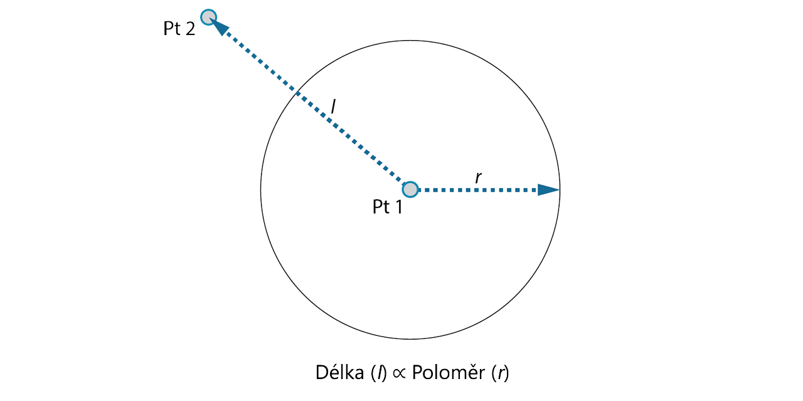
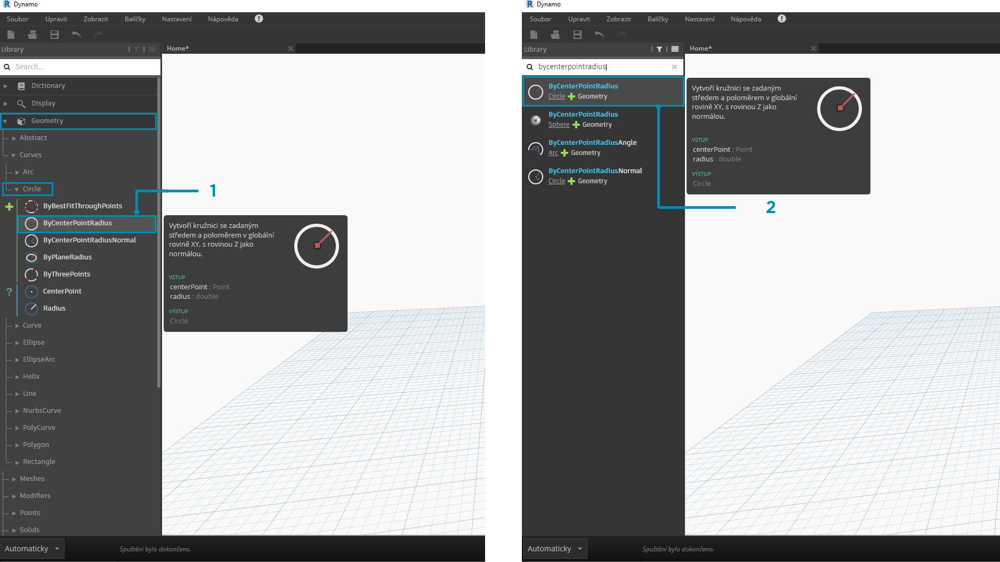
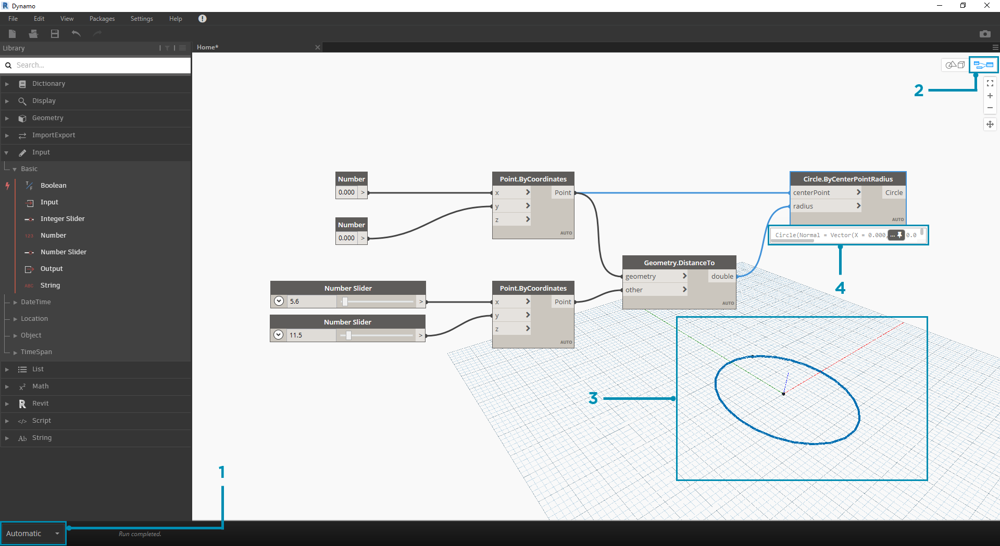

## ZAČÍNÁME

Když jsme se seznámili s rozvržením rozhraní a s navigací v pracovním prostoru, dalším krokem je pochopení typického pracovního postupu pro vývoj grafu v aplikaci Dynamo. Začneme vytvořením kružnice s dynamickou velikostí a poté vytvoříme pole kružnic s různými poloměry.

### Definování cílů a vztahů

Než přidáme cokoli do pracovního prostoru aplikace Dynamo, je důležité, abychom si plně uvědomili, čeho se snažíme dosáhnout a jaké vztahy budou důležité. Pamatujte, že pokaždé, když propojujeme dva uzly, vytvoříme mezi nimi explicitní spojení – můžeme později změnit tok dat, ale po propojení je již tento vztah pevně daný. V tomto cvičení vytvoříte kružnici (*Cíl*), kde je vstup poloměru definován vzdáleností k blízkému bodu (*Vztah*).



> Bod, který definuje vztah podle vzdálenosti, se obvykle označuje jako „Atraktor“. Zde bude vzdálenost k našemu bodu atraktoru použita k určení, jak velký by měl být náš kruh.

### Přidání uzlů do pracovního prostoru

Nyní, když máme načrtnuté cíle a vztahy, můžeme začít vytvářet náš graf. Potřebujeme uzly, které představují posloupnost akcí, která bude aplikací Dynamo provedena. Protože víme, že se pokoušíme vytvořit kružnici, začneme vyhledáním uzlu, který to dělá. Pomocí pole Vyhledat nebo procházením knihovny zjistíte, že existuje více než jeden způsob vytvoření kružnice.



> 1. Přejděte k položce Geometrie > Oblouky > Kružnice > **Circle.ByPointRadius**
2. Hledat > „ByCenterPointRadius...“

Kliknutím na uzel **Circle.ByPointRadius** v knihovně ho přidáme do pracovního prostoru. To by mělo uzel přidat do středu pracovního prostoru.


> 1. Uzel Circle.ByPointandRadius v knihovně
2. Kliknutím na uzel v knihovně jej přidáte do pracovního prostoru

Také budeme potřebovat uzly **Point.ByCoordinates**, **Number Input** a **Number Slider**.


> 1. Geometrie > Body > Bod > **Point.ByCoordinates**
2. Geometrie > Geometrie > **DistanceTo**
3. Vstup > Základní > **Number**
4. Vstup > Základní > **Number Slider**

### Připojení uzlů s vodiči

Nyní, když máme několik uzlů, je nutné propojit porty uzlů s vodiči. Tato připojení budou definovat tok dat.


> 1. **Number** k **Point.ByCoordinates**
2. **Number Sliders** k **Point.ByCoordinates**
3. **Point.ByCoordinates** (2) k **DistanceTo**
4. **Point.ByCoordinates** a **DistanceTo** k **Circle.ByCenterPointRadius**

### Spuštění programu

Když je definován náš tok programu, stačí říct aplikaci Dynamo, aby jej provedla. Po spuštění programu (buď automaticky, nebo po kliknutí na tlačítko Spustit v ručním režimu) budou data procházet vodiči a výsledky by měly být zobrazeny v 3D náhledu.



> 1. (Klikněte na tlačítko Spustit) – pokud je panel provádění v ručním režimu, je nutné graf spustit kliknutím na tlačítko Spustit
2. Náhled uzlu – pozastavením ukazatele myši nad polem v pravém dolním rohu uzlu zobrazíte místní nabídku výsledků
3. 3D náhled – pokud některý z našich uzlů vytvoří geometrii, uvidíte ji v 3D náhledu.
4. Výstupní geometrie při vytvoření uzlu.

### Přidání detailu

Pokud náš program funguje, měli bychom vidět kružnici v 3D náhledu, která prochází naším bodem atraktoru. To je skvělé, ale možná budeme chtít přidat více detailů nebo ovládacích prvků. Upravíme vstup na uzel kružnice, abychom mohli kalibrovat vliv na poloměr. Přidejte do pracovního prostoru další položku **Number Slider** a poté dvojitým kliknutím na prázdnou oblast pracovního prostoru přidejte uzel **Code Block**. Upravte pole v bloku kódu zadáním ```X/Y```.


> 1. **Blok kódu**
2. **DistanceTo** a **Number Slider** k **Code Block**
3. **Code Block** k **Circle.ByCenterPointRadius**

### Přidávání složitosti

Začít jednoduše a přidávat složitost je efektivní způsob, jak průběžně vytvářet náš program. Jakmile bude fungovat pro jeden kruh, použijeme sílu programu na více než jeden kruh. Pokud místo jednoho středového bodu použijeme rastr bodů a přizpůsobíme změnu ve výsledné datové struktuře, náš program nyní vytvoří mnoho kružnic – každou s jedinečnou hodnotou poloměru definovanou kalibrovanou vzdáleností k bodu atraktoru.


> 1. Přidejte uzel **Number Sequence** a nahraďte vstupy položky **Point.ByCoordinates** – klikněte pravým tlačítkem na položku Point.ByCoordinates a vyberte možnost Lacing > Cross Reference
2. Přidejte uzel **Flatten** za položku Point.ByCoordinates. Chcete-li seznam zcela rozvinout, ponechte pro vstup ```amt``` výchozí hodnotu ```-1```
3. 3D náhled se aktualizuje s rastrem kružnic

### Přizpůsobení pomocí přímé manipulace

Někdy číselná manipulace není správný přístup. Nyní můžete ručně tlačit a táhnout bodovou geometrii při procházení 3D náhledu pozadí. Také můžeme ovládat další geometrii, která byla vytvořena pomocí bodu. Například uzel **Sphere.ByCenterPointRadius** je také schopen přímé manipulace. Umístění bodu lze řídit z posloupností hodnot X, Y a Z pomocí **Point.ByCoordinates**. Při použití přímé manipulace však můžete hodnoty posuvníků aktualizovat ručním přesunutím bodu v režimu **Navigace 3D náhledu**. To nabízí intuitivnější přístup k ovládání sady diskrétních hodnot, které určují umístění bodu.


> 1. Chcete-li použít možnost **Přímá manipulace**, vyberte panel bodu, který chcete přesunout – nad vybraným bodem se zobrazí šipky.
2. Přepněte do režimu **Navigace 3D náhledu**.


> 1. Přesuňte kurzor nad bod a zobrazí se osy X, Y a Z.
2. Kliknutím a přetažením barevné šipky přemístíte odpovídající osu, přičemž hodnoty uzlu **Number Slider** se aktualizují na místo s ručně přesunutým bodem.


> 1. Všimněte si, že před **přímou manipulací** byl do komponenty **Point.ByCoordinates** připojen pouze jeden posuvník. Když bod ve směru X ručně přesuneme, aplikace Dynamo automaticky vygeneruje pro vstup X nový uzel **Number Slider**.

