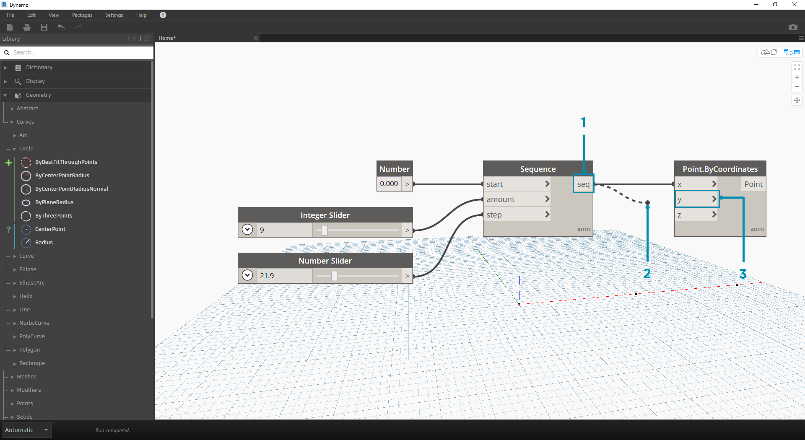

## Dráty

Dráty propojují uzly a vytvářejí mezi nimi vazby, které tvoří tok vizuálního programu. Lze si je představit jako elektrické dráty, které přenášejí pulzy dat od jednoho objektu k dalšímu.

### Tok programu

Dráty propojují výstupní port jednoho uzlu se vstupním portem jiného uzlu. Tím se v daném směru vytváří **tok dat** vizuálního programu. Přestože je možné uzly umístit na libovolné místo pracovní plochy, výstupní porty se nacházejí na jejich pravé straně a vstupní porty na levé straně, proto je směr toku programu zleva doprava.


### Tvorba drátů

Drát je možné vytvořit kliknutím levým tlačítkem myši na port a následným kliknutím na port jiného uzlu, čímž se uzly propojí. Při propojování uzlů se drát zobrazuje přerušovaně až do jeho propojení s jiným uzlem, pak se zobrazí plnou čarou. Data tímto drátem budou protékat od vstupu do výstupu, na porty je však možné klikat v libovolném pořadí.

> Tip: Než propojení dokončíte druhým kliknutím, najeďte myší nad port, drát se k portu přichytí a zároveň se zobrazí popisek daného portu.



> 1. Klikněte na výstupní port ```seq``` uzlu posloupnosti čísel (Sequence)
2. Při přesouvání myši k druhému portu je drát přerušovaný
3. Kliknutím na vstupní port ```y``` uzlu Point.ByCoordinates uzly propojíte

### Úprava drátů

Často je nutné upravit tok vizuálního programu tak, že se upraví propojení reprezentovaná dráty. Chcete-li upravit drát, klikněte levým tlačítkem myši na vstupní port uzlu, který je již propojen. Nyní máte dvě možnosti:


> 1. Existující drát
2. Chcete-li změnit propojení ke vstupnímu portu, klikněte levým tlačítkem myši na jiný vstupní port
3. Chcete-li drát odebrat, odsuňte jej pryč a klikněte levým tlačítkem myši na pracovní plochu

* Poznámka: Nyní je k dispozici funkce pro přesun několika drátů najednou. Tato funkce je popsána zde [http://dynamobim.org/dynamo-1-3-release/](http://dynamobim.org/dynamo-1-3-release/)

### Náhledy drátů

Ve výchozím nastavení se dráty zobrazují šedě. Po výběru uzlu se k němu připojené dráty zvýrazní světle modrou stejně jako uzel samotný.


> 1. Výchozí drát
2. Zvýrazněný drát

Aplikace Dynamo umožňuje upravit vzhled drátů na pracovní ploše pomocí nabídky Zobrazit > Konektory. Zde můžete přepínat mezi dráty ve tvaru křivek nebo lomených čar, případně je zcela vypnout.


> 1. Typ konektoru: Křivky
2. Typ konektoru: Lomené čáry

