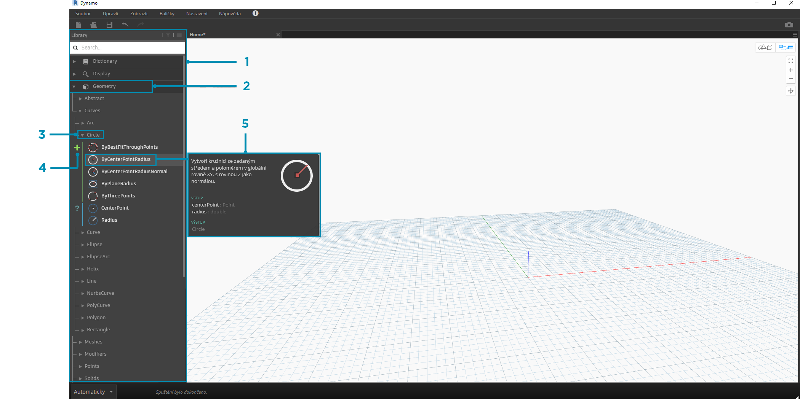
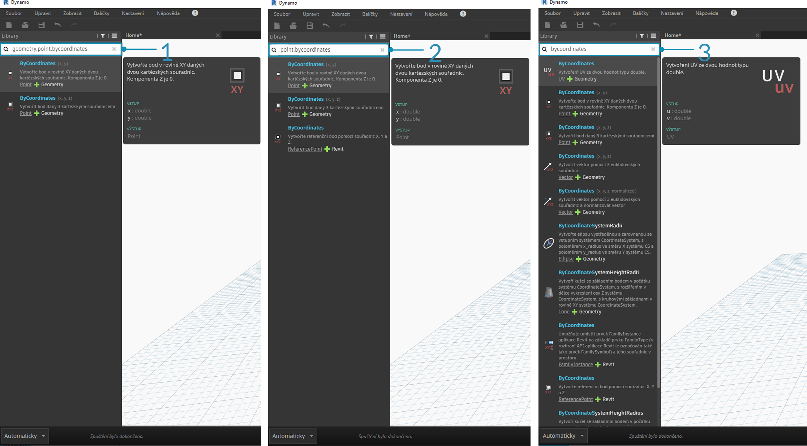

## Knihovna aplikace Dynamo

**Knihovna aplikace Dynamo** obsahuje uzly, které přidáme do pracovního prostoru, a definujeme tak vizuální programy pro spuštění. V knihovně lze vyhledávat uzly. Uzly obsažené zde – základní nainstalované uzly, vlastní uzly, které definujeme, a uzly z aplikace Package Manager, které přidáme do aplikace Dynamo – jsou uspořádány hierarchicky podle kategorií. Projděte si tuto organizaci a prozkoumejte klíčové uzly, které budeme často používat.

### Knihovna knihoven

**Knihovna** aplikace Dynamo, se kterou jsme v aplikaci pracovali, je ve skutečnosti kolekcí funkčních knihoven, z nichž každá obsahuje uzly seskupené podle kategorie. Ačkoliv se to může zdát jako nadbytečné, je to flexibilní rámec pro uspořádání uzlů, které jsou součástí výchozí instalace aplikace Dynamo, a je ještě lepší později, když začneme rozšiřovat tuto základní funkčnost pomocí vlastních uzlů a dalších balíčků.

#### Organizační schéma

Část **Knihovna** uživatelského rozhraní aplikace Dynamo se skládá z hierarchicky uspořádaných knihoven. Při zavrtání do knihovny postupně procházíme knihovnu, kategorie knihovny a podkategorie kategorií, abychom našli uzel.



> 1. Knihovna – oblast rozhraní aplikace Dynamo
2. Knihovna – kolekce souvisejících kategorií, například **Geometry**
3. Kategorie – kolekce souvisejících uzlů, například všech, které se týkají položek **Circles**
4. Podkategorie – Rozčlenění uzlů v rámci kategorie, obvykle podle **Create**, **Action** nebo **Query**
5. Uzel – Objekty přidané do pracovního prostoru pro provedení akce

#### Názvové konvence

Hierarchie jednotlivých knihoven se odráží v názvu uzlů přidaných do pracovního prostoru, které můžeme použít také v poli Vyhledat, nebo pomocí bloků kódu (které používají *textový jazyk Dynamo*). Kromě použití klíčových slov k nalezení uzlů můžeme zadat hierarchii oddělenou tečkou.

Zadáním různých částí místa uzlu do hierarchie knihovny ve formátu ```library.category.nodeName``` získáte různé výsledky:



> 1. ```library.category.nodeName```
2. ```category.nodeName```
3. ```nodeName``` nebo ```keyword```

Název uzlu v pracovním prostoru se obvykle rendruje ve formátu ```category.nodeName```, s důležitými výjimkami zejména v kategoriích Input a View. Dávejte pozor na podobně pojmenované uzly a všimněte si rozdílu kategorií:


> 1. Uzly z většiny knihoven budou obsahovat formát kategorie
2. Položky ```Point.ByCoordinates``` a ```UV.ByCoordinates``` mají stejný název, ale pocházejí z různých kategorií
3. Mezi povinné výjimky patří funkce Built-in, Core.Input, Core.View a Operators

### Často používané uzly

Se stovkami uzlů zahrnutých v základní instalaci aplikace Dynamo, které jsou nezbytné pro vývoj našich vizuálních programů? Zaměřme se na ty, které nám umožňují definovat parametry programu (**Input**), zobrazíme výsledky akce uzlu (**Watch**) a definujeme vstupy nebo funkce pomocí zástupce (**Code Block**).

#### Vstup

Vstupní uzly jsou primárním prostředkem pro uživatele našeho vizuálního programu – ať jste to vy nebo někdo jiný – pro propojení s klíčovými parametry. Zde jsou uzly dostupné v kategorii Input knihovny Core:


> 1. Boolean
2. Number
3. String
4. Number Slider
5. Integer Slider
6. Directory Path
7. File Path

#### Watch

Uzly Watch jsou nezbytné ke správě dat, která prochází vaším vizuálním programem. I když můžete zobrazit výsledek uzlu prostřednictvím náhledu dat uzlu, můžete jej nechat zobrazený v uzlu **Watch** nebo zobrazit výsledky geometrie prostřednictvím uzlu **Watch3D**. Obě tyto položky jsou v Knihovně Core v Kategorii View.

> Tip: Pokud vizuální program obsahuje mnoho uzlů, může být někdy 3D náhled rozptylující. Zvažte zrušení zaškrtnutí možnosti Zobrazovat náhled pozadí v nabídce Nastavení a použití uzlu Watch3D k zobrazení náhledu geometrie.


> 1. Watch – Všimněte si, že když vyberete položku v uzlu Watch, bude označena v náhledu Watch3D a 3D
2. Watch3D – Pomocí pravého dolního uzlu můžete změnit velikost a procházet stejným způsobem jako v 3D náhledu

#### Code Block

Uzly **Code Block** lze použít k definování bloku kódu pomocí řádků oddělených středníky. Může to být jednoduché jako ```X/Y```. Bloky kódu také můžeme použít jako zkratku pro definování položky Number Input nebo k volání funkce jiného uzlu. Syntaxe pro provedení je v souladu s konvencí pojmenování textového jazyka aplikace Dynamo DesignScript a je uvedena v části 7.2. Zkusíme vytvořit kružnici s touto zkratkou:


> 1. Dvojitým kliknutím vytvořte uzel **Code Block**
2. Zadejte ```Circle.ByCenterPointRadius(x,y);```
3. Kliknutím na pracovní prostor zrušíte výběr, měly by se automaticky přidat vstupy ```x``` a ```y```
4. Vytvořte uzel **Point.ByCoordinates** a **Number Slider** a připojte jej k zadaným vstupům položky Code Block
5. Výsledkem provádění vizuálního programu by měla být kružnice v 3D náhledu

